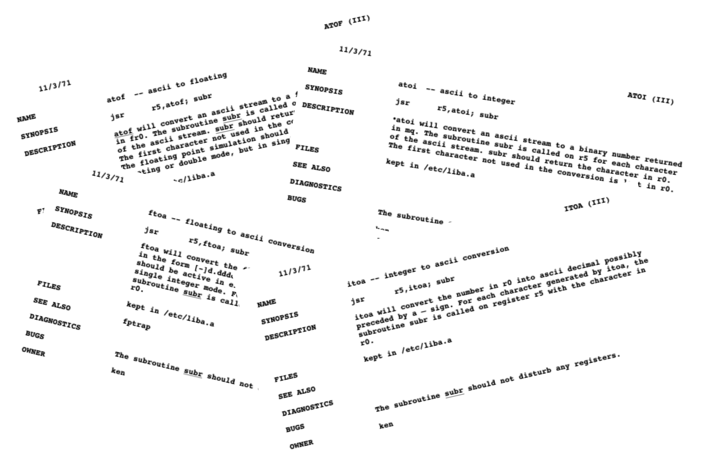
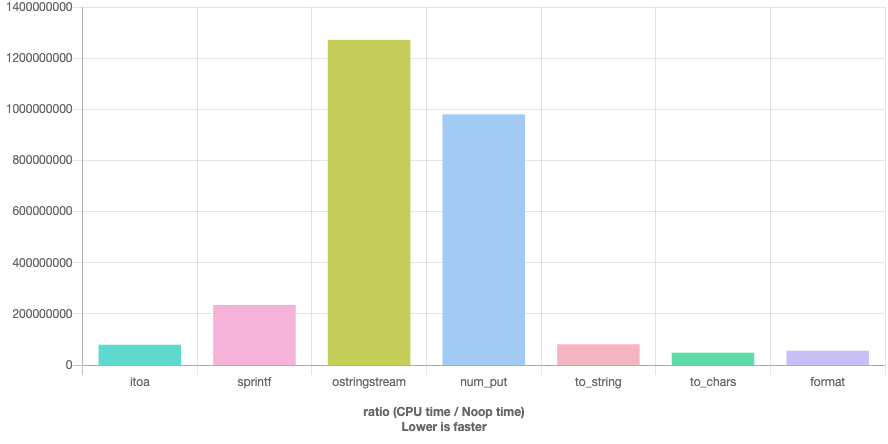
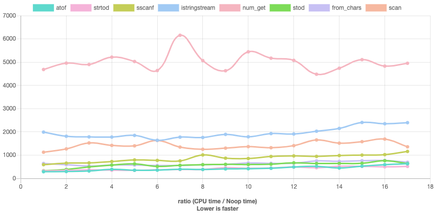
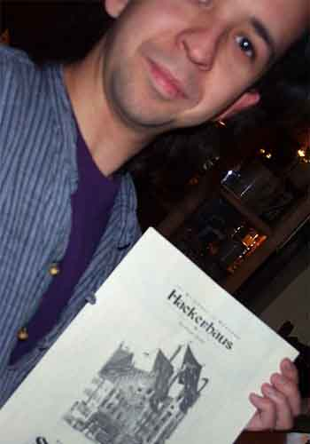

---
css:
  - node_modules/github-fork-ribbon-css/gh-fork-ribbon.css
  - css/custom.css
  - css/animations.css
  - slides/number-string-cpp-on-sea/number-string.css
scripts:
  - node_modules/jquery/dist/jquery.min.js
  - scripts/customize.js
  - node_modules/reveal-compiler-explorer/dist/reveal-compiler-explorer.js
  - node_modules/reveal-timeline/dist/timeline.js
  - node_modules/reveal-pdf/dist/reveal-pdf.js
  - node_modules/reveal-pdf/dist/reveal-pdf.worker.js
  - scripts/load-plugins.js
  - scripts/custom-options.js
revealOptions:
  compilerExplorer:
    useLocal: false
    compiler: g111
    options: '-std=c++20 -O2 -march=haswell -Wall -Wextra -pedantic -Wno-unused-variable -Wno-unused-parameter'
  pdf:
    addLink: true
  timeline:
    position: top
---

<!-- .slide: data-background-image="The Many Faces of Number String Conversions.png" data-timeline-hide -->

----

<!-- .slide: data-timeline-hide data-background-image="calculator.jpg" data-background-color="white" -->

<div class="r-stretch"></div>

Source: [PixaHive.com](https://pixahive.com/photo/complex-calculation-with-a-calculator/)

<!-- .element: class="footnote" style="justify-content: right;" -->

Note: Let's build a calculator. Nowadays calculators can do many things and I'm sure there's one somewhere who can make your coffee but in today's session we'll build a single operation calculator, one that can add two numbers.

---

<!-- .slide: data-timeline-hide data-background-color="white" -->


```cpp
///hide
struct String {};
///unhide
String add(String, String);
```

<!-- .element: class="fragment" -->

Source: [techtarget.com](https://www.techtarget.com/whatis/definition/calculator)

<!-- .element: class="footnote" -->

Note: Usually a calculator's user interface will include a small screen and a keyboard. The calculator will get user inputs as strings and will send a string to the screen for presenting the answer. So what we will actually implement is the following function:

The addition itself, however, is much more easily done if we're working with numbers, so what we'd like to do is to convert the inputs to numbers, add them, and convert the result back to a string. We do like to support integral and floating point numbers though, so the implementation should let the caller choose the type of numbers to use (`int`, `float`, etc.)

However trivial this task seems, there's a surprising number of ways to write this function, even when we confine ourselves to C++, and those different ways, together, tell the story of C++'s history.

So let's start at the beginning.

----

<!-- .slide: data-timeline-start-date="1969" data-timeline-headline="UNIX is born" -->

_and_Dennis_Ritchie_at_PDP-11_(2876612463).jpeg)

<!-- .element: class="r-stretch caption" -->

Note: In the late sixties Bell labs had a time sharing system call multics. Ken Thompson, a programmer in the lab, thought he could create such a system which was much smaller and simpler. He named it Unix as a pun. Soon after, he was joined by Dennis Ritchie, and together they made the first release in August 1969.

---

<!-- .slide: data-timeline-start-date="1971-11-03" data-timeline-headline="UNIX Programmers Manual" -->

<div style="display: grid; grid-template-columns: 1fr 3fr;" >

<div>


<!-- .element: class="r-stretch caption" -->

Source: [Faces of Open Source / Peter Adams](https://www.facesofopensource.com/ken-thompson-2/)

<!-- .element: class="footnote" -->

</div>

<canvas data-pdf-src="pdfs/unix_1st_manintro.pdf"></canvas>

</div>

Note: Here is Ken in a later age along the cover of the first unix programmer's manual from November 1971.

This photo, by the way, is taken from an amazing project called "faces of open source" which, quote,"is comprised of portraits of notable and unsung heroes who dedicate themselves to the creation and advancement of our open source technologies."

---

<!-- .slide: data-transition="slide none" -->



Note: this first manual already contains 4 functions for converting between strings and numbers, called `atoi`, `ftoi`, `itoa` and `ftoa`. 

---

<!-- .slide: data-transition="none slide" -->

<canvas data-pdf-src="pdfs/unix_1st_man31.pdf" data-pdf-page="2" data-pdf-scale="1.5"></canvas>

Note: this is before the C language was invented, and those are actually assembly subroutines. 

---

<!-- .slide: data-timeline-start-date="1978-02-22" data-timeline-headline="The C Programming Language" -->

<div style="display: grid; grid-template-columns: 1fr 2fr 1fr;">


<!-- .element: class="caption" -->


<!-- .element: class="caption" -->

</div>

Source: [Faces of Open Source](https://www.facesofopensource.com/bill-and-john-ritchie/) / [Peter Adams](https://www.facesofopensource.com/brian-kernighan-2/), [Wikipedia](https://commons.wikimedia.org/w/index.php?curid=24704373)

<!-- .element: class="footnote" -->

Note: contrary to the general notion at the time that an operating system's complexity and sophistication required it to be written in assembly, unix version 4 was rewritten in `C`, a language designed by Ritchie to this end. Ritchie, who's picture is held by his brothers here, together with Brian Kernighan, released the first edition of "The C programming language" book, commonly known as K&R, in 1978.

---

## `atoi`

```c []
///hide
#if 1
int atoi(char s[])
#else
///unhide
atoi() /* convert s to integer */
char s[];
///hide
#endif
///unhide
{
    int i, n, sign;
    for (i = 0; s[i]==' ' || s[i]=='\n' || s[i]=='\t'; i++)
      ; /* skip white space */
    sign = 1;
    if (s[i] == '+' || s[i] == '-')  /* sign */
        sign = (s[i++]=='+') ? 1 : -1;
    for (n = 0; s[i] >= '0' && s[i] <= '9'; i++)
        n = 10 * n + s[i] - '0';
    return(sign * n);
}
```

<!-- .element: style="font-size: 0.5em" -->

Source: [K&R, 1st Ed.](https://archive.org/details/cprogramminglang00kern) 

<!-- .element: class="footnote" -->

Note: This is the implementation of `atoi` as written in the 1st edition of K&R. Note that the parameters were written after the parentheses and the return type was not written at all (turns out an auto deduced return type is not a new concept). The implementation is pretty strait forward.

 - skip white space
 - check sign
 - on each step, multiply by 10 and add the next digit

---

## `atoi`

```c []
///hide
#include <ctype.h>

///unhide
int atoi(const char *s)
{
  int n=0, neg=0;
  while (isspace(*s)) s++;
  switch (*s) {
  case '-': neg=1;
  case '+': s++;
  }
  /* Compute n as a negative number */
    /* to avoid overflow on INT_MIN */
  while (isdigit(*s))
    n = 10*n - (*s++ - '0');
  return neg ? n : -n;
}
```

Source: [musl](https://git.musl-libc.org/cgit/musl/tree/src/stdlib/atoi.c) 

<!-- .element: class="footnote" -->

Note: this is the implementation from the modern `musl` c standard library. as you can see it's pretty much the same. 

---

## `atof`

```c [|11-17]
///hide
#include <ctype.h>

///unhide
/* atof:  convert string s to double */
double atof(char s[])
{
  double val, power;
  int i, sign;
  for (i = 0; isspace(s[i]); i++)  /* skip white space */
      ;
  sign = (s[i] == '-') ? -1 : 1;
  if (s[i] == '+' || s[i] == '-')
      i++;
  for (val = 0.0; isdigit(s[i]); i++)
      val = 10.0 * val + (s[i] - '0');
  if (s[i] == '.')
      i++;
  for (power = 1.0; isdigit(s[i]); i++) {
      val = 10.0 * val + (s[i] - '0');
      power *= 10.0;
  }
  return sign * val / power;
}
```

Source: [K&R, 2nd Ed.](https://archive.org/details/cprogramminglang00bria) 

<!-- .element: class="footnote" -->

Note: Here is the implementation of `atof` (which despite the name, returns a double!) from the 2nd edition of K&R.

As can be seen, it's based on the same algorithm, only calculating the integral and fractional parts separately. It was not until C99, that this function got support for hexadecimal floating-point, INFs and NANs.

---

<h2><code>ato<span style="color: #fdd7be">Y</span></code></h2>

```c
long      atol  ( const char* str );
int       atoi  ( const char* str );
long long atoll ( const char* str );    // C99

double atof( const char* str );
```

Note: Currently the C standard has these "overloads" of ascii to number functions. Note that there are no unsigned or float (probably because they didn't know what to name it) versions.

---

## `itoa`

```c []
///hide
#include <string.h>

void reverse(char s[])
{
    int c, i, j;

    for (i = 0, j = strlen(s)-1; i < j; i++, j--) {
        c = s[i];
        s[i] = s[j];
        s[j] = c;
    }
}

#if 0
///unhide
itoa(n, s) /* convert `s` to integer */
char s [];
int n;
///hide
#else
void itoa(int n, char s[])
#endif
///unhide
{
  int i, sign;
  
  if ((sign = n) < 0) /* record sign */
    n = -n;           /* make n positive */
  i = 0;
  do {    /* generate digits in reverse order */
    s[i++] = n % 10 + '0';  /* get next digit */
  } while ((n /= 10) > 0); /* delete it */
  if (sign < 0)
    s[i++] = '-';
  s[i] = '\0';
  reverse(s);
}
```

<!-- .element: style="font-size: 0.45em" -->

Source: [K&R, 1st Ed.](https://archive.org/details/cprogramminglang00kern) 

<!-- .element: class="footnote" -->

Note: K&R also had the integer to ascii function, called `itoa`. For some reason, it was not added to the C standard but is provided by Microsoft's CRT and some other C libraries. glibc has it as an implementation detail.

This algorithm generates the digits in reverse order and then reverses the result.

---

<h2><code><span style="color: #bee4fd">X</span>to<span style="color: #fdd7be">Y</span></code></h2>

```c
///hide
#include <stdlib.h>

void itoa(int, char*);
void ftoa(double, char*, int);

///unhide
void addi(const char* lhs, const char* rhs, char* result) {
  const int l = atoi(lhs);
  const int r = atoi(rhs);
  itoa(l + r, result);
}

void addf(const char* lhs, const char* rhs, char* result, 
          int precision) {
  const double l = atof(lhs);
  const double r = atof(rhs);
  ftoa(l + r, result, precision);
}
```

Note: finally, we can implement our add function using `Xtoa` and `atoY` functions. We should write a different implementation for each numeric type as the functions are named differently. The floating point version also allows the caller to set the desired precision.

Besides the necessary repetition, the code is as clean and readable as can be.

---

<!-- .slide: data-timeline-hide -->

## error handling

- string ⟶ number
  - no conversion possible
  - out of range
- number ⟶ string
  - buffer overflow

Note: when converting between strings and numbers those are the typical errors we're likely to encounter. we will examine how the different methods help us avoid or at least be notified about those errors.

---

## no error handling

```c
///hide
#include <assert.h>
#include <stdlib.h>

int main() {
///unhide
assert(atoi("junk") == 0);
int undefined = atoi("2147483648");
///hide
}
```

Note: unfortunately, the `atoX` methods don't provide any error handling. there's no way to tell a wrong result from a valid one because when no conversion was done, it will simply return 0 and the return value in case of out of range error is undefined.

---

<h2><code><span style="color: #bee4fd">X</span>to<span style="color: #fdd7be">Y</span></code></h2>

- <!-- .element: class="pro" --> simple and intuitive API
- <!-- .element: class="con" --> no error handling
- <!-- .element: class="con" --> not customizable
- <!-- .element: class="con" --> unknown end
- <!-- .element: class="con" --> number ⟶ string non standard

----

<!-- .slide: data-timeline-start-date="1979-01" data-timeline-headline="UNIX 7th" data-transition="slide none" -->

<div style="display: grid; grid-template-columns: 1fr 3fr;">

<div>


<!-- .element: class="caption" -->

Source: [Faces of Open Source / Peter Adams](https://www.facesofopensource.com/michael-lesk-2/)

<!-- .element: class="footnote" -->

</div>

<canvas data-pdf-src="pdfs/unix_7th_man.pdf"></canvas>

</div>

Note: Unix version 7 was the first readily portable version of Unix and it included a new portable I/O library, written by Mike Lesk.

---

<!-- .slide: data-transition="none slide" -->

<canvas data-pdf-src="pdfs/unix_7th_man.pdf" data-pdf-page="306" data-pdf-scale="1.5"></canvas>

Note: printf was actually already part of Algol 68, one of C's predecessors, but Lesk added the `fprintf` and `sprintf` variations, to be able to write the result to a file or a string rather than directly to the screen.  

---

<h2><code>s<span style="color: #bee4fd">X</span>f</code></h2>

```c
///hide
#include <stddef.h>

typedef size_t rsize_t;

///unhide
int sprintf    ( char *buffer,                const char *format, ... );
int snprintf   ( char *buffer, size_t bufsz,  const char *format, ... );  // C99
int snprintf_s ( char *buffer, rsize_t bufsz, const char *format, ... );  // C11
int sprintf_s  ( char *buffer, rsize_t bufsz, const char *format, ... );  // C11

int sscanf   ( const char *buffer, const char *format, ... );
int sscanf_s ( const char *buffer, const char *format, ... );             // C11
```

<!-- .element: style="font-size: 0.4em" -->

Note: Lesk also added the `scanf` family of functions for parsing input strings. While not written specifically for number ⟷ string conversions, we can use those functions for such conversions. 

The secure versions (ending with '_s') offer more error checking but aren't implemented by most implementations (even the microsoft implementation is not standard conforming) and there's even a proposal to remove them from the `C` standard.

`rsize_t` is an alias to `size_t` but functions will error out if input is larger from `RSIZE_MAX` to protect from passing negative values.

---

<h2><code>s<span style="color: #bee4fd">X</span>f</code></h2>

```c
///hide
#include <cstdio>

///unhide
void addi(const char* lhs, const char* rhs, char* result) {
  int l, r;
  sscanf(lhs, "%d", &l);
  sscanf(rhs, "%d", &r);
  sprintf(result, "%d", l + r);
}

void addf(const char* lhs, const char* rhs, char* result, 
          int precision) {
  double l, r;
  sscanf(lhs, "%lg", &l);
  sscanf(rhs, "%lg", &r);
  sprintf(result, "%.*lg", precision, l + r);
}
```

Note: back to `add`, using `sXf` makes the code is less readable. One has to be familiar with the different formatting flags, although, to be honest, most C++ programmers are. 

It might have been possible to write a generic implementation by providing a mapping from type to format string but it would be cumbersome.

---

## number formatting

```c []
///hide
#include <stdio.h>

int main(void) {
///unhide
printf("%x\n",   42);   // prints 2a
printf("%X\n",   42);   // prints 2A
printf("%#o\n",  42);   // prints 052
printf("%+d\n",  42);   // prints +42
printf("%.5u\n", 42);   // prints 00042

printf("%f\n",   0.42); // prints 0.420000
printf("%e\n",   0.42); // prints 4.200000e-01
printf("%E\n",   0.42); // prints 4.200000E-01
printf("%a\n",   0.42); // prints 0x1.ae147ae147ae1p-2
printf("%.3A\n", 0.42); // prints 0X1.AE1P-2
printf("%g\n",   0.42); // prints 0.42
///hide
}
```

Note: `sprintf` is highly customizable. here's the stuff you can change

- different base
- uppercase 
- print the base prefix
- force sign
- precision for integers simply prepends zeros

for floating points
- precision means number of digits after the decimal point (the default precision is 6)
- they can be written out using fixed, exponential (lower or upper case) and hexadecimal representation
- the general representation is fixed for small numbers and exponential for large and also truncates trailing zeros

---

## error handling

```c [1-3|5-8|10-12]
///noexecute
///options+=-Wformat=2
///hide
#include <stdio.h>
#include <assert.h>
#include <errno.h>

int main() {
///unhide
float f;
int res = sscanf("junk", "%g", &f);
assert(res == 0);

int i;
errno = 0;
sscanf("2147483648", "%i", &i);
assert(errno == ERANGE); // Linux only

i = 42;
char buffer[sizeof i];
sprintf(buffer, "%d", i); // UB
///hide
}
```

Note: Unlike, `atoi`, `sscanf` does handle errors by returning the number of successfully converted characters (meaning that 0 will be return when no conversion was done), and by setting `errno` in case of an out of range error. `sprintf`, however, suffers from UB in the case of

- buffer overflows
- invalid format string

---

<h2><code>s<span style="color: #bee4fd">X</span>f</code></h2>

- <!-- .element: class="pro" --> customizable
- <!-- .element: class="pro" --> some error handling
- <!-- .element: class="con" --> some error handling
- <!-- .element: class="con" --> less readable
- <!-- .element: class="con" --> no generality
- <!-- .element: class="con" --> only bases 8, 10, 16

Note: Most of us still have to look up the more rarely-used formatting flags, but they are after all used rarely. binary would be useful.

----

<!-- .slide: data-timeline-start-date="1983-01" data-timeline-headline="UNIX System V" data-transition="slide none" -->

<canvas data-pdf-src="pdfs/unix_systemv_man.pdf"></canvas>

Note: In the 80s, the development of Unix was split to two, with research moving to Berkley university, under the BSD brand, while AT&T, the owner of Bell labs, issuing commercial versions like System V. 

---

<!-- .slide: data-transition="none slide" -->

<canvas data-pdf-src="pdfs/unix_systemv_man.pdf" data-pdf-page="630" data-pdf-scale="2.0"></canvas>

The System V manual from 1983, is the first one to contain new a function to convert from string to numbers, named `strtol`. You can see the return value starting to be written explicitly here.

---

<h2><code>strto<span style="color: #bee4fd">X</span></code></h2>

```c
///hide
#include <stdint.h>

///unhide
long                strtol    ( const char* str, char** str_end, int base );
long long           strtoll   ( const char* str, char** str_end, int base );  // C99
unsigned long       strtoul   ( const char* str, char** str_end, int base );
unsigned long long  strtoull  ( const char* str, char** str_end, int base );  // C99
intmax_t            strtoimax ( const char* str, char** str_end, int base );  // C99
uintmax_t           strtoumax ( const char* str, char** str_end, int base );  // C99

float               strtof    ( const char* str, char** str_end           );  // C99
double              strtod    ( const char* str, char** str_end           );
long double         strtold   ( const char* str, char** str_end           );  // C99
```

<!-- .element: style="font-size: 0.4em" -->

Note: The `C` standard contains many "overloads" of `strtoX`. They work similarly to the `atoX` functions but offer a richer API. It is possible to get the position where the conversion has ended, and, for the integral overloads, to customize the base, which can be anything between 2 and 36. Integral types below `long` are not provided and the caller is expected to call the `long` version and cast the result.

---

<h2><code>strto<span style="color: #bee4fd">X</span></code></h2>

```c
///hide
#include <stddef.h>
#include <stdlib.h>

void itoa(int, char*);
void ftoa(double, char*, int);

///unhide
void addl(const char* lhs, const char* rhs, char* result) {
  const long l = strtol(lhs, NULL, 10);
  const long r = strtol(rhs, NULL, 10);
  itoa(l + r, result);
}

void addd(const char* lhs, const char* rhs, char* result, 
          int precision) {
  const double l = strtod(lhs, NULL);
  const double r = strtod(rhs, NULL);
  ftoa(l + r, result, precision);
}
```

Note: here's the `add` implementation using `strtoX`. As C doesn't have default parameters, we have to write them explicitly. since there's no number to string counterpart, I'm using `Xtoa` functions for that direction. 

---

## error handling

```c [1-5|7-10]
///hide
#include <stdlib.h>
#include <errno.h>
#include <limits.h>
#include <assert.h>

int main() {
///unhide
errno = 0;
char* end;
const long l = strtol("10000000000000000000", &end, 10);
assert(l == LONG_MAX);
assert(errno == ERANGE);

const char* str = "junk";
const double d = strtod(str, &end);
assert(d == 0);
assert(end == str);
///hide
}
```

Note: `strtoX` offers a similar level of error handling as `sscanf` and we can compare the end output parameter with the start pointer to know if no conversion was done.

---

<h2><code>strto<span style="color: #bee4fd">X</span></code></h2>

- <!-- .element: class="pro" --> customizable
- <!-- .element: class="pro" --> error handling
- <!-- .element: class="con" --> one way only
- <!-- .element: class="con" --> no default arguments
- <!-- .element: class="con" --> no generality

Note: `strtoX` suffers from the usual drawbacks of any C API (which doesn't support default args).

----

<!-- .slide: data-timeline-start-date="1985-06-11" data-timeline-headline="The Stream I/O Library" data-transition="slide none" -->

<div style="display: grid; grid-template-columns: 1fr 3fr;" >

<div> 


<!-- .element: class="r-stretch caption" -->

Source: [bell-labs](https://www.bell-labs.com/about/history/innovation-stories/rise-c-plus-plus/#gref)

<!-- .element: class="footnote" -->

</div>

<canvas data-pdf-src="pdfs/usenix_1985.pdf"></canvas>

</div>

Note: Another project coming from Bell Labs is the C++ language created by Bjarne Stroustrup. The I/O stream library was written by Bjarne in 1985 for the 2nd release of CFront, the first C++ compiler. 

---

<!-- .slide: data-transition="none slide" -->

<canvas data-pdf-src="pdfs/usenix_1985.pdf" data-pdf-page="73" data-pdf-scale="1.5"></canvas>

Note: The I/O stream library was designed to be type-safe, terse, extensible and efficient alternative to the `printf` family. 

---

<!-- .slide: data-background-color="white" data-timeline-start-date="1989-06" data-timeline-headline="stringstream" -->


Source: [ntu.edu.sg](https://www3.ntu.edu.sg/home/ehchua/programming/cpp/cp10_io.html)

<!-- .element: class="footnote" -->

Note: The 1985 library only had the `istream` and `ostream`. The rich hierarchy we have know was mostly designed by Jerry Schwartz in 1989. 

---

## <code>std::<span style="color: #bee4fd">X</span>stringstream</code>

```cpp []
///hide
template<typename CharT>
class char_traits;

template<typename CharT>
class allocator;

///unhide
namespace std {
template<class CharT, class Traits = char_traits<CharT>,
          class Allocator = allocator<CharT>>
class basic_stringstream;
using stringstream  = basic_stringstream<char>;

template<class CharT, class Traits = char_traits<CharT>,
         class Allocator = allocator<CharT>>
class basic_istringstream;
using istringstream  = basic_istringstream<char>;

template<class CharT, class Traits = char_traits<CharT>,
         class Allocator = allocator<CharT>>
class basic_ostringstream;
using ostringstream  = basic_ostringstream<char>;
}
```

<!-- .element: data-hide-line-numbers style="font-size: 0.45em" -->

Note:  like `std::string`, `stringstream` is actually a specialization of `basic_stringstream` and there are classes to deal with input or output only, which is safer if you know you only use one of the directions. There's also wide character versions but we won't cover them today.

---

## <code>std::<span style="color: #bee4fd">X</span>stringstream</code>

```cpp [3-5,16|6-10|12-15]
///hide
#include <sstream>
#include <iomanip>

///unhide
constexpr int DEFAULT_PRECISION = 6;

template<typename T>
std::string add(const std::string& lhs, const std::string& rhs, 
                int precision = DEFAULT_PRECISION) {  
  T l, r;
  std::istringstream in{lhs};  
  in >> l;
  in.str(rhs);
  in >> r;
  
  std::ostringstream out;
  out << std::setprecision(precision) << std::fixed 
      << l + r;
  return out.str();
}
```

<!-- .element: style="font-size: 0.45em" -->

Note: True to its promise, we're now finally able to write a generic implementation. Note that we have to feed the input strings to the `stringstream` before we can use it to parse the numbers and to copy the result string out of the `stringstream` in order to return it to the caller.  The `fixed` notation and precision will be ignored by the integral case.

---

## error handling

```cpp []
///hide
#include <sstream>
#include <cassert>

int main() {
///unhide
std::stringstream sst;
sst << "junk";
float f;
sst >> f;
assert(sst.fail());

sst.clear();
int i;
sst << "2147483648";
sst >> i;
assert(sst.fail());
///hide
}
```

Note: The main disadvantages of `sprintf` are avoided due to the use of typed operators and dynamic containers like `std::string`. Other failures are signaled through the `fail` method. 

---

## prefer exceptions?

```cpp [2,5-12]
///hide
#include <sstream>
#include <iostream>
#include <cassert>

int main() {
///unhide
std::stringstream sst;
sst.exceptions(std::ios_base::failbit);
auto exception_count = 0;

sst << "junk";
try {
  float f;
  sst >> f;
} catch (const std::ios_base::failure& fail) {
  std::cerr << fail.what() << '\n';
  ++exception_count;
}

sst.clear();
sst << "2147483648";
try {
  int i;
  sst >> i;
} catch (const std::ios_base::failure& fail) {
  std::cerr << fail.what() << '\n';
  ++exception_count;
}
///hide
assert(exception_count == 2);

}
```

Note: If one prefers, they can request the stream to throw exceptions in case of a failure by calling the exceptions method.

---

## `stringstream`

- <!-- .element: class="pro" --> customizable
- <!-- .element: class="pro" --> generic
- <!-- .element: class="pro" --> secure
- <!-- .element: class="con" --> verbose
- <!-- .element: class="con" --> only bases 8, 10, 16

----

<!-- .slide: data-timeline-start-date="2005-04-18" data-timeline-headline="Simple Numeric Access" -->

<canvas data-pdf-src="pdfs/simple_numeric_access.pdf" data-pdf-scale="1.5"></canvas>

Note: If `stringstream` was the answer to `sprintf` and `sscanf`, this C++11 paper from Pete Becker, added the C++ versions of the `strtoX` versions but also they're missing counterparts of converting numbers to strings.

---

## `to_string`

```cpp
///hide
namespace std {
  class string;
}

///unhide
std::string to_string( int value );
std::string to_string( long value );
std::string to_string( long long value );
std::string to_string( unsigned value );
std::string to_string( unsigned long value );
std::string to_string( unsigned long long value );
std::string to_string( float value );
std::string to_string( double value );
std::string to_string( long double value );
```

<!-- .element: style="font-size: 0.5em" -->

Note: finally, a standard way to elegantly convert numbers to string. the API is too simple, however, and doesn't offer any customizability (like base and precision).

---

<h2><code>sto<span style="color: #bee4fd">X</span></code></h2>

```cpp
///hide
#include <cstdint>

namespace std {
  class string;
}

///unhide
int       stoi  ( const std::string& str, std::size_t* pos = nullptr, int base = 10 );
long      stol  ( const std::string& str, std::size_t* pos = nullptr, int base = 10 );
long long stoll ( const std::string& str, std::size_t* pos = nullptr, int base = 10 );

unsigned long      stoul  ( const std::string& str, std::size_t* pos = nullptr, int base = 10 );
unsigned long long stoull ( const std::string& str, std::size_t* pos = nullptr, int base = 10 );

float       stof  ( const std::string& str, std::size_t* pos = nullptr );
double      stod  ( const std::string& str, std::size_t* pos = nullptr );
long double stold ( const std::string& str, std::size_t* pos = nullptr );
```

<!-- .element: style="font-size: 0.35em" -->

Note: These are the C++ versions of `strtoX` and are defined by the standard to do the same except for throwing exceptions on errors. 
The exclusion of `stoui` is discussed at [LWG2270](https://wg21.link/lwg2270)

---

<h2><code>sto<span style="color: #bee4fd">X</span>_to_string</code></h2>

```cpp
///hide
#include <string>

///unhide
std::string addi(const std::string& lhs, const std::string& rhs) {
  return std::to_string(std::stoi(lhs) + std::stoi(rhs));
}

std::string addd(const std::string& lhs, const std::string& rhs) {
  return std::to_string(std::stod(lhs) + std::stod(rhs));
}
```

<!-- .element: style="font-size: 0.5em" -->

Note: combining the two functions we get the most concise solution so far only that it's again not generic due to the C-like naming. Again, this solution is also not customizable.

---

## error handling

```cpp [3-8]
///hide
#include <string>
#include <iostream>
#include <cassert>

int main() {
///unhide
auto exception_count = 0;

try {
  const float f = std::stof("junk");
} catch (const std::invalid_argument& ex) {
  std::cerr << ex.what() << '\n';
  ++exception_count;
}

try {
  const int i = std::stoi("2147483648");
} catch (const std::out_of_range& ex) {
  std::cerr << ex.what() << '\n';
  ++exception_count;
}
///hide
assert(exception_count == 2);

}
```

Note: the error handling is similar to IO streams with exceptions.

---

<h2><code>sto<span style="color: #bee4fd">X</span>_to_string</code></h2>

- <!-- .element: class="pro" --> simple API
- <!-- .element: class="pro" --> error detection
- <!-- .element: class="con" --> forces use of exceptions
- <!-- .element: class="con" --> <code>to_string</code> not customizable
- <!-- .element: class="con" --> <code>sto<span style="color: #bee4fd">X</span></code> not generic

----

<!-- .slide: data-auto-animate data-timeline-hide -->

## ideal floating point conversion

FILE: number-string-cpp-on-sea/short_round_trip.svg

Note: let's talk a bit about converting between floating point numbers and strings. Since not every real number is representable in a limited size floating point representation, like IEEE 754 for example, there are gaps between the representable numbers. In fact, those gaps are getting bigger as the numbers are growing. 

Let's say we're converting the number in the middle here to a string. The other numbers are the closest numbers which can be represented as floats.
We could use a very long string to represent the number exactly, but actually any string representing a number which is closer to this numbers than to its neighbors, i.e. falls between the midpoints, allows us to identify the input exactly. `0.100000001` is such a string. In this case, however, there's a shorter string: `0.1`. So Ideally, we would like a conversion to return the shortest string that can be mapped uniquely to the input.

---

<!-- .slide: data-auto-animate data-timeline-hide -->

## ideal floating point conversion

FILE: number-string-cpp-on-sea/round_to_nearest.svg

Note: Sometimes there are two possible shortest strings in the midpoints interval. In this case, an ideal conversion will return the one which is actually closer to the input (the one ending in 6 in this case).

----

<!-- .slide: data-timeline-start-date="2015-02-24" data-timeline-headline="Shortcomings of iostreams" -->

<div style="display: grid; grid-template-columns: 1fr 3fr;" >

<div>


<!-- .element: class="caption" -->

Source: [boost.org](https://www.boost.org/users/people/jens_maurer.html)

<!-- .element: class="footnote" -->

</div>

<canvas data-pdf-src="pdfs/shortcomings_of_iostreams.pdf"></canvas>

</div>

Note: The desire to have such an "ideal" conversion which is also efficient has brought Jens Maurer to write two papers, targeting C++17. The first one, describing the shortcomings of the current solutions.

---

<!-- .slide: data-timeline-start-date="2015-09-25" data-timeline-headline="Elementary string conversions" -->

<canvas data-pdf-src="pdfs/elementary_string_conversions.pdf" data-pdf-scale="1.5"></canvas>

Note: ... and the other one proposing new, low level, functions for number ⟷ string conversions. As STL describes in his excellent CppCon talk, implementing those methods required a novel conversion algorithm only published after C++17 was finalized.

---

<!-- .slide: data-auto-animate -->

## `from_chars`

```cpp
///hide
namespace std {
  enum class chars_format {
    general
  };
}

struct from_chars_result;
///unhide
from_chars_result from_chars(const char* first, const char* last, char&               value, int base = 10);
from_chars_result from_chars(const char* first, const char* last, signed char&        value, int base = 10);
from_chars_result from_chars(const char* first, const char* last, unsigned char&      value, int base = 10);
from_chars_result from_chars(const char* first, const char* last, short&              value, int base = 10);
from_chars_result from_chars(const char* first, const char* last, unsigned short&     value, int base = 10);
from_chars_result from_chars(const char* first, const char* last, int&                value, int base = 10);
from_chars_result from_chars(const char* first, const char* last, unsigned int&       value, int base = 10);
from_chars_result from_chars(const char* first, const char* last, long&               value, int base = 10);
from_chars_result from_chars(const char* first, const char* last, unsigned long&      value, int base = 10);
from_chars_result from_chars(const char* first, const char* last, long long&          value, int base = 10);
from_chars_result from_chars(const char* first, const char* last, unsigned long long& value, int base = 10);

from_chars_result from_chars(const char* first, const char* last, float& value,
                             std::chars_format fmt = std::chars_format::general);
from_chars_result from_chars(const char* first, const char* last, double& value,
                             std::chars_format fmt = std::chars_format::general);
from_chars_result from_chars(const char* first, const char* last, long double& value,
                             std::chars_format fmt = std::chars_format::general);
```

<!-- .element: data-id="code" style="font-size: 0.3em" -->

Note: for converting strings to numbers, we have `from_chars`. There are many overloads, including, for the first time, types which are shorter than int.

---

<!-- .slide: data-auto-animate -->

## `from_chars`

```cpp [6-10|12-16|1-4]
///hide
#include <system_error>

namespace std {
  enum class chars_format {
    general
  };
}
///unhide
struct from_chars_result {
    const char* ptr;
    std::errc ec;
};

template<typename Integral>
from_chars_result 
from_chars(const char* first, const char* last, 
           Integral& value, 
           int base = 10);

template<typename FloatingPoint>
from_chars_result 
from_chars(const char* first, const char* last, 
           FloatingPoint& value,
           std::chars_format fmt = std::chars_format::general);
```

<!-- .element: data-id="code" style="font-size: 0.45em" -->

Note:  Conceptually, there are two signatures, one for integral types and the other for floating point types. They are customizable to a degree. The return value contains the position where conversion ended and an error code. No exception is thrown.

---

## `to_chars`

```cpp [6-10|12-28|1-4]
///hide
#include <system_error>

namespace std {
  enum class chars_format;
}
///unhide
struct to_chars_result {
    char* ptr;
    std::errc ec;
};

template<typename Integral>
to_chars_result 
to_chars(char* first, char* last, 
         Integral value, 
         int base = 10);

template<typename FloatingPoint>
to_chars_result 
to_chars(char* first, char* last, 
         FloatingPoint value);

template<typename FloatingPoint>
to_chars_result 
to_chars(char* first, char* last, 
         FloatingPoint value,
         std::chars_format fmt);

template<typename FloatingPoint>
to_chars_result 
to_chars(char* first, char* last, 
         FloatingPoint value,
         std::chars_format fmt,
         int precision);
```

<!-- .element: style="font-size: 0.45em" -->

Note: the opposite direction looks very similar. the overloads without a defined precision output the shortest recoverable string.
The resulting string is not null-terminated. here the return value has the one-past-the-end pointer of the characters written.  

---

```cpp [1|3-13]
///hide
#include <limits>
#include <string>
///unhide
#include <charconv>

template <typename T>
std::string add(const std::string& lhs, const std::string& rhs) {
    T l, r;
    std::from_chars(lhs.data(), lhs.data() + lhs.size(), l);
    std::from_chars(rhs.data(), rhs.data() + rhs.size(), r);

    std::string res(std::numeric_limits<T>::digits10 + 1, 0);
    const auto [end, _] =
        std::to_chars(res.data(), res.data() + res.size(), l + r);
    res.resize(end - res.data());
    return res;
}
///hide

int main() { add<int>("1", "2"); }
```

<!-- .element: data-id="code" style="font-size: 0.5em" -->

Note: To use those functions, include the `charconv` header. The implementation is not very readable but is generic. Note that we don't need precision because the ideal conversion property we've talked about.
Being low level, it requires manually allocating the output buffer, a `std::string` in this case. I used `numeric_limits` to get the maximum number of characters required to uniquely represent the type `T` and then downsized the string to the actual number of characters written.

[p2007](https://wg21.link/p2007) proposes adding a `string_view` interface.

---

## error handling

```cpp [2-7|10-15|18-23]
///compiler=g111
///options+=-std=c++17
///hide
#include <charconv>
#include <iterator>
#include <cassert>

int main() {
///unhide
{
  const char str[] = "junk";
  double d;
  const auto [ptr, ec] = 
    std::from_chars(std::begin(str), std::end(str), d);
  assert(ptr == str);
  assert(ec == std::errc::invalid_argument);
}
{
  const char str[] = "2147483648";
  int i;
  const auto [ptr, ec] = 
    std::from_chars(std::begin(str), std::end(str), i);
  assert(ptr == std::prev(std::end(str)));
  assert(ec == std::errc::result_out_of_range);
}
{
  int i = 12345678;
  char str[7];
  const auto [ptr, ec] = 
    std::to_chars(std::begin(str), std::end(str), i);
  assert(ptr == std::end(str));
  assert(ec == std::errc::value_too_large);
}
///hide
}
```

Note: here error handling looks the same in both directions. We can check the error code and the end position to detect errors.   in addition to the errors we've previously seen, `to_chars` avoids buffer overflow and returns an error code instead. 

If you want exceptions, you need to throw them yourself, preferably by passing the error code to `std::system_error`.

---

## <code><span style="color: #bee4fd">X</span>_chars</code>

- <!-- .element: class="pro" --> customizable
- <!-- .element: class="pro" --> generic
- <!-- .element: class="pro" --> reports error code
- <!-- .element: class="con" --> manual memory management
- <!-- .element: class="con" --> verbose
- <!-- .element: class="con" --> less customizable

----

<!-- .slide: data-timeline-start-date="2012-12-07" data-timeline-headline="fmt" -->

```diff
 $ git show ec27d5d8a1681f9b15f3fb7c5491d55a3bf8e83b
commit ec27d5d8a1681f9b15f3fb7c5491d55a3bf8e83b
Author: vitaut <victor.zverovich@gmail.com>
Date:   Fri Dec 7 08:26:46 2012 -0800

    Initial commit

diff --git a/README.md b/README.md
new file mode 100644
index 00000000..691b4cdb
--- /dev/null
+++ b/README.md
@@ -0,0 +1,4 @@
+format
+======
+
+Small, safe and fast printf-like formatting library for C++
\ No newline at end of file
```

Note: we're almost about to get back to present days and even get a snick pick to the future. Since variadic templates were introduced to C++11, it was known that they can be used to write a type safe version of the `printf` family of functions. Victor Zverovich, picked the glove quite quickly, and in 2012 started a formatting library called `fmt`.

---

<!-- .slide: data-timeline-start-date="2017-05-22" data-timeline-headline="std::format" -->

<div style="display: grid; grid-template-columns: 1fr 3fr;" >

<div>


<!-- .element: class="caption" -->

Source: [cppcast.com](https://cppcast.com/victor-zverovich/)

<!-- .element: class="footnote" -->

</div>

<canvas data-pdf-src="pdfs/text_formatting.pdf" data-pdf-scale="1.2"></canvas>

</div>

Note: `fmt` became extremely popular, and part of it was proposed for standardization, targeting C++20.

---

## `std::format`

```cpp [1-2|4-6|8-11]
///hide
#include <string>
#include <iterator>

namespace std {
template< class OutputIt >
struct format_to_n_result {
  OutputIt out;
  std::iter_difference_t<OutputIt> size;
};
}

template<typename...>
using format_string = int;
///unhide
template< class... Args >
std::string format( format_string<Args...> fmt, const Args&... args );

template< class OutputIt, class... Args >
OutputIt format_to( OutputIt out, 
                    format_string<Args...> fmt, const Args&... args );

template< class OutputIt, class... Args >
std::format_to_n_result<OutputIt>
format_to_n( OutputIt out, std::iter_difference_t<OutputIt> n,
             format_string<Args...> fmt, const Args&... args );
```

<!-- .element: data-hide-line-numbers style="font-size: 0.45em" -->

Note: and indeed, C++20 include a number of new formatting functions. The API reminds that for `sprintf` only type aware which means it doesn't require writing a format flag to tell the argument type and can be used for user defined types.
There's an overload for returning the result as a string, writing it to an output iterator and to a sized range.

---

## `std::format`

```cpp
///libs=fmt:713
///hide
#include <fmt/format.h>

namespace std {
  template<typename... Args>
  auto format(Args&&... args) { return fmt::format(std::forward<Args>(args)...); }
}

int main() {
///unhide
std::format("{} {}!", "Hello", "world");
///hide
}
```

Note: The format string syntax is inspired by Python, writing curly braces whenever an argument's value should be inserted.

---

<!-- .slide: data-visibility="hidden" -->

## separate locale overloads

<pre>
<code data-trim data-noescape class="lang-cpp">
///hide
#include &lt;string&gt;

namespace std {
template&lt; class OutputIt &gt;
struct format_to_n_result {
  OutputIt out;
  std::iter_difference_t&lt;OutputIt&gt; size;
};
}

template&lt;typename...&gt;
using format_string = int;

///unhide
template&lt; class... Args &gt;
std::string format( <mark>const std::locale& loc</mark>,
                    format_string&lt;Args...&gt; fmt, const Args&... args );

template&lt; class OutputIt, class... Args &gt;
OutputIt format_to( OutputIt out, <mark>const std::locale& loc</mark>,
                    format_string&lt;Args...&gt; fmt, const Args&... args );
                    
template&lt; class OutputIt, class... Args &gt;
std::format_to_n_result&lt;OutputIt&gt;
format_to_n( OutputIt out, std::iter_difference_t&lt;OutputIt&gt; n,
             <mark>const std::locale& loc</mark>, 
             format_string&lt;Args...&gt; fmt, const Args&... args );
</code>
</pre>

<!-- .element: style="font-size: 0.45em" -->

Note: `std::format` is not locale aware by default. If you do want to use a locale, you can call one of these overloads.

---

<!-- .slide: data-timeline-start-date="2018-11-16" data-timeline-headline="scnlib" -->

## `scnlib`


```cpp
///libs=scnlib:04
///hide
#include <string>
///unhide
#include <scn/scn.h>

///hide
int main() {
///unhide
std::string key;
int value;
scn::scan("answer = 42", "{} = {}", key, value);
//        ~~~~~~~~~~~~~  ~~~~~~~~~  ~~~~~~~~~~
//            input        format    arguments
//
// Result: key == "answer", value == 42
///hide
}
```

Note: there's also the parallel scanning library, `scnlib`, created by Elias Kosunen, which is the variadic template answer to `scanf`.

---

<!-- .slide: data-timeline-start-date="2019-10-06" data-timeline-headline="std::scan" -->

<div style="display: grid; grid-template-columns: 1fr 3fr;" >


<!-- .element: class="caption" -->

<canvas data-pdf-src="pdfs/text_parsing.pdf"></canvas>

</div>

Source: [linkedin.com](https://www.linkedin.com/in/eliaskosunen/)

<!-- .element: class="footnote" -->

Note: Elias, joined by Victor Zverovich, proposed the library for standardization. It didn't get in C++23, unfortunately, but I hope it will be for 26.

---

## `scan` and `format`

```cpp
///libs=scnlib:04,fmt:713
///hide
#include <concepts>
#include <string>
#include <scn/scn.h>
#include <fmt/format.h>

namespace std {
  template<typename... Args>
  auto scan(Args&&... args) { return scn::scan(std::forward<Args>(args)...); }
  template<typename... Args>
  auto format(Args&&... args) { return fmt::format(std::forward<Args>(args)...); }
}

///unhide
template<std::integral I>
std::string add(const std::string& lhs, const std::string& rhs) {
  I l, r;
  std::scan(lhs, "{}", l);
  std::scan(rhs, "{}", r);
  return std::format("{}", l + r);
}

template<std::floating_point F>
std::string add(const std::string& lhs, const std::string& rhs, 
                int precision) {
  F l, r;
  std::scan(lhs, "{}", l);
  std::scan(rhs, "{}", r);
  return std::format("{:.{}}", l + r, precision);
}
```

<!-- .element: style="font-size: 0.45em" -->

Assuming [P1729](https://wg21.link/p1729) is accepted.

<!-- .element: class="footnote" -->

Note: Assuming it is accepted, this is how we would used `std::format` and `std::scan` to implement add. We can't have a single generic implementation, however, because `format` refuses to accept precision for integral arguments, which is a good thing I assume, but we can use concepts to let the compiler do the overload resolution.

---

<!-- .slide: data-visibility="hidden" -->

## generic with default precision

```cpp
///libs=scnlib:04,fmt:713
///hide
#include <concepts>
#include <string>
#include <scn/scn.h>
#include <fmt/format.h>

namespace std {
  template<typename... Args>
  auto scan(Args&&... args) { return scn::scan(std::forward<Args>(args)...); }
  template<typename... Args>
  auto format(Args&&... args) { return fmt::format(std::forward<Args>(args)...); }
}

///unhide
template<typename T>
requires std::is_arithmetic_v<T>
std::string add(const std::string& lhs, const std::string& rhs) {
  T l, r;
  std::scan(lhs, "{}", l);
  std::scan(rhs, "{}", r);
  return std::format("{}", l + r);
}
```

<!-- .element: style="font-size: 0.5em" -->

Assuming [P1729](https://wg21.link/p1729) is accepted.

<!-- .element: class="footnote" -->

---

## no output params

```cpp [3-4]
///libs=scnlib:04,fmt:713
///hide
#include <concepts>
#include <string>
#include <scn/scn.h>
#include <fmt/format.h>

///unhide
template<std::integral I>
std::string add(const std::string& lhs, const std::string& rhs) {
  const auto l = scn::scan_value<I>(lhs);
  const auto r = scn::scan_value<I>(rhs);
  return fmt::format("{}", l + r);
}
```

<!-- .element: data-hide-line-numbers style="font-size: 0.5em" -->

\* not proposed

<!-- .element: class="footnote" -->

Note: Personally, I much prefer not to use output params. This is possible with `scnlib`, by calling `scan_value`, but currently not proposed for standardization.

---

## error handling

```cpp [2-6|9-13|16-22]
///libs=scnlib:04,fmt:713
///hide
#include <scn/scn.h>
#include <fmt/format.h>
#include <cassert>

int main() {
///unhide
{
    double d;
    const auto res = scn::scan("junk", "{}", d);
    assert(!res);
    assert(res.error().code() == 
      scn::error::code::invalid_scanned_value);
}
{
    int i;
    const auto res = scn::scan("2147483648", "{}", i);
    assert(!res);
    assert(res.error().code() == 
      scn::error::code::value_out_of_range);
}
{
  int i = 12345678;
  char str[7];
  // fmt::format_to(str, "{}", i); // UB
  const auto [out, size] 
    = fmt::format_to_n(str, std::size(str), "{}", i);
  assert(out == std::end(str));
  assert(size == 8);
}
///hide
}
```

Note: for error handling, `scnlib` return value is convertible to `bool`, with false meaning an unsuccessful scan. It also produces an error code which you can check. 

Be aware that you *might* get a buffer overflow with `format_to` so better always use `format_to_n`, which will stop when the buffer is full, when writing to a preallocated buffer.

---

## `scan` and `format`

- <!-- .element: class="pro" --> safe
- <!-- .element: class="pro" --> generic
- <!-- .element: class="pro" --> highly customizable
- <!-- .element: class="con" --> somewhat verbose

----

<!-- .slide: data-timeline-hide -->

## random `int` ⟶ string

[](benchmarks/itoa.cpp)

Tested on Apple MacBook Pro 2.4GHz 8-core i9 32gb RAM TB Retina 16"

<!-- .element: class="footnote" -->

Note: now it's time to compare the performance of all the functions we explored. The code for the benchmarks was taken from what Vladimir Zverovich, the author of `fmtlib` use for testing the performance if his library.

as we'll see later, those methods don't perform too bad even though they use `std::string` as they're able to take advantage of the small string optimization (22 chars in `libstdc++`) 

---

<!-- .slide: data-timeline-hide -->

## why is `stringstream` 
## so slow?

- Shared formatting state
- Uncontrolled use of locale

Source: [stackoverflow.com](https://stackoverflow.com/a/65325727/621176)

<!-- .element: class="footnote" -->

---

<!-- .slide: data-timeline-hide -->

## random string ⟶ `int`

[](benchmarks/atoi.cpp)

Tested on Apple MacBook Pro 2.4GHz 8-core i9 32gb RAM TB Retina 16"

<!-- .element: class="footnote" -->

---

<!-- .slide: data-timeline-hide -->

## random `double` ⟶ string

[](benchmarks/dtoa-random.cpp)

by precision

Tested on Apple MacBook Pro 2.4GHz 8-core i9 32gb RAM TB Retina 16"

<!-- .element: class="footnote" -->

---

<!-- .slide: data-timeline-hide -->

## random string ⟶ `double`

[](benchmarks/atod-digit.cpp)

by digits

Tested on Apple MacBook Pro 2.4GHz 8-core i9 32gb RAM TB Retina 16"

<!-- .element: class="footnote" -->

----

<!-- .slide: data-timeline-hide -->

### Number ⟷ String Conversions

<div id="comparison">

| | <code><span style="color: #bee4fd">X</span>to<span style="color: #fdd7be">Y</span></code> | <code>strto<span style="color: #bee4fd">X</span></code> | <code>s<span style="color: #bee4fd">X</span>f</code> | `string`<br>`stream` | <code>sto<span style="color: #bee4fd">X</span><br>to_string</code> | <code><span style="color: #bee4fd">X</span>_chars</code> | `scan`<br>`format` |
|-|:-:|:-:|:-:|:-:|:-:|:-:|:-:|
| **standard** | `C89`<sup>[1](#comparison1)</sup> | `C89`<sup>[1](#comparison1)</sup> | `C89` | `C++98` | `C++11` | `C++17` | `C++2X`<sup>[2](#comparison2)</sup>
| **readability** |  |  |  |  |  |  |  |
| **customizability** |  |  |  |  |  |  |  |
| **safety** |  |  |  |  |  |  |  |
| **generality** |  |  |  |  |  |  |  |
| **efficiency**<sup>[3](#comparison3)</sup> | 1 | 2 | 3 | 12 | 2 | 1 | 2 |


<div class="footnotes">

1. <a name="comparison1"></a> string ⟶ number only
2. <a name="comparison2"></a> number ⟶ string only
3. <a name="comparison3"></a> lower is better

</div>

</div>

Note: This table concludes all the different methods we've seen so far. It is somewhat my personal opinion, but I think we can tell for sure that we improve with time.

*But* I would still like a more readable solution. And if we can't get it in the standard, how about we will look at the next obvious choice - Boost. 

----

<!-- .slide: data-timeline-start-date="2001-01" -->

## `boost::lexical_cast`

```cpp
///libs=boost:176
///hide
#include <string_view>
#include <string>
///unhide
#include <boost/lexical_cast.hpp>

template <typename T>
std::string add(std::string_view lhs, std::string_view rhs) {
  const auto l = boost::lexical_cast<T>(lhs);
  const auto r = boost::lexical_cast<T>(rhs);
  return boost::lexical_cast<std::string>(l + r);
}
```

<div style="position: absolute; left: -13vw; top: 10vh">



<!-- .element: class="caption" style="width: 250px" -->

Source: [boost.org](https://www.boost.org/users/people/kevlin_henney.html)

<!-- .element: class="footnote" -->

</div>

Note:

A disclaimer: I'm only mentioning the original authors, but there's more people who've worked and continue maintaining those boost libraries.  

`boost::lexical_cast` was created at 2001, and supports C++02. It is a actually wrapper around I/O streams, which means you can convert any type who has an overloaded stream operators.

 Downsides include:

- only exceptions
- requires default constructability
- not customizable

---

<!-- .slide: data-timeline-start-date="2002-10" -->

## `boost::format`

```cpp
///libs=boost:176
///hide
#include <string_view>
#include <string>
#include <boost/lexical_cast.hpp>
///unhide
#include <boost/format.hpp>

std::string addd(std::string_view lhs, std::string_view rhs) {
  const auto l = boost::lexical_cast<double>(lhs);
  const auto r = boost::lexical_cast<double>(rhs);
  return (boost::format("%.17f") % (l + r)).str();
}
```

<div style="position: absolute; left: -13vw; top: 10vh">


<!-- .element: class="caption" style="width: 250px" -->

Source: [boost.org](https://www.boost.org/users/people/samuel_krempp.html)

<!-- .element: class="footnote" -->

</div>

Note:

There's also boost format from 2002, also supporting C++03, a similar idea to `fmtlib` but uses the percentage operator for passing the arguments.

Downside:

- number ⟶ string only
- `printf`-like format string
- doesn't support dynamic precision
- not generic

---

<!-- .slide: data-timeline-start-date="2003-03" -->

## `boost::spirit`

```cpp [14-25|27-36]
///libs=boost:176
///hide
#include <string_view>
#include <string>
///unhide
#include <boost/spirit/include/karma.hpp>
#include <boost/spirit/include/qi.hpp>

template <typename Num>
struct precision_policy : boost::spirit::karma::real_policies<Num> {
  precision_policy(int precision) : precision_{precision} {}
  unsigned precision(Num /*n*/) const { return precision_; }
  int precision_;
};

std::string addd(std::string_view lhs, std::string_view rhs, 
                int precision) {
  const auto parse_double = [](std::string_view str, double& d) {
    namespace qi = boost::spirit::qi;

    using qi::double_;

    const auto action = [&d](double v) { d = v; };
    qi::parse(str.begin(), str.end(), double_[action]);
  };

  double l, r;
  parse_double(lhs, l);
  parse_double(rhs, r);

  namespace karma = boost::spirit::karma;
  using karma::double_;
  using precision_double_ =
      karma::real_generator<double, precision_policy<double>>;

  std::string res;
  karma::generate(std::back_inserter(res), 
                  precision_double_{precision}, 
                  l + r);
  return res;
}
```

<!-- .element: style="font-size: 0.45em" -->

<div style="position: absolute; left: -13vw; top: 10vh">


<!-- .element: class="caption" style="width: 250px" -->

Source: [boost.org](https://www.boost.org/users/people/joel_de_guzman.html)

<!-- .element: class="footnote" -->

</div>

Note:

- from March 2003
- supports C++03
- quite a lot of ceremony

---

<!-- .slide: data-timeline-start-date="2015-08" -->

## `boost::convert`

<div class="r-stack">

```cpp [|10-11|12-13|8]
///libs=boost:176,fmt:811
///hide
#include <fmt/format.h>

#include <boost/convert.hpp>
#include <boost/convert/lexical_cast.hpp>
#include <boost/convert/printf.hpp>
#include <boost/convert/spirit.hpp>
#include <boost/convert/stream.hpp>
#include <boost/convert/strtol.hpp>
#include <charconv>
#include <string>
#include <string_view>

namespace boost::cnv {
struct charconv;
}

/// @brief std::to/from_chars-based extended converter
/// @details The converter offers good overall performance and moderate
/// formatting facilities.

struct boost::cnv::charconv : boost::cnv::cnvbase<boost::cnv::charconv> {
    using this_type = boost::cnv::charconv;
    using base_type = boost::cnv::cnvbase<this_type>;

   private:
    friend struct boost::cnv::cnvbase<this_type>;

    template <typename in_type>
    cnv::range<char*> to_str(in_type value_in, char* buf) const {
        const auto [ptr, ec] = [&] {
            if constexpr (std::is_integral_v<in_type>) {
                return std::to_chars(buf, buf + bufsize_, value_in,
                                     static_cast<int>(base_));
            } else {
                return std::to_chars(buf, buf + bufsize_, value_in,
                                     chars_format(), precision_);
            }
        }();
        bool success = ec == std::errc{};

        return cnv::range<char*>(buf, success ? ptr : buf);
    }

    template <typename string_type, typename out_type>
    void str_to(cnv::range<string_type> range,
                optional<out_type>& result_out) const {
        out_type result = boost::make_default<out_type>();
        const auto [ptr, ec] = [&] {
            if constexpr (std::is_integral_v<out_type>) {
                return std::from_chars(&*range.begin(), &*range.end(), result,
                                       static_cast<int>(base_));
            } else {
                return std::from_chars(&*range.begin(), &*range.end(), result,
                                       chars_format());
            }
        }();

        if (ec == std::errc{}) result_out = result;
    }

    std::chars_format chars_format() const {
        static constexpr std::chars_format format[] = {
            std::chars_format::fixed, std::chars_format::scientific,
            std::chars_format::hex};
        return format[0];
    }

    std::chars_format fmt_ = std::chars_format::fixed;
};

constexpr int DEFAULT_PRECISION = 6;

/// unhide
#include <boost/convert.hpp>

template <typename T = double>
static std::string add(std::string_view lhs, std::string_view rhs,
                       int precision = DEFAULT_PRECISION) {
    namespace arg = boost::cnv::parameter;

    boost::cnv::strtol ccnv;

    const auto l = boost::convert<T>(lhs, ccnv).value();
    const auto r = boost::convert<T>(rhs, ccnv).value();
    return boost::convert<std::string>(l + r, ccnv(arg::precision = precision))
        .value();
}
///hide

int main() { fmt::print("1 + 1 = {}\n", add("1", "1")); }
```

<!-- .element: style="font-size: 0.4em" -->

```cpp [8]
///libs=boost:176,fmt:811
///hide
#include <fmt/format.h>

#include <boost/convert.hpp>
#include <boost/convert/lexical_cast.hpp>
#include <boost/convert/printf.hpp>
#include <boost/convert/spirit.hpp>
#include <boost/convert/stream.hpp>
#include <boost/convert/strtol.hpp>
#include <charconv>
#include <string>
#include <string_view>

namespace boost::cnv {
struct charconv;
}

/// @brief std::to/from_chars-based extended converter
/// @details The converter offers good overall performance and moderate
/// formatting facilities.

struct boost::cnv::charconv : boost::cnv::cnvbase<boost::cnv::charconv> {
    using this_type = boost::cnv::charconv;
    using base_type = boost::cnv::cnvbase<this_type>;

   private:
    friend struct boost::cnv::cnvbase<this_type>;

    template <typename in_type>
    cnv::range<char*> to_str(in_type value_in, char* buf) const {
        const auto [ptr, ec] = [&] {
            if constexpr (std::is_integral_v<in_type>) {
                return std::to_chars(buf, buf + bufsize_, value_in,
                                     static_cast<int>(base_));
            } else {
                return std::to_chars(buf, buf + bufsize_, value_in,
                                     chars_format(), precision_);
            }
        }();
        bool success = ec == std::errc{};

        return cnv::range<char*>(buf, success ? ptr : buf);
    }

    template <typename string_type, typename out_type>
    void str_to(cnv::range<string_type> range,
                optional<out_type>& result_out) const {
        out_type result = boost::make_default<out_type>();
        const auto [ptr, ec] = [&] {
            if constexpr (std::is_integral_v<out_type>) {
                return std::from_chars(&*range.begin(), &*range.end(), result,
                                       static_cast<int>(base_));
            } else {
                return std::from_chars(&*range.begin(), &*range.end(), result,
                                       chars_format());
            }
        }();

        if (ec == std::errc{}) result_out = result;
    }

    std::chars_format chars_format() const {
        static constexpr std::chars_format format[] = {
            std::chars_format::fixed, std::chars_format::scientific,
            std::chars_format::hex};
        return format[0];
    }

    std::chars_format fmt_ = std::chars_format::fixed;
};

constexpr int DEFAULT_PRECISION = 6;

/// unhide
#include <boost/convert.hpp>

template <typename T = double>
static std::string add(std::string_view lhs, std::string_view rhs,
                       int precision = DEFAULT_PRECISION) {
    namespace arg = boost::cnv::parameter;

    boost::cnv::printf ccnv;

    const auto l = boost::convert<T>(lhs, ccnv).value();
    const auto r = boost::convert<T>(rhs, ccnv).value();
    return boost::convert<std::string>(l + r, ccnv(arg::precision = precision))
        .value();
}
///hide

int main() { fmt::print("1 + 1 = {}\n", add("1", "1")); }
```

<!-- .element: class="fragment" style="font-size: 0.4em" -->

```cpp [8]
///libs=boost:176,fmt:811
///hide
#include <fmt/format.h>

#include <boost/convert.hpp>
#include <boost/convert/lexical_cast.hpp>
#include <boost/convert/printf.hpp>
#include <boost/convert/spirit.hpp>
#include <boost/convert/stream.hpp>
#include <boost/convert/strtol.hpp>
#include <charconv>
#include <string>
#include <string_view>

namespace boost::cnv {
struct charconv;
}

/// @brief std::to/from_chars-based extended converter
/// @details The converter offers good overall performance and moderate
/// formatting facilities.

struct boost::cnv::charconv : boost::cnv::cnvbase<boost::cnv::charconv> {
    using this_type = boost::cnv::charconv;
    using base_type = boost::cnv::cnvbase<this_type>;

   private:
    friend struct boost::cnv::cnvbase<this_type>;

    template <typename in_type>
    cnv::range<char*> to_str(in_type value_in, char* buf) const {
        const auto [ptr, ec] = [&] {
            if constexpr (std::is_integral_v<in_type>) {
                return std::to_chars(buf, buf + bufsize_, value_in,
                                     static_cast<int>(base_));
            } else {
                return std::to_chars(buf, buf + bufsize_, value_in,
                                     chars_format(), precision_);
            }
        }();
        bool success = ec == std::errc{};

        return cnv::range<char*>(buf, success ? ptr : buf);
    }

    template <typename string_type, typename out_type>
    void str_to(cnv::range<string_type> range,
                optional<out_type>& result_out) const {
        out_type result = boost::make_default<out_type>();
        const auto [ptr, ec] = [&] {
            if constexpr (std::is_integral_v<out_type>) {
                return std::from_chars(&*range.begin(), &*range.end(), result,
                                       static_cast<int>(base_));
            } else {
                return std::from_chars(&*range.begin(), &*range.end(), result,
                                       chars_format());
            }
        }();

        if (ec == std::errc{}) result_out = result;
    }

    std::chars_format chars_format() const {
        static constexpr std::chars_format format[] = {
            std::chars_format::fixed, std::chars_format::scientific,
            std::chars_format::hex};
        return format[0];
    }

    std::chars_format fmt_ = std::chars_format::fixed;
};

constexpr int DEFAULT_PRECISION = 6;

/// unhide
#include <boost/convert.hpp>

template <typename T = double>
static std::string add(std::string_view lhs, std::string_view rhs,
                       int precision = DEFAULT_PRECISION) {
    namespace arg = boost::cnv::parameter;

    boost::cnv::cstream ccnv;

    const auto l = boost::convert<T>(lhs, ccnv).value();
    const auto r = boost::convert<T>(rhs, ccnv).value();
    return boost::convert<std::string>(l + r, ccnv(arg::precision = precision))
        .value();
}
///hide

int main() { fmt::print("1 + 1 = {}\n", add("1", "1")); }
```

<!-- .element: class="fragment" style="font-size: 0.4em" -->

</div>

<div style="position: absolute; left: -13vw; top: 10vh">

Vladimir 

Batov

</div>

Note: this is the newest library, added in 2015 and it offers a generic interface for some of the methods we've discussed today. It's possible to plug in a custom conversion back end as well.

---

<!-- .slide: data-background-iframe="https://yet-another-user.github.io/convert/doc/html/boost_convert/converters_detail/charconv_converter.html" data-timeline-hide -->

---

<!-- .slide: data-timeline-start-date="2022-08-10" data-timeline-headline="boost 1.80" -->

## `boost::convert`

<div class="r-stack">

```cpp [8|10-13]
///libs=boost:176,fmt:811
///hide
#include <fmt/format.h>

#include <boost/convert.hpp>
#include <boost/convert/lexical_cast.hpp>
#include <boost/convert/printf.hpp>
#include <boost/convert/spirit.hpp>
#include <boost/convert/stream.hpp>
#include <boost/convert/strtol.hpp>
#include <charconv>
#include <string>
#include <string_view>

namespace boost::cnv {
struct charconv;
}

/// @brief std::to/from_chars-based extended converter
/// @details The converter offers good overall performance and moderate
/// formatting facilities.

struct boost::cnv::charconv : boost::cnv::cnvbase<boost::cnv::charconv> {
    using this_type = boost::cnv::charconv;
    using base_type = boost::cnv::cnvbase<this_type>;

   private:
    friend struct boost::cnv::cnvbase<this_type>;

    template <typename in_type>
    cnv::range<char*> to_str(in_type value_in, char* buf) const {
        const auto [ptr, ec] = [&] {
            if constexpr (std::is_integral_v<in_type>) {
                return std::to_chars(buf, buf + bufsize_, value_in,
                                     static_cast<int>(base_));
            } else {
                return std::to_chars(buf, buf + bufsize_, value_in,
                                     chars_format(), precision_);
            }
        }();
        bool success = ec == std::errc{};

        return cnv::range<char*>(buf, success ? ptr : buf);
    }

    template <typename string_type, typename out_type>
    void str_to(cnv::range<string_type> range,
                optional<out_type>& result_out) const {
        out_type result = boost::make_default<out_type>();
        const auto [ptr, ec] = [&] {
            if constexpr (std::is_integral_v<out_type>) {
                return std::from_chars(&*range.begin(), &*range.end(), result,
                                       static_cast<int>(base_));
            } else {
                return std::from_chars(&*range.begin(), &*range.end(), result,
                                       chars_format());
            }
        }();

        if (ec == std::errc{}) result_out = result;
    }

    std::chars_format chars_format() const {
        static constexpr std::chars_format format[] = {
            std::chars_format::fixed, std::chars_format::scientific,
            std::chars_format::hex};
        return format[0];
    }

    std::chars_format fmt_ = std::chars_format::fixed;
};

constexpr int DEFAULT_PRECISION = 6;

/// unhide
#include <boost/convert.hpp>

template <typename T = double>
static std::string add(std::string_view lhs, std::string_view rhs,
                       int precision = DEFAULT_PRECISION) {
    namespace arg = boost::cnv::parameter;

    boost::cnv::charconv ccnv;

    const auto l = boost::convert<T>(lhs, ccnv).value();
    const auto r = boost::convert<T>(rhs, ccnv).value();
    return boost::convert<std::string>(l + r, ccnv(arg::precision = precision))
        .value();
}
///hide

int main() { fmt::print("1 + 1 = {}\n", add("1", "1")); }
```

<!-- .element: style="font-size: 0.4em" -->

```cpp [11-14]
///libs=boost:176,fmt:811
///hide
#include <fmt/format.h>

#include <boost/convert.hpp>
#include <boost/convert/lexical_cast.hpp>
#include <boost/convert/printf.hpp>
#include <boost/convert/spirit.hpp>
#include <boost/convert/stream.hpp>
#include <boost/convert/strtol.hpp>
#include <charconv>
#include <string>
#include <string_view>

namespace boost::cnv {
struct charconv;
}

/// @brief std::to/from_chars-based extended converter
/// @details The converter offers good overall performance and moderate
/// formatting facilities.

struct boost::cnv::charconv : boost::cnv::cnvbase<boost::cnv::charconv> {
    using this_type = boost::cnv::charconv;
    using base_type = boost::cnv::cnvbase<this_type>;

   private:
    friend struct boost::cnv::cnvbase<this_type>;

    template <typename in_type>
    cnv::range<char*> to_str(in_type value_in, char* buf) const {
        const auto [ptr, ec] = [&] {
            if constexpr (std::is_integral_v<in_type>) {
                return std::to_chars(buf, buf + bufsize_, value_in,
                                     static_cast<int>(base_));
            } else {
                return std::to_chars(buf, buf + bufsize_, value_in,
                                     chars_format(), precision_);
            }
        }();
        bool success = ec == std::errc{};

        return cnv::range<char*>(buf, success ? ptr : buf);
    }

    template <typename string_type, typename out_type>
    void str_to(cnv::range<string_type> range,
                optional<out_type>& result_out) const {
        out_type result = boost::make_default<out_type>();
        const auto [ptr, ec] = [&] {
            if constexpr (std::is_integral_v<out_type>) {
                return std::from_chars(&*range.begin(), &*range.end(), result,
                                       static_cast<int>(base_));
            } else {
                return std::from_chars(&*range.begin(), &*range.end(), result,
                                       chars_format());
            }
        }();

        if (ec == std::errc{}) result_out = result;
    }

    std::chars_format chars_format() const {
        static constexpr std::chars_format format[] = {
            std::chars_format::fixed, std::chars_format::scientific,
            std::chars_format::hex};
        return format[0];
    }

    std::chars_format fmt_ = std::chars_format::fixed;
};

constexpr int DEFAULT_PRECISION = 6;

/// unhide
#include <boost/convert.hpp>

template <typename T = double>
static std::string add(std::string_view lhs,
                                        std::string_view rhs,
                                        int precision = DEFAULT_PRECISION) {
    namespace arg = boost::cnv::parameter;

    boost::cnv::charconv ccnv;

    const auto l = boost::convert<T>(lhs, ccnv).value_or(0);
    const auto r = boost::convert<T>(rhs, ccnv).value_or(0);
    return boost::convert<std::string>(
        l + r, ccnv(arg::precision = precision)).value_or("fail");
}
///hide

int main() { fmt::print("1 + 1 = {}\n", add("1", "l")); }
```

<!-- .element: class="fragment" style="font-size: 0.4em" -->

<!-- .element: style="font-size: 0.4em" -->

```cpp [4,11-16]
///libs=boost:176,fmt:811
///hide
#include <fmt/format.h>

#include <boost/convert.hpp>
#include <boost/convert/lexical_cast.hpp>
#include <boost/convert/printf.hpp>
#include <boost/convert/spirit.hpp>
#include <boost/convert/stream.hpp>
#include <boost/convert/strtol.hpp>
#include <charconv>
#include <string>
#include <string_view>

namespace boost::cnv {
struct charconv;
}

/// @brief std::to/from_chars-based extended converter
/// @details The converter offers good overall performance and moderate
/// formatting facilities.

struct boost::cnv::charconv : boost::cnv::cnvbase<boost::cnv::charconv> {
    using this_type = boost::cnv::charconv;
    using base_type = boost::cnv::cnvbase<this_type>;

   private:
    friend struct boost::cnv::cnvbase<this_type>;

    template <typename in_type>
    cnv::range<char*> to_str(in_type value_in, char* buf) const {
        const auto [ptr, ec] = [&] {
            if constexpr (std::is_integral_v<in_type>) {
                return std::to_chars(buf, buf + bufsize_, value_in,
                                     static_cast<int>(base_));
            } else {
                return std::to_chars(buf, buf + bufsize_, value_in,
                                     chars_format(), precision_);
            }
        }();
        bool success = ec == std::errc{};

        return cnv::range<char*>(buf, success ? ptr : buf);
    }

    template <typename string_type, typename out_type>
    void str_to(cnv::range<string_type> range,
                optional<out_type>& result_out) const {
        out_type result = boost::make_default<out_type>();
        const auto [ptr, ec] = [&] {
            if constexpr (std::is_integral_v<out_type>) {
                return std::from_chars(&*range.begin(), &*range.end(), result,
                                       static_cast<int>(base_));
            } else {
                return std::from_chars(&*range.begin(), &*range.end(), result,
                                       chars_format());
            }
        }();

        if (ec == std::errc{}) result_out = result;
    }

    std::chars_format chars_format() const {
        static constexpr std::chars_format format[] = {
            std::chars_format::fixed, std::chars_format::scientific,
            std::chars_format::hex};
        return format[0];
    }

    std::chars_format fmt_ = std::chars_format::fixed;
};

constexpr int DEFAULT_PRECISION = 6;

/// unhide
#include <boost/convert.hpp>

template <typename T = double>
static boost::optional<std::string> add(std::string_view lhs,
                                        std::string_view rhs,
                                        int precision = DEFAULT_PRECISION) {
    namespace arg = boost::cnv::parameter;

    boost::cnv::charconv ccnv;

    return boost::convert<T>(lhs, ccnv).flat_map([&](T l) {
        return boost::convert<T>(rhs, ccnv).flat_map([&](T r) {
            return boost::convert<std::string>(
                l + r, ccnv(arg::precision = precision));
        });
    });
}
///hide

int main() { fmt::print("1 + 1 = {}\n", add("1", "l").value_or("fail")); }
```

<!-- .element: class="fragment" style="font-size: 0.4em" -->

```cpp [3-9|14-17]
///libs=boost:176,fmt:811
///hide
#include <fmt/format.h>

#include <boost/convert.hpp>
#include <boost/convert/lexical_cast.hpp>
#include <boost/convert/printf.hpp>
#include <boost/convert/spirit.hpp>
#include <boost/convert/stream.hpp>
#include <boost/convert/strtol.hpp>
#include <charconv>
#include <string>
#include <string_view>

namespace boost::cnv {
struct charconv;
}

/// @brief std::to/from_chars-based extended converter
/// @details The converter offers good overall performance and moderate
/// formatting facilities.

struct boost::cnv::charconv : boost::cnv::cnvbase<boost::cnv::charconv> {
    using this_type = boost::cnv::charconv;
    using base_type = boost::cnv::cnvbase<this_type>;

   private:
    friend struct boost::cnv::cnvbase<this_type>;

    template <typename in_type>
    cnv::range<char*> to_str(in_type value_in, char* buf) const {
        const auto [ptr, ec] = [&] {
            if constexpr (std::is_integral_v<in_type>) {
                return std::to_chars(buf, buf + bufsize_, value_in,
                                     static_cast<int>(base_));
            } else {
                return std::to_chars(buf, buf + bufsize_, value_in,
                                     chars_format(), precision_);
            }
        }();
        bool success = ec == std::errc{};

        return cnv::range<char*>(buf, success ? ptr : buf);
    }

    template <typename string_type, typename out_type>
    void str_to(cnv::range<string_type> range,
                optional<out_type>& result_out) const {
        out_type result = boost::make_default<out_type>();
        const auto [ptr, ec] = [&] {
            if constexpr (std::is_integral_v<out_type>) {
                return std::from_chars(&*range.begin(), &*range.end(), result,
                                       static_cast<int>(base_));
            } else {
                return std::from_chars(&*range.begin(), &*range.end(), result,
                                       chars_format());
            }
        }();

        if (ec == std::errc{}) result_out = result;
    }

    std::chars_format chars_format() const {
        static constexpr std::chars_format format[] = {
            std::chars_format::fixed, std::chars_format::scientific,
            std::chars_format::hex};
        return format[0];
    }

    std::chars_format fmt_ = std::chars_format::fixed;
};

constexpr int DEFAULT_PRECISION = 6;

/// unhide
#include <boost/convert.hpp>

struct boost::cnv::by_default : boost::cnv::charconv {
    by_default() {
        namespace arg = boost::cnv::parameter;

        (*this)(arg::precision = 2);
    }
};

template <typename T = double>
static boost::optional<std::string> add(std::string_view lhs,
                                        std::string_view rhs) {
    return boost::convert<T>(lhs).flat_map([&](T l) {
        return boost::convert<T>(rhs).flat_map(
            [&](T r) { return boost::convert<std::string>(l + r); });
    });
}
///hide

int main() { fmt::print("1 + 1 = {}\n", add("1", "1").value_or("fail")); }
```

<!-- .element: class="fragment" style="font-size: 0.4em" -->

</div>

<div style="position: absolute; left: -13vw; top: 10vh">

Vladimir 

Batov

</div>

----

<!-- .slide: data-background-image="all_faces.png" data-background-repeat="repeat" data-background-size="50%" data-timeline-hide -->

<div class="r-stretch" style="display: flex; justify-content: center; flex-direction: column;">

# Thank you <!-- .element: style="background-color: rgba(0, 0, 0, 0.5);" -->

</div>

<div class="split" style="column-count: 3; background-color: black; font-size: 25px">

[dvirtz@gmail.com](mailto:dvirtz@gmail.com)

[github.com/dvirtz](https://github.com/dvirtz)

[twitter.com/dvirtzwastaken](https://twitter.com/dvirtzwastaken)

<!-- .element: style="text-align: left" -->

</div>
