## A predictable guide to

## `<random>`


Dvir Yitzchaki

Core C++, December 2020 <!-- .element: style="font-size: 0.5em" -->

---

## about me

- Sr. software engineer at [  <!-- .element: style="height: 1em; margin: 0; vertical-align: sub" -->](https://www.verizonmedia.com/)
- 4 kids, 1 wife
- member of the [Israeli C++ NB](https://github.com/wg21il)
- dvirtz at [gmail](mailto:dvirtz@gmail.com), [slack](https://cpplang.slack.com/team/U88AJJYN4), [github](https://github.com/dvirtz)
- [@dvirtzwastaken](https://twitter.com/dvirtzwastaken) on twitter


----

## why?

- numerics (simulation, Monte-Carlo integration)
- games (shuffling card decks, non-deterministic enemy behavior)
- testing (generation of test input data for good coverage)
- security (generation of cryptographic keys)

Note: Computers are deterministic machines by design: equal input data results in equal output, given the same internal state. Sometimes, applications require seemingly non-deterministic behavior, usually provided by generating random numbers.

---

## c-style

```cpp
///hide
#include <cstdlib>
#include <ctime>
#include <iostream>

void foo() {
///unhide
std::srand(std::time(nullptr));

for (size_t _ = 0; _ < 1'000; ++_) {
    std::cout << std::rand() % 100'000 << '\n';
}
///hide
}
```

---

## what's wrong?

1. <!-- .element: class="fragment" -->  seed in seconds
2. <!-- .element: class="fragment" -->  non-uniform distribution
3. <!-- .element: class="fragment" -->  <code>RAND_MAX</code>
4. <!-- .element: class="fragment" -->  might not be thread safe

Note: 
1. Imagine our application runs in a grid. There's a likely chance two instances will start on the same second.
2. Assuming range is not divisible by the modulus without a remainder
3. can be as low as 32767
4. this is implementation defined

----

<!-- .slide: data-background-image="crack2.gif" -->

<div class="chapter">

## Pseudo-random number generation library

</div>

<div class="footnotes" style="color: #333">

Sources: 

- [N3551](http://www.open-std.org/jtc1/sc22/wg21/docs/papers/2013/n3551.pdf), Walter E. Brown
- [N1398](http://www.open-std.org/jtc1/sc22/wg21/docs/papers/2002/n1398.html), Jens Maurer

</div>

---

<!-- .slide: class="aside" -->

## generating pseudo randomness

 

Note: We start with some seed data as an entropy source. This is used to initialize an engine which is a function object which upon call, generates a pseudo-random number and updates its internal state. The distribution post-processes the engine's output in such a way that resulting output is distributed according to a defined statistical probability density function.

---

## dice rolling

```cpp
///hide
#include <iostream>
///unhide
#include <random>

int roll_a_fair_die( ) {
  static unsigned seed{0x12345678};
  static std::default_random_engine e{seed};
  static std::uniform_int_distribution<int> d{1, 6};
  return d(e);
}
///hide

int main() {
  for (size_t i = 0; i < 20; ++i) {
      std::cout << roll_a_fair_die() << ' ';
  }
  std::cout << '\n';
}
```

----

<!-- .slide: data-background-image="engine.gif" -->

## engines

<!-- .element: class="chapter" -->

Note: An engine’s role is to return unpredictable (random) bits, ensuring that the likelihood of
next obtaining a 0 bit is always the same as the likelihood of next obtaining a 1 bit. 
To reduce overhead and improve throughput, C++ engines typically compute and return many bits per call by
encoding them into a single result of an unsigned integer type.

---

## what can it do

```cpp [1|3-5|7-16]
///hide
#include <random>
#include <iostream>
#include <cassert>
#include <sstream>

int main() {
///unhide
std::default_random_engine e;

std::cout << "e's range is [" 
          << e.min() << "," 
          << e.max() << "]\n";

std::stringstream sst;
sst << e;
const auto n1 = e();

e.seed(42);
e.discard(10);

sst >> e;
const auto n2 = e();
assert(n1 == n2);
///hide
}
```

<!-- .element: style="font-size: 0.5em" -->

Note: 
1. default constructible with some default seed
2. generates values between `min` and `max`
3. can be serialized/deserialized to an `iostream`
4. can be called directly
5. can be reseeded
6. results can be discarded

---

## Library engines

beyond `std::default_random_engine`.

Note: it is actually an alias to one of several library defined engines.

---

## Linear congruential generator (LCG)

`$$ X_{n+1} = \left( a X_n + c \right)\bmod m $$`

for some predefined `a`, `c` and `m`.

Note: of course, not every choice of parameters will generate a pseudo-random sequence. for example, a = 1 and c = 1 produces a simple modulo-m counter, but there are parameters which were found to produce series of high quality.

---

<!-- .slide: data-auto-animate -->

## LCG

```cpp
template <class UIntType, 
          UIntType a, UIntType c, UIntType m>
class linear_congruential_engine;
```

<!-- .element: data-id="code" style="font-size: 0.45em" -->

---

<!-- .slide: data-auto-animate -->

## predefined 

## LCG

```cpp
///hide
#include <cstdint>

///unhide
template <class UIntType, 
          UIntType a, UIntType c, UIntType m>
class linear_congruential_engine;

using minstd_rand0 =
    linear_congruential_engine<uint_fast32_t, 16807, 0, 2147483647>;

using minstd_rand =
    linear_congruential_engine<uint_fast32_t, 48271, 0, 2147483647>;
```

<!-- .element: data-id="code" style="font-size: 0.45em" -->

---

## Subtract with carry (SWC)

`$$ x_i = (x_{i-s} - x_{i-r} - c_{i-1})\ \bmod\ m $$`

where

`$$
c_i = \begin{cases}
    1, & \text{if } x_{i-s} - x{i-r} - c_{i-1} < 0\\
    0, & \text{otherwise}
\end{cases}
$$`

---

<!-- .slide: data-auto-animate -->

## SWC

```cpp
///hide
#include <cstddef>

///unhide
template<class UIntType,
         size_t w, size_t s, size_t r> 
class subtract_with_carry_engine;
```

<!-- .element: data-id="code" -->

---

<!-- .slide: data-auto-animate -->

## predefined 

## SWC

```cpp
///hide
#include <cstddef>
#include <cstdint>

///unhide
template<class UIntType,
         size_t w, size_t s, size_t r> 
class subtract_with_carry_engine;

using ranlux24_base 
  = subtract_with_carry_engine<uint_fast32_t, 24, 10, 24>;

using ranlux48_base 
  = subtract_with_carry_engine<uint_fast64_t, 48, 5, 12>;
```

<!-- .element: data-id="code" -->

Note: ranlux is the name of the Fortran library which was the first implementation of this RNG.

---

## mersenne twister (MT)

`$$ x_{k+n} := x_{k+m} \oplus \left( ({x_k}^u \mid\mid {x_{k+1}}^l) A \right) \qquad k=0,1,\ldots $$`

where

`$$ A = \begin{pmatrix} 0 & I_{w - 1} \\ a_{w-1} & (a_{w - 2}, \ldots , a_0) \end{pmatrix} $$`

Note: This is a form of a shift register. `||` denotes concatenation of bit vectors, `^u` means the upper `w - r` bits, and `^l` means the lower `r` bits.

---

## mersenne twister (MT)

on state `x` the engine's output will be

```cpp
///hide
#include <cstdint>

uint32_t calc(uint32_t x, uint32_t u, uint32_t s, uint32_t t, uint32_t d, uint32_t b, uint32_t c, uint32_t l) {
///unhide
auto y = x ^ ((x >> u) & d);
     y = y ^ ((y << s) & b);
     y = y ^ ((y << t) & c);
auto z = y ^ (y >> l);

return z;
///hide
}
```

for some predefined parameters `u`, `s`, `t`, `d`, `b`, `c` and `l`.

---

<!-- .slide: data-auto-animate -->

## MT

```cpp
///hide
#include <cstddef>

///unhide
template <class UIntType, size_t w, size_t n, size_t m, size_t r, UIntType a,
          size_t u, UIntType d, size_t s, UIntType b, size_t t, UIntType c,
          size_t l, UIntType f>
class mersenne_twister_engine;
```

<!-- .element: data-id="code" style="font-size: 0.4em" -->

---

<!-- .slide: data-auto-animate -->

## predefined 

## MT

```cpp
///hide
#include <cstddef>
#include <cstdint>

///unhide
template <class UIntType, size_t w, size_t n, size_t m, size_t r, UIntType a,
          size_t u, UIntType d, size_t s, UIntType b, size_t t, UIntType c,
          size_t l, UIntType f>
class mersenne_twister_engine;

using mt19937 =
    mersenne_twister_engine<uint_fast32_t, 32, 624, 397, 31, 0x9908b0df,
                            11, 0xffffffff, 7, 0x9d2c5680, 15, 0xefc60000, 18,
                            1812433253>;

using mt19937_64 =
    mersenne_twister_engine<uint_fast64_t, 64, 312, 156, 31,
                            0xb5026f5aa96619e9, 29, 0x5555555555555555, 17,
                            0x71d67fffeda60000, 37, 0xfff7eee000000000, 43,
                            6364136223846793005>;
```

<!-- .element: data-id="code" style="font-size: 0.4em" -->

Note: the period of those engines is `2^19937 − 1`

---

## engine adaptors

generate pseudo-random numbers using another random number engine as entropy source.

---

<!-- .slide: data-auto-animate -->

## `discard_block_engine`

```cpp
///hide
#include <cstddef>

///unhide
template <class Engine,
          size_t P, size_t R> 
class discard_block_engine;
```

<!-- .element: data-id="code" -->

FILE: predictable-guide-to-random/discard.svg

Note: From each block of size P generated by the base engine, the adaptor keeps only R numbers, discarding the rest.

---

<!-- .slide: data-auto-animate -->

## predefined

## `discard_block_engine`

```cpp
///hide
#include <cstddef>
#include <cstdint>

template<class UIntType,
         size_t w, size_t s, size_t r> 
class subtract_with_carry_engine;

using ranlux24_base 
  = subtract_with_carry_engine<uint_fast32_t, 24, 10, 24>;

using ranlux48_base 
  = subtract_with_carry_engine<uint_fast64_t, 48, 5, 12>;

///unhide
template <class Engine,
          size_t P, size_t R> 
class discard_block_engine;

using ranlux24 
  = discard_block_engine<ranlux24_base, 223, 23>;

using ranlux48 
  = discard_block_engine<ranlux48_base, 389, 11>;
```

<!-- .element: data-id="code" -->

---

<!-- .slide: data-auto-animate data-autoslide="2000" -->

## `shuffle_order_engine`

```cpp
///hide
#include <cstddef>

///unhide
template<class Engine,
         std::size_t K> 
class shuffle_order_engine;
```

<!-- .element: data-id="code" -->

FILE: predictable-guide-to-random/shuffle_pre.svg

Note: It maintains a table of size K and delivers a randomly selected number from that table when requested, replacing it with a number generated by the base engine

---

<!-- .slide: data-auto-animate -->

## `shuffle_order_engine`

```cpp
///hide
#include <cstddef>

///unhide
template<class Engine,
         std::size_t K> 
class shuffle_order_engine;
```

<!-- .element: data-id="code" -->

FILE: predictable-guide-to-random/shuffle_post.svg

---

<!-- .slide: data-auto-animate -->

## predefined

## `shuffle_order_engine`

```cpp
///hide
#include <cstdint>
#include <cstddef>

template <class UIntType, 
          UIntType a, UIntType c, UIntType m>
class linear_congruential_engine;

using minstd_rand0 =
    linear_congruential_engine<uint_fast32_t, 16807, 0, 2147483647>;

///unhide
template<class Engine,
         std::size_t K> 
class shuffle_order_engine;

using knuth_b =
  shuffle_order_engine<minstd_rand0, 256>;
```

<!-- .element: data-id="code" -->

---

## `independent_bits_engine`

```cpp
///hide
#include <cstddef>

///unhide
template<class Engine,
         std::size_t W,
         class UIntType> 
class independent_bits_engine;
```

Note: produces random numbers with different number of bits than that of the wrapped engine

---

## what to choose

| engine | quality | speed | state size |
|--------|---------|-------|------------|
|`linear_congruential_engine`|medium|medium|1 word|
|`mersenne_twister_engine`|good|fast|624 words|
|`subtract_with_carry_engine`|medium|fast|25 words|
|`discard_block_engine`|good|slow|base + 1 word|
|`shuffle_order_engine`|good|fast|base + 100 words|

<!-- .element: style="font-size: 0.7em" -->

Note:
- quality: What is the cycle length? Does the engine pass all relevant statistical tests?
- speed: How many and what kind of operations have to be performed to produce one random number, on average?

----

<!-- .slide: data-background-image="distribution.gif" -->

## distributions

<!-- .element: class="chapter" -->

Note: It makes no sense to ask for a random number without some context. 
A distribution’s role is to return random numbers (variates) whose likelihoods correspond to
a specific shape. E.g., a normal distribution produces variates according to a "bell-shaped
curve."

---

## what can it do

```cpp [1-2,17|3|5-7|9-16]
///hide
#include <random>
#include <iostream>
#include <cassert>
#include <sstream>

///unhide
template<typename Distribution, typename Engine>
void distribute(Engine& e) {
  Distribution d;

  std::cout << "d's range is [" 
            << d.min() << "," 
            << d.max() << "]\n";

  std::stringstream sst;
  sst << e << '\n' << d << '\n';
  const auto n1 = d(e);
  d(e);

  sst >> e >> d;
  const auto n2 = d(e);
  assert(n1 == n2);
}
///hide

int main() {
  std::default_random_engine e;
  distribute<std::uniform_int_distribution<>>(e);
}
```

<!-- .element: style="font-size: 0.45em" -->

Note: 
1. default constructible
2. generates values between `min` and `max`
3. can be serialized/deserialized to an `iostream`
4. can be called directly
5. can be reseeded
6. results can be discarded

---

## distribution parameters

```cpp [1-2,13|3|5-6|6,8-9|6,11-12]
///hide
#include <cassert>
#include <random>

///unhide
template<typename Distribution, typename Engine, typename... Params>
void distribute(Engine& e, Params... params) {
  Distribution d1{params...};

  typename Distribution::param_type p{params...};
  Distribution d2{p};

  d1.param(p);
  assert(d1.param() == d2.param());

  Distribution d3;
  assert(d3(e, p) == d2(e));
}

///hide

int main() {
  std::default_random_engine e;
  distribute<std::uniform_int_distribution<>>(e, 1, 6);
}
```

<!-- .element: style="font-size: 0.45em" -->

---

<div class="r-stretch" style="display: flex; justify-content: center; flex-direction: column">

## Library distributions

no default this time

</div>

Source: [N1588](wg21.link/n1588), Marc Paterno 

<!-- .element: class="footnote" -->

----

## uniform distributions

 <!--.element: style="height: 100%; width: auto" -->

<!--.element: class="r-stretch" -->

All values in range are equally likely to occur.

Note: 

This family contains the very simplest and most basic distributions. They describe uniform
random processes — random processes which can result in the occurrence of any element of a
set, each of which is equally likely as the outcome. While sometimes useful on their own, the
distributions in this family find their primary use as building blocks for the generation of other
distributions. 

Gerolamo Cardano, one of the fathers of the probability theory.

---

### integral uniform distribution

```cpp
template<class IntType = int>
class uniform_int_distribution;
```

<div class="distribution">

<formula>

`$$ P(i|a,b) = \frac{1}{b-a+1} $$`

 </formula>

 <parameters>

|parameter|type|default|
|---------|----|-------|
|`a`|`IntType`|`0`|
|`b`|`IntType`|`numeric_limits<IntType>::max()`|

<!-- .element: style="font-size: 0.3em" -->

</parameters>

<diagram>


</diagram>

</div>

Note: Produces random integer values `i`, uniformly distributed on the closed interval `[a, b]`.

Describes the outcome of a process with a finite
number of possible results, each of which is equally likely. Examples include:
- the number of spots appearing resulting from a single roll of a fair die
- the drawing of a specific card from a deck of cards.

---

### floating point uniform distribution

```cpp
template<class RealType = double>
class uniform_real_distribution;
```

<div class="distribution">

<formula>

`$$ P(i|a,b) = \frac{1}{b-a} $$`

 </formula>

 <parameters>

|parameter|type|default|
|---------|----|-------|
|`a`|`RealType`|`0.0`|
|`b`|`RealType`|`1.0`|

</parameters>

<diagram>

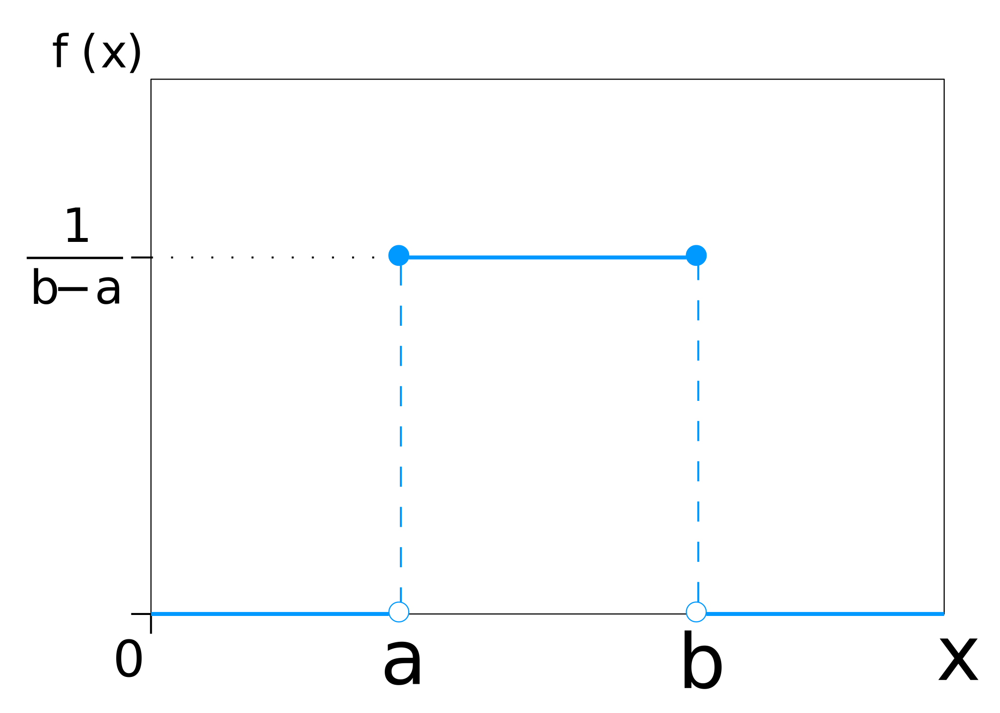

</diagram>

</div>

Note: Produces random floating-point values `i`, uniformly distributed on the closed interval `[a, b]`.

This is an extension of the integer uniform distribution to the limiting case of an infinite 
number of possible outcomes. A floating-point uniform process results in one value from a 
continuous range of finite extent.
The probability of the value falling within any sub-range must depend on only the size of
that sub-range.

----

## Bernoulli distributions


<!--.element: class="r-stretch" -->

Successes/frailures in a series of trials.

Note: 

Named after Swiss mathematician Jacob Bernoulli.

These distributions are related to Bernoulli processes. A Bernoulli process is a random process 
with exactly two possible outcomes, and with a fixed probability of obtaining each of those outcomes. 
(These probabilities need not be equal.) It is common to label one of the outcomes "success” and 
the other "failure,” and to term each event a "trial.”

For example, the flipping of a coin, whether "fair” or not, is a Bernoulli process.

Another example is an unreliable mechanical component that has a chance of failing upon use, and
that chance of failing does not change with time or use, then use of that component is a
Bernoulli process.

---

### Bernoulli distribution

```cpp
class bernoulli_distribution;
```

<div class="distribution">

<formula>

`$$ P(b|p) = \begin{cases}
   p & \text{if }b == true, \\
   1-p & \text {if } b == false.
 \end{cases} $$`

 </formula>

 <parameters>

|parameter|type|default|
|---------|----|-------|
|`p`|`double`|`0.5`|

</parameters>

<diagram>

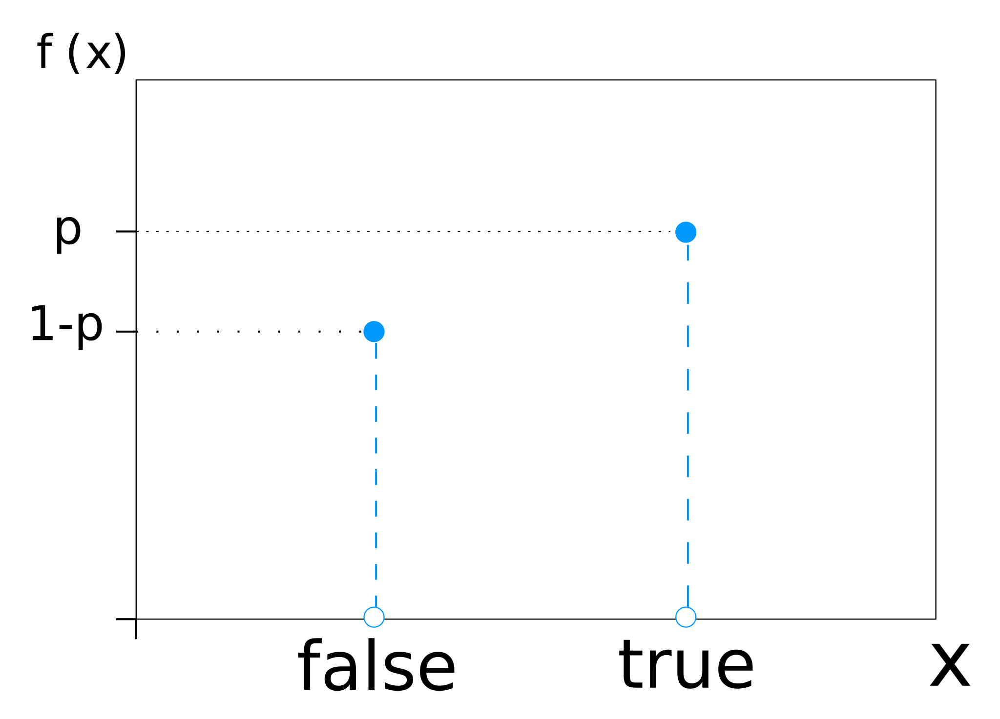

</diagram>

</div>

Note: Generates a result of true (success) with a specified probability, and false (failure) the rest of the time. 
The distribution is memoryless in that each trial has the same chance of success, regardless of
the history of previous results.

---

### Binomial distribution

```cpp
template<class IntType = int>
class binomial_distribution;
```

<div class="distribution">

<formula>

`$$ P(i|t,p) = \binom{t}{i}p^i(1-p)^{t-i} $$`

 </formula>

 <parameters>

|parameter|type|default|
|---------|----|-------|
|`t`|`IntType`|`1`|
|`p`|`double`|`0.5`|

</parameters>

<diagram>

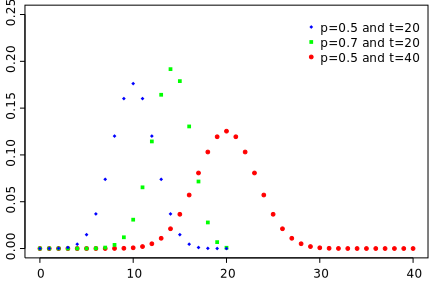

</diagram>

</div>

Note: The value obtained is the number of successes in a sequence of `t` yes/no experiments, each of which succeeds with probability `p`. Notice that Bernoulli distribution is a special case of the binomial distribution, where `t = 1`.
Examples include:
- the number of times that "heads” occurs in a fixed number of coin flips,
- the number of failures of an unreliable mechanical component (as described above) in
a fixed number of uses

---

### Negative Binomial distribution

```cpp
template<class IntType = int>
class negative_binomial_distribution;
```

<div class="distribution">

<formula>

`$$ P(i|k,p) = \binom{k+i-1}{i}p^k(1-p)^i $$`

 </formula>

 <parameters>

|parameter|type|default|
|---------|----|-------|
|`k`|`IntType`|`1`|
|`p`|`double`|`0.5`|

</parameters>

<diagram>


</diagram>

</div>

Note: The value represents the number of failures in a series of independent yes/no trials (each succeeds with probability `p`), before exactly `k` successes occur.
Examples include:
- the number of "tails" observed in a series of coin flips before the observation of the third
"head", and
- the number of successful uses of an unreliable component before the second failure
occurs.

---

### Geometric distribution

```cpp
template<class IntType = int>
class geometric_distribution;
```

<div class="distribution">

<formula>

`$$ P(i|p) = p\cdot(1-p)^i $$`

 </formula>

 <parameters>

|parameter|type|default|
|---------|----|-------|
|`p`|`double`|`0.5`|

</parameters>

<diagram>


</diagram>

</div>

Note: The value represents the number of yes/no trials (each succeeding with probability `p`) which are necessary to obtain a single success. It is exactly equivalent to `std::negative_binomial_distribution<>(1, p)`;
Examples include:
- the number of times a coin is flipped before the first "tail" is found, and
- the number of times an unreliable mechanical component is used before it fails.

----

## Poisson distributions

 <!--.element: style="height: 100%; width: auto" -->

<!-- .element: class="r-stretch" -->

**Independent events** occurring in a **constant mean rate**, in a **fixed interval** of time or space.

Note: 

Named after French mathematician Siméon Denis Poisson.

These distributions are related to Poisson processes. A Poisson process is a random
process such that:
- events happen one at a time, not in batches (i.e., the probability of two events occurring
exactly simultaneously is zero),
- the probability of an event occurring in a given interval is directly proportional to the length
of the interval (the constant of proportionality determines the rate of the process), and
- the rate of the process does not change.

For example, at a uniformly busy call center (i.e., one at which the probability of receiving a call in any
one second is constant over the day), the arrival of calls is a Poisson process.

---

### Poisson distribution

```cpp
template<class IntType = int>
class poisson_distribution;
```

<div class="distribution">

<formula>

`$$ P(i|\mu) = \frac{e^{-\mu} \mu^i}{i!} $$`

 </formula>

 <parameters>

|parameter|type|default|
|---------|----|-------|
|`mean`|`double`|`1.0`|

</parameters>

<diagram>


</diagram>

</div>

Note: The value obtained is the probability of exactly `i` occurrences of a random event if the expected, mean number of its occurrence under the same conditions (on the same time/space interval) is `μ`.
Examples include:
- the number of calls arriving at a uniformly busy call center in any 10 minute interval,
and
- the number of nuclear decays observed in a large radioactive sample in one second.

---

### Exponential distribution

```cpp
template<class RealType = double>
class exponential_distribution;
```

<div class="distribution">

<formula>

`$$ P(x|\lambda) = \lambda e^{-\lambda x} $$`

 </formula>

 <parameters>

|parameter|type|default|
|---------|----|-------|
|`lambda`|`RealType`|`1.0`|

</parameters>

<diagram>


</diagram>

</div>

Note: The value obtained is the time/distance until the next random event if random events occur at constant rate λ per unit of time/distance.
Examples include:
- the time between the arrival of calls at a uniformly busy call center, and
- the time between observations of nuclear decay in a large body of radioactive material.

---

### Gamma distribution

```cpp
template<class RealType = double>
class gamma_distribution;
```

<div class="distribution">

<formula>

`$$ P(x|\alpha,\beta) = \frac{e^{-x/\beta}}{\beta^a\cdot\Gamma(\alpha)}\cdot x^{\alpha-1} $$`

 </formula>

 <parameters>

|parameter|type|default|
|---------|----|-------|
|`alpha`|`RealType`|`1.0`|
|`beta`|`RealType`|`1.0`|

</parameters>

<diagram>

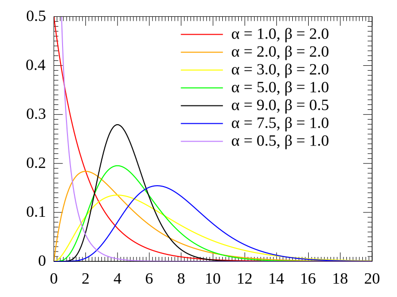

</diagram>

</div>

Note: The value obtained is the sum of `α` independent exponentially distributed random variables, each of which has a mean of `β`. This is a generalization of the exponential distribution.
Examples include:
- the time taken to receive 10 calls at a uniformly busy call center, and
- the time taken observe 1000 nuclear decays in a large body of radioactive material.

---

### Weibull distribution

```cpp
template<class RealType = double>
class weibull_distribution;
```

<div class="distribution">

<formula>

`$$ P(x|a,b) = \frac{a}{b}(\frac{x}{b})^{a-1}e^{-(x/b)^a} $$`

 </formula>

 <parameters>

|parameter|type|default|
|---------|----|-------|
|`a`|`RealType`|`1.0`|
|`b`|`RealType`|`1.0`|

</parameters>

<diagram>

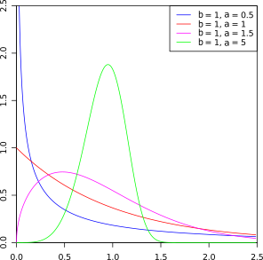

</diagram>

</div>

Note:  If one generates a series of random numbers from the exponential distribution, and raises each number to
some power `a`, the resulting values are distributed according to the Weibull distribution.
Examples include:
- If the cost incurred due to operator idle time between calls at a uniformly busy call
center is proportional to the square of the idle time, then the distribution of costs
follows a Weibull distribution.
- If size of the signal from a detector of radioactive decays is proportional to the square
root of the time between the observation of such decays, then the distribution of signals
from a detector exposed to a large body of radioactive decays will follow the Weibull
distribution.

---

### Extreme value distribution

```cpp
template<class RealType = double>
class extreme_value_distribution;
```

<div class="distribution">

<formula>

`$$ P(x|a,b) = \frac{1}{b}e^{\frac{a-x}{b}-e^{(a-x)/b}} $$`

 </formula>

 <parameters>

|parameter|type|default|
|---------|----|-------|
|`a`|`RealType`|`0.0`|
|`b`|`RealType`|`1.0`|

</parameters>

<diagram>


</diagram>

</div>

Note: AKA Gumbel distribution. If one generates a series of random numbers according to the
Weibull distribution, and takes the logarithm of each number, the resulting values are
distributed according to the extreme value distribution. 
Often used to model the time to failure for a system which
has many competing failure processes.

----

## normal distributions

 <!--.element: style="height: 100%; width: auto" -->

<!-- .element: class="r-stretch" -->

Modeling of quantities that are calculated from measurements containing **errors**.

Note: 

Those distribution, gains their importance from the central limit theorem, which roughly stated, says that
the distribution of the sum of a set of independent random variables tends toward the normal
distribution as the number of variables being summed grows large.

The normal distribution, also called the Gaussian distribution, 
after the German mathematician Johann Carl Friedrich Gauss, or "the bell curve,” is widely
used to model measurement errors, using the argument that the errors in question result from
the accumulation of a large number of small, independent effects.

---

### Normal distribution

```cpp
template<class RealType = double>
class normal_distribution;
```

<div class="distribution">

<formula>

`$$ P(x|\mu,\sigma) = \frac{1}{\sigma\sqrt{2\pi}}e^{-\frac{1}{2}(\frac{x-\mu}{\sigma})^2} $$`

 </formula>

 <parameters>

|parameter|type|default|
|---------|----|-------|
|`mean`|`RealType`|`0.0`|
|`stddev`|`RealType`|`1.0`|

</parameters>

<diagram>

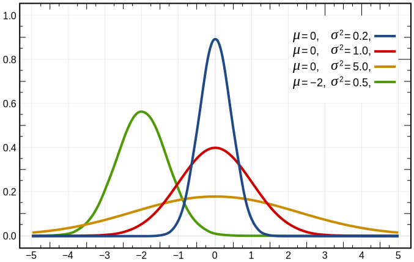

</diagram>

</div>

Note: arguably the single most widely used distribution.
In most fields involving the statistical analysis of data, "random” measurement errors are
frequently modeled as following the normal distribution, often justified by the claim that the
error being modeled is the sum of a large number of independent effects, with an appeal to
the central limit theorem.
In simulations, the normal distribution is often used to add "noise” to a signal, to model
measurement errors in a real system.

---

### Log-normal distribution

```cpp
template<class RealType = double>
class lognormal_distribution;
```

<div class="distribution">

<formula>

`$$ P(x|m,s) = \frac{1}{sx\sqrt{2\pi}}e^{-\frac{(\ln{x}-m)^2}{2s^2}} $$`

 </formula>

 <parameters>

|parameter|type|default|
|---------|----|-------|
|`m`|`RealType`|`0.0`|
|`s`|`RealType`|`1.0`|

</parameters>

<diagram>


</diagram>

</div>

Note: If one generates a series of random numbers generated according to the normal distribution, 
and takes the exponential of each of the generated numbers, the result is distributed
according to the lognormal distribution. 
Where the normal distribution is often used to model additive measurement errors, multiplicative factors 
in a measurement error are often modeled using the lognormal distribution.
Future values of stock prices (in the model most often used) are distributed according to
the lognormal distribution.

---

### Chi-square distribution

```cpp
template<class RealType = double>
class chi_squared_distribution;
```

<div class="distribution">

<formula>

`$$ P(x|n) = \frac{x^{(n/2)-1}e^{-x/2}}{\Gamma(n/2)2^{n/2}} $$`

 </formula>

 <parameters>

|parameter|type|default|
|---------|----|-------|
|`n`|`RealType`|`1.0`|

</parameters>

<diagram>


</diagram>

</div>

Note: This distribution is of central importance to the
statistical analysis of data, and is used to describe the distribution of quality-of-fit parameters.
If one generates tuples of N numbers from N independent standard normal distributions,
then the sum of the N elements of each tuple will be distributed according to the chisquared distribution with parameter N.

---

### Cauchy distribution

```cpp
template<class RealType = double>
class cauchy_distribution;
```

<div class="distribution">

<formula>

`$$ P(x|a,b) = (b\pi[1+\frac{x-a}{b}^2])^{-1} $$`

 </formula>

 <parameters>

|parameter|type|default|
|---------|----|-------|
|`a`|`RealType`|`0.0`|
|`b`|`RealType`|`1.0`|

</parameters>

<diagram>

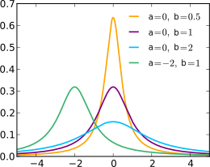

</diagram>

</div>

Note: Also called the Lorentz distribution, or the Breit-Wigner distribution. 
Describes the ratio of two independent standard normal random variables. This
distribution appears frequently in the statistical analysis of data, especially in so-called
“robust” fitting methods.

---

### F-distribution

```cpp
template<class RealType = double>
class fisher_f_distribution;
```

<div class="distribution">

<formula style="font-size: 0.6em">

`$$ P(x|m,n) = \frac{\Gamma\big((m+n)/2\big)
     \cdot \left(\frac{m}{n}\right)^{m/2}
     \cdot x^{(m/2)-1}}{\Gamma(m/2) \; \Gamma(n/2) \left(1 + \frac{m x}{n}\right)^{(m + n)/2}} $$`

 </formula>

 <parameters>

|parameter|type|default|
|---------|----|-------|
|`m`|`RealType`|`1.0`|
|`n`|`RealType`|`1.0`|

</parameters>

<diagram>

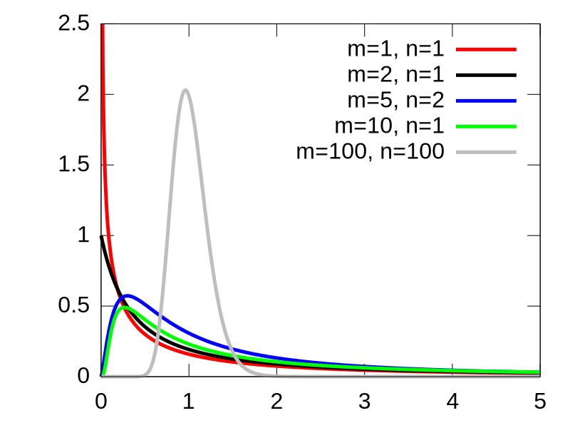

</diagram>

</div>

Note: Used in the analysis of variance, and is thus one of the most important distributions in the 
statistical analysis of data. If one generates a sequence of pairs of random numbers, 
each generated from an independent chi-squared distribution, the ratio of the values in each pair is distributed according
to the F distribution.

---

### Student's t-distribution

```cpp
template<class RealType = double>
class student_t_distribution;
```

<div class="distribution">

<formula>

`$$ P(x|n) = \frac{\Gamma\big((n+1)/2\big)}{\Gamma(n/2)\sqrt{n \pi}\left(1 + \frac{x^2}{n} \right)^{(n+1)/2}} $$`

 </formula>

 <parameters>

|parameter|type|default|
|---------|----|-------|
|`n`|`RealType`|`1.0`|

</parameters>

<diagram>

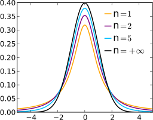

</diagram>

</div>

Note: Appears in the analysis of the mean of a sample of data generated according to the normal distribution.
If one generates a sequence of pairs of numbers, the first element from a standard normal distribution and the second element from a chi-squared distribution, the value of the ratios of the pairs is generated according to the t distribution.

----

## Sampling distributions

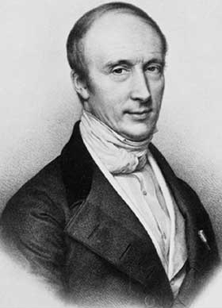 <!--.element: style="height: 100%; width: auto" -->

<!-- .element: class="r-stretch" -->

Efficient generation of random numbers of a predefined shape.

Note: One of the normal distributions is named after Augustin-Louis Cauchy.

The final family differs from the others in one respect: its members are not based upon an
underlying, fundamental random process. Rather, they are methods of specifying a distribution of 
(almost) arbitrary shape, in a fashion that allows for efficient generation of random numbers 
according to that distribution.

---

### Discrete distribution

```cpp
template<class IntType = int>
class discrete_distribution;
```

<div class="distribution">

<formula>

`$$ P(i \,|\, p_0, \dotsc, p_{n-1}) = p_i $$`

 </formula>

 <parameters>

|parameter|type|default|
|---------|----|-------|
|`probabilities`|`std::vector<double>`|`{1.0}`|

<!-- .element:  style="font-size: 0.4em" -->

</parameters>

<diagram>


</diagram>

</div>

Note: A generalization of `uniform_int_distribution`

---

### Piecewise constant distribution

```cpp
template<class RealType = double>
class piecewise_constant_distribution;
```

<div class="distribution">

<formula>

`$$ p(x \,|\, b_0, \dotsc, b_n, \; \rho_0, \dotsc, \rho_{n-1}) = \rho_i $$`
`$$ \text{for $b_i \le x < b_{i+1}$} $$`

 </formula>

 <parameters>

|parameter|type|default|
|---------|----|-------|
|`intervals`|`std::vector<RealType>`|`{0, 1}`|
|`densities`|`std::vector<RealType>`|`{1}`|

<!-- .element:  style="font-size: 0.4em" -->

</parameters>

<diagram>


</diagram>

</div>

Note: A generalization of `uniform_real_distribution`

---

### Piecewise linear distribution

```cpp
template<class RealType = double>
class piecewise_linear_distribution;
```

<div class="distribution">

<formula>

`$$ p(x \,|\, b_0, \dotsc, b_n, \; \rho_0, \dotsc, \rho_n) = $$` 
`$$ \rho_{i} \cdot {\frac{b_{i+1} - x}{b_{i+1} - b_i}} + \rho_{i+1} \cdot {\frac{x - b_i}{b_{i+1} - b_i}} $$`
`$$ \text{for $b_i \le x < b_{i+1}$} $$`

 </formula>

 <parameters>

|parameter|type|default|
|---------|----|-------|
|`intervals`|`std::vector<RealType>`|`{0, 1}`|
|`densities`|`std::vector<RealType>`|`{1}`|

<!-- .element:  style="font-size: 0.4em" -->

</parameters>

<diagram>

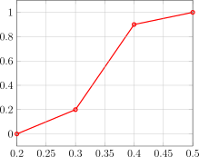

</diagram>

</div>

Note: A generalization of `piecewise_constant_distribution`

----

## example

```cpp
///external
///compiler=g102
///options+=-std=c++2a
///hide
#include <algorithm>
#include <cmath>
#include <iomanip>
#include <iostream>
#include <map>
#include <random>
#include <vector>

template <int Height = 8, int BarWidth = 5, int Padding = 1, int Offset = 0,
          bool DrawMinMax = true, class Hist>
void draw_vbars(const char* name, Hist const& hist, const int norm) {
    const float cutoff = 0.002f;
    static_assert((Height > 0) && (BarWidth > 0) && (Padding >= 0) && (Offset >= 0));
    auto cout_n = [](auto const& v, int n) { while (n-- > 0) std::cout << v; };

    std::vector<float> bars;
    std::vector<int> indices;
    for (const auto [n, p] : hist) {
        if (float x = p * (1.0/norm); cutoff < x) {
            bars.push_back(x);
            indices.push_back(n);
        }
    }

    const auto [min, max] = std::minmax_element(std::cbegin(bars), std::cend(bars));
    std::vector<std::div_t> qr;
    for (float e : bars) {
        qr.push_back(std::div(std::lerp(0.f, Height*8, (e - *min)/(*max - *min)), 8));
    }

    std::cout << name << ":\n";
    for (auto h{Height}; h-- > 0 ;) {
        cout_n(' ', Offset);
        for (auto [q, r] : qr) {
            char d[] = "█"; // == { 0xe2, 0x96, 0x88, 0 }
            q < h ? d[0] = ' ', d[1] = '\0' : q == h ? d[2] -= (7 - r) : 0;
            cout_n(d, BarWidth);
            cout_n(' ', Padding);
        }
        if (DrawMinMax && Height > 1)
            h == Height - 1 ? std::cout << "┬ " << *max:
                     h != 0 ? std::cout << "│"
                            : std::cout << "┴ " << *min;
        cout_n('\n', 1);
    }
    for (int n : indices) { std::cout << " " << std::setw(2) << n << "   "; }
        cout_n('\n', 2);
}

///unhide
template<typename Engine, typename Distribution>
void generate_and_draw(Engine& gen, Distribution&& d, const char* name) {
    const int norm = 1'00'00;
    std::map<int, int> hist{};
    for (int n=0; n!=norm; ++n) { ++hist[std::round(d(gen))]; }
    draw_vbars(name, hist, norm);
}

///hide
int main() {
///unhide
std::mt19937 gen;
generate_and_draw(gen, std::normal_distribution<>{5,2}, "Normal");
generate_and_draw(gen, std::uniform_real_distribution<>{1.0, 7.0}, "Uniform");
generate_and_draw(gen, std::binomial_distribution<>{4, 0.5}, "Binomial");
generate_and_draw(gen, std::fisher_f_distribution<float>{1.0f, 5.0f}, "Fisher F");
///hide
}
```

<!-- .element: style="font-size: 0.4em" -->

---

## canonical distribution

```cpp
///hide
#include <cstddef>

///unhide
template< class RealType, size_t bits, class Generator >
RealType generate_canonical( Generator& g );
```

Generates a random floating point number in the range `[0, 1)` with a predefined bits of entropy.

---

## a building block

Used to implement other distributions, e.g.

```cpp
///hide
#include <cstddef>
#include <limits>

template<class RealType = double>
class uniform_real_distribution {
  template<typename URNG>
  RealType operator()(URNG& g);

  RealType a();
  RealType b();
};

template<class RealType, size_t bits, class Generator>
RealType generate_canonical(Generator& g);

///unhide
template<class RealType>
template<typename URNG>
RealType uniform_real_distribution<RealType>::operator()(URNG& g)
{
  constexpr auto bits = std::numeric_limits<RealType>::digits;
  return (b() - a()) * generate_canonical<RealType, bits>(g) + a();
}
```

----

<!-- .slide: data-background-image="sid.gif" -->

## Seeds

<!-- .element: class="chapter" -->

Note: Random number generation always starts with one or more seeds, which represent the initial input to the calculation that produces the random numbers. The seeds determine the initial state of a random number generator and determine the entire sequence. The number of bits in a seed is significant. With a 1-byte seed, you only have 255 possible values, so you can only produce a maximum of 255 different sequences. To maximize the entropy of a random sequence, you need two things: you need a seed value that is truly random – not pseudo-random, and you need the range of possible values for the seed to be large.

---

<!-- .slide: data-auto-animate -->

## `std::random_device`

```cpp
///hide
#include <random>
#include <iostream>

int main() {
///unhide
std::random_device rd;

std::cout << "rd's range is [" 
          << rd.min() << "," 
          << rd.max() << "]\n";

std::cout << "rd's entropy is " << rd.entropy() << '\n';

std::cout << "generated " << rd() << '\n';
///hide
}
```

<!-- .element: data-id="code" -->

Note: Using the OS to gen nondeterministic number from sources such as the times between successive keyboard keystrokes, or intervals between mouse clicks, or the current clock time.

---

<!-- .slide: data-auto-animate -->

## specifying source 

```cpp
///hide
///external
#include <random>
#include <iostream>

int main() {
///unhide
std::random_device rd{"/dev/random"};

std::cout << "rd's range is [" 
          << rd.min() << "," 
          << rd.max() << "]\n";

std::cout << "rd's entropy is " << rd.entropy() << '\n';

std::cout << "generated " << rd() << '\n';
///hide
}
```

<!-- .element: data-id="code" -->

Note: Differs between implementations. Some of `libstdc++` sources are `rdseed` and `dev/urandom`. Might fall back to a pseudo RNG if no source is available.

---

## seeding a pseudo RNG

```cpp
///hide
///external
#include <random>
#include <iostream>

int main() {
///unhide
std::random_device rd;
std::mt19937 gen{rd()};

std::cout << "generated " << gen() << '\n';
///hide
}
```

Note: As we saw, `mt19937`'s state is 624 words, so seeding it with a 32-bit value limits the possible entropy.

---

## `std::seed_seq`

```cpp [1|3-4]
///hide
#include <random>
#include <vector>
#include <iostream>

int main()
{
///unhide
std::seed_seq seq{1,2,3,4,5};

std::vector<std::uint32_t> seeds(10);
seq.generate(seeds.begin(), seeds.end());

for (std::uint32_t n : seeds) {
  std::cout << n << '\n';
}
///hide
}
```

Note: It consumes a sequence of integer-valued data and produces a requested number of unsigned integer values, based on the consumed data. The produced values are distributed over the entire 32-bit range even if the consumed values are close.
It provides a way to seed a large number of random number engines or to seed a generator that requires a lot of entropy, given a small seed or a poorly distributed initial seed sequence.

---

## initializing RNG

```cpp
///hide
#include <random>
#include <vector>
#include <iostream>

int main()
{
///unhide
std::random_device rd;
std::seed_seq seq{rd(), rd()};
std::mt19937_64{seq};
///hide
}
```

Note: the RNG calls `generate` to initialize its internal state

---

## querying params

```cpp [1-3|5-7]
///hide
#include <random>
#include <iostream>
#include <iterator>
#include <sstream>

int main()
{
///unhide
std::stringstream sst{"-1 0 1"};
std::seed_seq s1(std::istream_iterator<uint32_t>{sst}, 
                 std::istream_iterator<uint32_t>{});

std::cout << "size: " << s1.size() << '\n';
s1.param(std::ostream_iterator<int>(std::cout, " "));
std::cout << '\n';
///hide
}
```

----

## random algorithms

```cpp [4-11]
///options+=-std=c++17
///hide
#include <random>
#include <algorithm>
#include <iterator>
#include <iostream>
 
int main()
{
///unhide
std::vector<int> v = {1, 2, 3, 4, 5, 6, 7, 8, 9, 10};

std::random_device rd;
std::mt19937 g(rd());

std::shuffle(v.begin(), v.end(), g);

std::sample(v.begin(), v.end(), 
            std::ostream_iterator<int>(std::cout, " "), 
            5,
            g);
std::cout << "\n";
///hide
}
```

Note: a new algorithm for shuffling random access ranges. deprecates `std::random_shuffle` which used `std::rand`.

---

## possible implementation

```cpp [8-13]
///hide
#include <iterator>
#include <random>

///unhide
template<class RandomIt, class URBG>
void shuffle(RandomIt first, RandomIt last, URBG&& g)
{
  typedef typename std::iterator_traits<RandomIt>::difference_type diff_t;
  typedef std::uniform_int_distribution<diff_t> distr_t;
  typedef typename distr_t::param_type param_t;

  distr_t D;
  diff_t n = last - first;
  for (diff_t i = n-1; i > 0; --i) {
    using std::swap;
    swap(first[i], first[D(g, param_t(0, i))]);
  }
}
```

<!-- .element: style="font-size: 0.4em" -->

Note: the actual implementation is not standardized so different platform might order the range differently.

----

<!-- .slide: data-background-image="perfect.gif" -->

## make it better

<!-- .element: class="chapter" -->

Note: Despite its reach interface and modularity there are some pain points in the current design of
the random library. Let's discuss some of them.

---

> To the extent that anyone cares about C++11’s random-number facility at all, the C++
> community is polarized between two views. ...
> 
> - It’s amazingly elegant, a shining example of separation of concerns [with] a pluggable and extensible architecture [that’s] comprehensive and flexible.
> 
> - It’s horrible to use, ... unnecessarily overengineered. ... It’s completely unsuitable
> for beginners, and even seasoned programmers hate it.
>
> Both camps are right
>
> <cite>Melissa E. O'Neill</cite>

<!-- .element: style="font-size: 0.7em" -->

---

## `std::rand` replacement

```cpp
///hide
#include <cstdlib>
#include <ctime>

///unhide
int roll_a_pretty_fair_die( ) {
  return 1 + std::rand() % 6;
}
```

vs. 

```cpp
///hide
#include <random>

///unhide
int roll_a_fair_die( ) {
  static std::default_random_engine e;
  static std::uniform_int_distribution<int> d{1, 6};
  return d(e);
}
```

---

## `std::randint`

```cpp
///hide
#include <algorithm>
#include <vector>
#include <random>

namespace std {
  template <typename IntType>
  inline IntType randint(IntType a, IntType b);
  
  template<typename It>
  void shuffle(It from, It to);

  void reseed();
  void reseed(std::default_random_engine::result_type value);
}

void foo() {
std::vector<int> v;
///unhide
std::randint(0, 6);              // randomly seeded
std::randint(0L, 6L);            // deduced type
std::randint<size_t>(0, 6);      // selected type

std::reseed(0);                  // for debugging purpose
std::shuffle(std::begin(v), std::end(v));
std::reseed();                   // back to random
///hide
}
```

Source: [N4531](wg21.link/n4531), Zhihao Yuan

<!-- .element: class="footnote" -->

---

## another approach

```cpp
///options+=-std=c++17 -Wno-unused-but-set-variable
///hide
#include <random>
#include <string_view>

namespace std {
class mt19937_rng {
public:
  template <class Numeric>
  Numeric uniform(Numeric lower, Numeric upper);

  template<typename T>
  T pick(std::initializer_list<T>);

  template <class DistType>
  typename DistType::result_type variate(DistType&& dist);
};
} // namespace std

void foo()
{
///unhide
std::mt19937_rng rng; // nondeterministically seeded, 
                      // convenience typedef for 
                      // std::random_generator<std::mt19937>
int i    = rng.uniform(1, 17); // uniform integer in [1, 17]
double d = rng.uniform(3.1, 3.2); // uniform real in [3.1, 3.2)
std::string_view str = rng.pick({"welcome",
          "look forward to synergizing with",
          "will resist",
          "are apathetic towards"});
d = rng.variate(std::normal_distribution<>(70.0, 10.0));
///hide
}
```

<!-- .element: style="font-size: 0.5em" -->

Source: [P0347](wg21.link/p0347), R. "Tim" Song, Melissa O'Neill

<!-- .element: class="footnote" -->

Note: This proposal suggests generator wrappers with default seeding and convinence member functions

---

## fully random seed

```cpp []
///hide
#include <random>
#include <array>
#include <algorithm>
#include <functional>

///unhide
template <typename EngineT, std::size_t StateSize = EngineT::state_size>
void seed_non_deterministically(EngineT& engine)
{
  using engine_type = typename EngineT::result_type;
  using device_type = std::random_device::result_type;
  using seedseq_type = std::seed_seq::result_type;
  constexpr auto bytes_needed = StateSize * sizeof(engine_type);
  constexpr auto numbers_needed = (sizeof(device_type) < sizeof(seedseq_type))
    ? (bytes_needed / sizeof(device_type))
    : (bytes_needed / sizeof(seedseq_type));
  std::array<device_type, numbers_needed> numbers {};
  std::random_device rnddev {};
  std::generate(std::begin(numbers), std::end(numbers), std::ref(rnddev));
  std::seed_seq seedseq(std::cbegin(numbers), std::cend(numbers));
  engine.seed(seedseq);
}
```

<!-- .element: style="font-size: 0.4em" -->

---

## simplified

```cpp
///hide
#include <random>

///unhide
template <typename EngineT>
void seed_non_deterministically(EngineT& engine)
{
  std::random_device rnddev{};
  engine.seed(rnddev);
}
```

<div class="footnotes">

Sources:
- [P0205](wg21.link/p0205), Moritz Klammler
- [P2060](wg21.link/p2060), Martin Hořeňovský

</div>

---

## even more

- Adding modern generators: [P1932](wg21.link/p1932), Pavel Dyakov et al.
- Range API for generating multiple variates: [P1068](wg21.link/p1068), Pavel Dyakov et al.
- [PCG](https://www.pcg-random.org/), A Family of Better Random Number Generators, Melissa O'Neill

----

<!-- .slide: data-background-image="thanks.gif" -->

## thank you

<!-- .element: class="chapter" -->