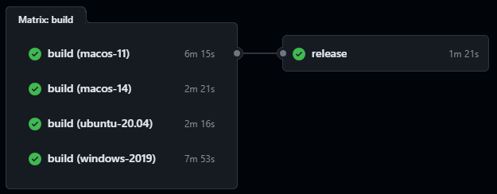

---
css:
  - node_modules/github-fork-ribbon-css/gh-fork-ribbon.css
  - css/custom.css
  - css/animations.css
  - slides/modern-js-addons/modern-js-addons.css
scripts:
  - node_modules/jquery/dist/jquery.min.js
  - scripts/customize.js
  - node_modules/reveal-compiler-explorer/dist/reveal-compiler-explorer.js
  - plugins/embed-code/embed-code.js
  - scripts/load-plugins.js
  - scripts/custom-options.js
---

### Modern C++ addons for node.js


<!-- .element: class="r-stretch" -->

Dvir Yitzchaki

---

<!-- .slide: data-background-image="assets/parquet-viewer.png" data-background-size="contain" -->

----


```ts
import { createServer, IncomingMessage, ServerResponse } from 'http';

const server = createServer((req: IncomingMessage, res: ServerResponse) => {
  res.writeHead(200, { 'Content-Type': 'text/plain' });
  res.end('Hello World!\n');
});

// starts a simple http server locally on port 3000
server.listen(3000, '127.0.0.1', () => {
  console.log('Listening on 127.0.0.1:3000');
});
```

<!-- .element: style="font-size: 0.45em" -->

Notes:

Node.js, created in 2008 by Ryan Dahl, is a runtime environment that allows developers to build network applications using JavaScript. It is based on the V8 JavaScript engine, which is the same engine used by Google Chrome. Node.js provides an event-driven, non-blocking I/O model, making it suited for handling concurrent requests and real-time applications.

Node.js is commonly used for building web servers, APIs, and even desktop applications, as we'll see today. It has a rich ecosystem of modules, libraries and frameworks that can be used to extend its functionality.

We will use Typescript, a superset of JavaScript that adds static typing and other features, to write our code examples.

---


- Cross-platform framework for building desktop apps with web technologies.
- Leverages HTML, CSS, and JavaScript for native-like user interfaces.
- Access to Node.js modules and vibrant community support.

Notes:

Electron is a framework that allows developers to build cross-platform desktop applications using web technologies such as HTML, CSS, and JavaScript. It was initially developed by GitHub and has gained significant popularity due to its ease of use and powerful capabilities. Electron leverages the Chromium rendering engine and Node.js runtime.

One of the most famous applications built with Electron is Visual Studio Code, which both this presentation and the demo are built with.

---

### Electron process model


Notes: 

Each Electron app has a single main process, which acts as the application's entry point. The main process runs in a Node.js environment, meaning it has the ability to require modules and use all of Node.js APIs.

The main process' primary purpose is to create and manage application windows, control the application's lifecycle and interact with the operating system. 

Each application window loads a web page in a separate renderer process. The rendered process, by default,
does not have access to Node.js APIs for security reasons, and needs to communicate with the main process via IPC (Inter-Process Communication) to perform tasks that require access to the file system, network, or other system resources.

---

<!-- .slide: data-transition="slide-in fade-out" -->

`index.html`

<pre class="r-stretch"><code data-url="electron-calendar/src/index.html" class="language-html" data-line-numbers=|13-20|22-23></code></pre>

---

<!-- .slide: data-transition="fade-in slide-out" -->

<iframe src="electron-calendar/src/index.html" class="r-stretch" style="background-color: aliceblue; width: 600px"></iframe>

---

`main.ts`

<pre class="r-stretch"><code data-url="electron-calendar/src/main.ts" class="language-typescript" data-line-numbers="16-28|33,37-38"></code></pre>

---

`renderer.ts`

<pre class="r-stretch"><code data-url="electron-calendar/src/renderer.ts" class="language-typescript" data-line-numbers="32-42"></code></pre>

---

`preload.ts`

<pre class="r-stretch"><code data-url="electron-calendar/src/preload.ts" class="language-typescript" data-line-numbers="5-13"></code></pre>

---

`main.ts`

<pre class="r-stretch"><code data-url="electron-calendar/src/main.ts" class="language-typescript" data-line-numbers="34-36"></code></pre>

---

<!-- .slide: data-background-image="assets/ACCU_2023.png" data-background-size="contain" -->

----

## Node.js Addons

- shared libraries loaded by node.js
- can be imported like node.js modules
- [Node-API](https://nodejs.org/api/n-api.html) C API
- [node-addon-api](https://github.com/nodejs/node-addon-api) C++ header only API

Notes:

Addons are dynamically-linked shared objects that can be loaded into Node.js like JavaScript modules. 

Node-API (formerly N-API) is an API for building native Addons. Unlike older APIs (like nan), it is independent from the underlying JavaScript runtime (for example, V8) and is maintained as part of Node.js itself. This API will be Application Binary Interface (ABI) stable across versions of Node.js. 

There's also other, unofficial, bindings for other languages like rust, swift and zig.

---

## building a C++ addon

- `node-gyp`
- `CMake.js`

Notes:

node-gyp is the official build system from the Node.js org. It is based on the chromium build system, written in Python and is wide and has widespread adoption and documentation. 

However, for C++ developers, it might be more convenient to use CMake, which is a more modern and powerful build system that is widely used in the C++ community.
For that, we can use CMake.js, which is a CMake wrapper integrating with the Node.js ecosystem.

Both tools require a C++ toolchain to be installed on the system. For node-gyp, Python is required and for CMake.js, CMake is required.

---


<!-- .element: class="r-stretch" -->

```bash
pipenv install cmake
pipenv run cmake
```

Notes:

Pipenv is a tool that automatically creates and manages virtual Python environments. It's main advantages here is the ability to run installed pyton packages simply with the `pipenv run`command.

---

`Pipfile`

<pre class="r-stretch"><code data-url="electron-calendar/packages/calendar-generator/Pipfile" class="language-ini" data-line-numbers="|7"></code></pre>


---

`package.json`

<pre class="r-stretch"><code data-url="electron-calendar/packages/calendar-generator/package.json" class="language-json" data-line-numbers="16-17,19-21|11-12|5-9"></code></pre>

---

## Node-Api version [matrix](https://nodejs.org/api/n-api.html#node-api-version-matrix)

<table style="font-size: 0.8em" -->
  <tr>
    <th>Node-API version</th>
    <th scope="col">Supported In</th>
  </tr>
  <tr>
    <th scope="row">9</th>
    <td>v18.17.0+, 20.3.0+, 21.0.0 and all later versions</td>
  </tr>
  <tr>
    <th scope="row">8</th>
    <td>v12.22.0+, v14.17.0+, v15.12.0+, 16.0.0 and all later versions</td>
  </tr>
  <tr>
    <th scope="row">7</th>
    <td>v10.23.0+, v12.19.0+, v14.12.0+, 15.0.0 and all later versions</td>
  </tr>
  <tr>
    <th scope="row">6</th>
    <td>v10.20.0+, v12.17.0+, 14.0.0 and all later versions</td>
  </tr>
</table>

---

`.npmrc`

<pre class="r-stretch"><code data-url="assets/npmrc" class="language-ini" data-line-numbers="12-14"></code></pre>

---

`CMakeLists.txt`

<pre class="r-stretch"><code data-url="electron-calendar/packages/calendar-generator/src/cpp/CMakeLists.txt" class="language-cmake" data-line-numbers="1-3|5-24|39-47"></code></pre>

---

`inteface.cpp`

<pre class="r-stretch"><code data-url="electron-calendar/packages/calendar-generator/src/cpp/interface.cpp" class="language-cpp" data-line-numbers="1|37-44|9-23|25-34|7"></code></pre>

---

`calendar.cxx`

<pre class="r-stretch"><code data-url="electron-calendar/packages/calendar-generator/src/cpp/calendar.cxx" class="language-cpp" data-line-numbers="1-11|81-83|166-179|113-124"></code></pre>

---

`concat.cxx`

<pre class="r-stretch"><code data-url="electron-calendar/packages/calendar-generator/src/cpp/concat.cxx" class="language-cpp" data-line-numbers="1-7|37-41"></code></pre>

---


```bash
pipenv install conan
```

Notes: 

Conan is a C++ package manager that allows developers to easily manage dependencies and build artifacts for C++ projects. It is widely used in the C++ community and integrates with many build systems and package managers.

---

`.npmrc`

<pre class="r-stretch"><code data-url="assets/npmrc" class="language-ini" data-line-numbers="15"></code></pre>

<!-- .element: style="font-size: 0.45em" -->

https://github.com/conan-io/cmake-conan

---

`CMakeLists.txt`

<pre class="r-stretch"><code data-url="electron-calendar/packages/calendar-generator/src/cpp/CMakeLists.txt" class="language-cmake" data-line-numbers="29-37,50"></code></pre>

---

## demo

----

## deployment

- `node-pre-gyp`
- `prebuild`
- `prebuildify`
- `pkg-prebuilds`

Notes:

`node-pre-gyp` is a tool based on node-gyp that adds the ability to upload binaries to a server of the developer's choice. node-pre-gyp has particularly good support for uploading binaries to Amazon S3.

`prebuild` is a tool that supports builds using either node-gyp or CMake.js. Unlike node-pre-gyp which supports a variety of servers, `prebuild` uploads binaries only to GitHub releases. `prebuild` is a good choice for GitHub projects using CMake.js.

`prebuildify` is a tool based on node-gyp. The advantage of `prebuildify` is that the built binaries are bundled with the native addon when it's uploaded to npm. The binaries are downloaded from npm and are immediately available to the module user when the native addon is installed.

`pkg-prebuild` is built to support cmake-js and be simple.

---

`binding-options.ts`

<pre><code data-url="electron-calendar/packages/calendar-generator/src/ts/binding-options.ts" class="language-typescript" data-line-numbers=""></code></pre>

---

`package.json`

<pre class="r-stretch"><code data-url="electron-calendar/packages/calendar-generator/package.json" class="language-json" data-line-numbers="12"></code></pre>

---

`CMakeLists.txt`

<pre class="r-stretch"><code data-url="electron-calendar/packages/calendar-generator/src/cpp/CMakeLists.txt" class="language-cmake" data-line-numbers="52-55"></code></pre>

---

`interface.ts`

<pre><code data-url="electron-calendar/packages/calendar-generator/src/ts/interface.ts" class="language-typescript" data-line-numbers=""></code></pre>

---

## GitHub actions



---

## GitHub actions

<pre><code data-url="https://raw.githubusercontent.com/dvirtz/vscode-parquet-viewer/c109a1dcb7a12b88ab9e3eaee628c7fb4c83a010/.github/workflows/main.yml" class="language-yaml" data-line-numbers="59-65|117-120"></code></pre>

----

<!-- .slide: data-background-image="assets/thank_you.png" data-background-size="contain" -->

