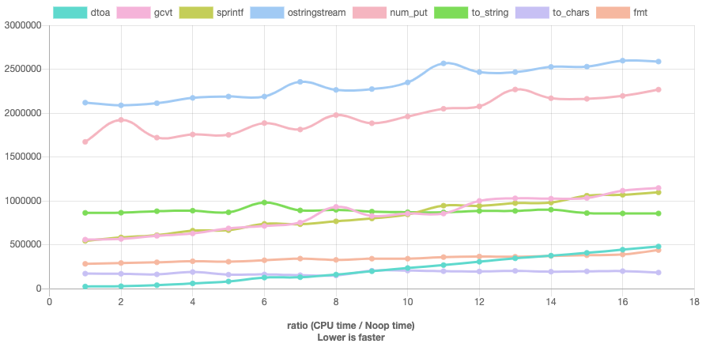
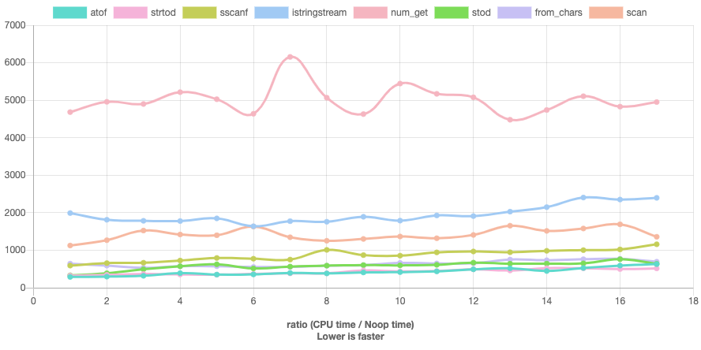
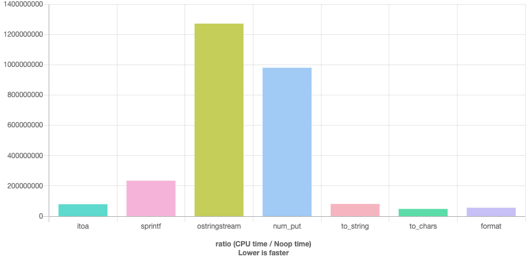
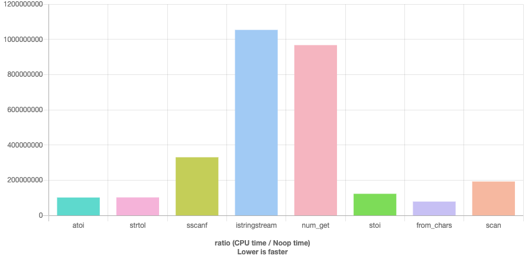

---
scripts:
  - node_modules/jquery/dist/jquery.min.js
  - scripts/customize.js
  - node_modules/reveal-compiler-explorer/dist/reveal-compiler-explorer.js
  - scripts/load-plugins.js
  - scripts/twitter-widgets.js
  - scripts/custom-options.js
css:
  - node_modules/github-fork-ribbon-css/gh-fork-ribbon.css
  - css/custom.css
  - css/animations.css
  - slides/number-string-core-cpp/number-string.css
revealOptions:
  compilerExplorer:
    useLocal: true
    compiler: g111
    options: '-std=c++20 -O2 -march=haswell -Wall -Wextra -pedantic -Wno-unused-variable -Wno-unused-parameter'
---

<!-- .slide: data-background-image="conf.png" data-background-size="contain" data-background-color="white" -->

<div class="r-stretch" style="display: flex; flex-direction: column;">

<div style="flex: 4;"></div>

<div style="flex: 2;">

The Many Faces of 

## Number ⟷ String Conversions

</div>

<div style="flex: 1;"></div>

<div style="flex: 1;">

Dvir Yitzchaki

</div>

</div>

----

## the task

Implement a function that gets two decimal numbers as strings, adds them and returns the result as a string

```cpp
///hide
struct String {};
///unhide
String add(String, String);
```

Note: the implementation should let the caller choose the type of numbers to use (`int`, `float`, etc.)

----

<!-- .slide: data-background-image="bird1.png" data-background-size="auto" data-background-position="5% 70%" -->

<blockquote class="twitter-tweet" data-align="center"><p lang="en" dir="ltr">`std::atoi` generates a number from a string.<br><br>`std::iota` generates a string of numbers.<br><br>🤯</p>&mdash; Vector of Bool - 🌻 (@vector_of_bool) <a href="https://twitter.com/vector_of_bool/status/1173752717837139969?ref_src=twsrc%5Etfw">September 17, 2019</a></blockquote>

Note: Dennis Ritchie and Brian Kernighan published the first `C` manual which is commonly known as K&R in 1978. The first edition contained a function for converting character arrays to integers called `atoi` (not really related to `iota` which is a C++11 algorithm)

---

## `atoi`

```c []
///hide
#if 1
int atoi(char s[])
#else
///unhide
atoi() /* convert s to integer */
char s[];
///hide
#endif
///unhide
{
    int i, n, sign;
    for (i = 0; s[i]==' ' || s[i]=='\n' || s[i]=='\t'; i++)
      ; /* skip white space */
    sign = 1;
    if (s[i] == '+' || s[i] == '-')  /* sign */
        sign = (s[i++]=='+') ? 1 : -1;
    for (n = 0; s[i] >= '0' && s[i] <= '9'; i++)
        n = 10 * n + s[i] - '0';
    return(sign * n);
}
```

<!-- .element: style="font-size: 0.5em" -->

Source: [K&R, 1st Ed.](https://archive.org/details/cprogramminglang00kern) 

<!-- .element: class="footnote" -->

Note: This is the implementation as written in the 1st edition of K&R. Note that the parameters were written after the parentheses and the return type was not written at all. The implementation is pretty strait forward.

 - skip white space
 - check sign
 - on each step, multiply by 10 and add the next digit

---

## `atoi`

```c []
///hide
#include <ctype.h>

///unhide
int atoi(const char *s)
{
  int n=0, neg=0;
  while (isspace(*s)) s++;
  switch (*s) {
  case '-': neg=1;
  case '+': s++;
  }
  /* Compute n as a negative number */
    /* to avoid overflow on INT_MIN */
  while (isdigit(*s))
    n = 10*n - (*s++ - '0');
  return neg ? n : -n;
}
```

Source: [musl](https://git.musl-libc.org/cgit/musl/tree/src/stdlib/atoi.c) 

<!-- .element: class="footnote" -->

Note: this is the implementation from modern `musl` c library. as you can see it's pretty much the same. 

---

## `atof`

```c [|11-17]
///hide
#include <ctype.h>

///unhide
/* atof:  convert string s to double */
double atof(char s[])
{
  double val, power;
  int i, sign;
  for (i = 0; isspace(s[i]); i++)  /* skip white space */
      ;
  sign = (s[i] == '-') ? -1 : 1;
  if (s[i] == '+' || s[i] == '-')
      i++;
  for (val = 0.0; isdigit(s[i]); i++)
      val = 10.0 * val + (s[i] - '0');
  if (s[i] == '.')
      i++;
  for (power = 1.0; isdigit(s[i]); i++) {
      val = 10.0 * val + (s[i] - '0');
      power *= 10.0;
  }
  return sign * val / power;
}
```

Source: [K&R, 2nd Ed.](https://archive.org/details/cprogramminglang00bria) 

<!-- .element: class="footnote" -->

Note: Here is the implementation of `atof` (which despite the name, returns a double!) from the 2nd edition of K&R. As can be seen, it's based on the same algorithm, only calculating the integral and fractional part separately. It was not until C99, that this function got support for hexadecimal floating-point, INFs and NANs.

<!-- .element: class="footnote" -->

---

<h2><code>ato<span style="color: #fdd7be">Y</span></code></h2>

```c
long      atol  ( const char* str );
int       atoi  ( const char* str );
long long atoll ( const char* str );    // C99

double atof( const char* str );
```

Note: These are the "overloads" of array to number currently in the C standard. Note that there are no unsigned versions.

---

## `itoa`

```c []
///hide
#include <string.h>

void reverse(char s[])
{
    int c, i, j;

    for (i = 0, j = strlen(s)-1; i < j; i++, j--) {
        c = s[i];
        s[i] = s[j];
        s[j] = c;
    }
}

#if 0
///unhide
itoa(n, s) /* convert `s` to integer */
char s [];
int n;
///hide
#else
void itoa(int n, char s[])
#endif
///unhide
{
  int i, sign;
  
  if ((sign = n) < 0) /* record sign */
    n = -n;           /* make n positive */
  i = 0;
  do {    /* generate digits in reverse order */
    s[i++] = n % 10 + '0';  /* get next digit */
  } while ((n /= 10) > 0); /* delete it */
  if (sign < 0)
    s[i++] = '-';
  s[i] = '\0';
  reverse(s);
}
```

<!-- .element: style="font-size: 0.4em" -->

Source: [K&R, 1st Ed.](https://archive.org/details/cprogramminglang00kern) 

Note: K&R also had the opposite function, called `itoa` (again, don't confuse with `iota`). For some reason, it was not added to the C standard but is provided by Microsoft's CRT and some other C libraries. glibc has it as an implementation detail.
This algorithm generates the digits in reverse order and then reverses the result.

---

<h2><code><span style="color: #bee4fd">X</span>to<span style="color: #fdd7be">Y</span></code></h2>

```c
///hide
#include <stdlib.h>

void itoa(int, char*);
void ftoa(double, char*, int);

///unhide
void addi(const char* lhs, const char* rhs, char* result) {
  const int l = atoi(lhs);
  const int r = atoi(rhs);
  itoa(l + r, result);
}

void addf(const char* lhs, const char* rhs, char* result, 
          int precision) {
  const double l = atof(lhs);
  const double r = atof(rhs);
  ftoa(l + r, result, precision);
}
```

Note: here is the implementation of our task using `Xtoa` and `atoY` functions. We should write a different implementation for each type of number as the functions are named differently. The floating point version also allows the caller to set the desired precision.
Besides the necessary repetition, the code is as clean and readable as can be.

---

## error handling

- string ⟶ number
  - no conversion possible
  - out of range
- number ⟶ string
  - buffer overflow
- invalid arguments

Note: when converting between strings and numbers those are the typical errors we're likely to encounter. we will examine how the different methods help us avoid or at least be notified about those errors.

---

## no error handling

```c
///hide
#include <assert.h>
#include <stdlib.h>

int main() {
///unhide
assert(atoi("junk") == 0);
int undefined = atoi("2147483648");
///hide
}
```

Note: unfortunately, the `atoX` methods don't provide any error handling. there's no way to tell a wrong result from a valid one.

---

<h2><code><span style="color: #bee4fd">X</span>to<span style="color: #fdd7be">Y</span></code></h2>

- <!-- .element: class="pro" --> simple and intuitive API
- <!-- .element: class="pro" --> efficient
- <!-- .element: class="con" --> undefined value on overflow
- <!-- .element: class="con" --> no error handling
- <!-- .element: class="con" --> not customizable
- <!-- .element: class="con" --> unknown end
- <!-- .element: class="con" --> <code>itoa</code> / <code>ftoa</code> non standard

----

<!-- .slide: data-background-image="bird2.png" data-background-size="auto" data-background-position="95% 20%" -->

<blockquote class="twitter-tweet" data-align="center"><p lang="en" dir="ltr">Tired: C with classes<br>Wired: C with templates</p>&mdash; 🤍❤️🤍 Moji Baker (@vzverovich) <a href="https://twitter.com/vzverovich/status/1407344536465117186?ref_src=twsrc%5Etfw">June 22, 2021</a></blockquote>

Note: The development of C in the 80s, during its standardization, mostly came from implementing Unix versions. We'll now take a look at functions coming from Unix but again, not all of them ending in the standard.

---

<h2><code>strto<span style="color: #bee4fd">X</span></code></h2>

```c
///hide
#include <stdint.h>

///unhide
long                strtol    ( const char* str, char** str_end, int base );
long long           strtoll   ( const char* str, char** str_end, int base );  // C99
unsigned long       strtoul   ( const char* str, char** str_end, int base );
unsigned long long  strtoull  ( const char* str, char** str_end, int base );  // C99
intmax_t            strtoimax ( const char* str, char** str_end, int base );  // C99
uintmax_t           strtoumax ( const char* str, char** str_end, int base );  // C99

float               strtof    ( const char* str, char** str_end           );  // C99
double              strtod    ( const char* str, char** str_end           );
long double         strtold   ( const char* str, char** str_end           );  // C99
```

<!-- .element: style="font-size: 0.4em" -->

Note: The first family is `strtoX`. They function similarly to the `atoX` functions but offer a richer API. It is possible to get the position where the number parsing has ended at and to customize the base, which can be between 2 and 36 for the integral overloads. Integral types below `long` are not provided and the called is expected to call the `long` version and cast the result.

---

<h2><code>strto<span style="color: #bee4fd">X</span></code></h2>

```c
///hide
#include <stddef.h>
#include <stdlib.h>

void itoa(int, char*);
void ftoa(double, char*, int);

///unhide
void addl(const char* lhs, const char* rhs, char* result) {
  const long l = strtol(lhs, NULL, 10);
  const long r = strtol(rhs, NULL, 10);
  itoa(l + r, result);
}

void addd(const char* lhs, const char* rhs, char* result, 
          int precision) {
  const double l = strtod(lhs, NULL);
  const double r = strtod(rhs, NULL);
  ftoa(l + r, result, precision);
}
```

---

## error handling

```c [1-5|7-10]
///hide
#include <stdlib.h>
#include <errno.h>
#include <limits.h>
#include <assert.h>

int main() {
///unhide
errno = 0;
char* end;
const long l = strtol("10000000000000000000", &end, 10);
assert(l == LONG_MAX);
assert(errno == ERANGE);

const char* str = "junk";
const double d = strtod(str, &end);
assert(d == 0);
assert(end == str);
///hide
}
```

Note: unlike `atoX`, `strtoX` provides error handling by setting `errno` in case of an out of range input and by setting end to the start of the string if no conversion was possible.

---

<h2><code>strto<span style="color: #bee4fd">X</span></code></h2>

- <!-- .element: class="pro" --> customizable
- <!-- .element: class="pro" --> efficient
- <!-- .element: class="pro" --> error handling
- <!-- .element: class="con" --> one way only
- <!-- .element: class="con" --> no default arguments
- <!-- .element: class="con" --> no generality

Note: `strtoX` suffers from the usual drawbacks of any C API.

----

<!-- .slide: data-background-image="bird3.png" data-background-size="auto" data-background-position="80% 80%" -->

<blockquote class="twitter-tweet" data-align="center"><p lang="en" dir="ltr">sprintf() has nothing to do with running.</p>&mdash; Ólafur Waage (@olafurw) <a href="https://twitter.com/olafurw/status/1406148416040755203?ref_src=twsrc%5Etfw">June 19, 2021</a></blockquote>

Note: the last C functions we'll explore are not used specifically for number ⟷ string conversions but like any IO methods, they should support converting between strings and numbers. 

---

## ALGOL 68


```algol68
printf(($"Color "g", number1 "6d,", number2 "4zd,", 
        hex "16r2d,", float "-d.2d,", 
        unsigned value"-3d"."l$,
        "red", 123456, 89, BIN 255, 3.14, 250));
```

Note: The abstract promised looking at other languages. We won't have time to do that unfortunately, but here is a teaser.
ALGOL 68 is the language that invented `printf`. Note how the formatting directives are written between the textual parts.

---

<h2><code>s<span style="color: #bee4fd">X</span>f</code></h2>

```c
///hide
#include <stddef.h>

typedef size_t rsize_t;

///unhide
int sprintf    ( char *buffer,                const char *format, ... );
int snprintf   ( char *buffer, size_t bufsz,  const char *format, ... );  // C99
int snprintf_s ( char *buffer, rsize_t bufsz, const char *format, ... );  // C11
int sprintf_s  ( char *buffer, rsize_t bufsz, const char *format, ... );  // C11

int sscanf   ( const char *buffer, const char *format, ... );
int sscanf_s ( const char *buffer, const char *format, ... );             // C11
```

<!-- .element: style="font-size: 0.4em" -->

Note: For our needs, we'll use the variants which read or write to a character array instead of the screen. The secure versions (ending with '_s') offer more error checking but aren't implemented in most c libs (even the microsoft implementation is not standard conforming) and there are even proposals to remove them from the standard.

`rsize_t` is an alias to `size_t` but functions will error out if input is larger from `RSIZE_MAX` to protect from passing negative values.

---

<h2><code>s<span style="color: #bee4fd">X</span>f</code></h2>

```c
///hide
#include <cstdio>

///unhide
void addi(const char* lhs, const char* rhs, char* result) {
  int l, r;
  sscanf(lhs, "%d", &l);
  sscanf(rhs, "%d", &r);
  sprintf(result, "%d", l + r);
}

void addf(const char* lhs, const char* rhs, char* result, 
          int precision) {
  double l, r;
  sscanf(lhs, "%lg", &l);
  sscanf(rhs, "%lg", &r);
  sprintf(result, "%.*lg", precision, l + r);
}
```

Note: here the core is less readable. One has to know the formatting flags, although most programmers do. It might have been possible to write a generic implementation by providing a mapping from type to format string but it would be cumbersome.

---

## number formatting
  
```c []
///hide
#include <stdio.h>

int main(void) {
///unhide
printf("%x\n",   42);   // prints 2a
printf("%X\n",   42);   // prints 2A
printf("%#o\n",  42);   // prints 052
printf("%+d\n",  42);   // prints +42
printf("%.5u\n", 42);   // prints 00042

printf("%f\n",   0.42); // prints 0.420000
printf("%e\n",   0.42); // prints 4.200000e-01
printf("%E\n",   0.42); // prints 4.200000E-01
printf("%a\n",   0.42); // prints 0x1.ae147ae147ae1p-2
printf("%.3A\n", 0.42); // prints 0X1.AE1P-2
printf("%g\n",   0.42); // prints 0.42
///hide
}
```

Note: `sprintf` is highly customizable. here's the stuff you can do

- different base
- uppercase 
- print the base prefix
- force sign
- precision for integers simply prepends zeros

floating points have the
- fixed representation (the default precision is 6)
- exponential
- uppercase
- hexadecimal (exponent is `p`)
- precision means number of digits after the decimal point
- the general representation is fixed for small numbers and exponential for large and also truncates trailing zeros

---

## error handling

```c [1-3|5-8|10-12]
///noexecute
///options=-Wformat=2
///hide
#include <stdio.h>
#include <assert.h>
#include <errno.h>

int main() {
///unhide
float f;
int res = sscanf("junk", "%g", &f);
assert(res == 0);

int i;
errno = 0;
sscanf("2147483648", "%i", &i);
assert(errno == ERANGE); // Linux only

i = 42;
char buffer[sizeof i];
sprintf(buffer, "%d", i); // UB
///hide
}
```

Note: `sscanf` offers the same error handling as `strtoX` but `sprintf` suffers UB if

- buffer overflows
- invalid conversion spec

---

<h2><code>s<span style="color: #bee4fd">X</span>f</code></h2>

- <!-- .element: class="pro" --> customizable
- <!-- .element: class="pro" --> efficient
- <!-- .element: class="con" --> little error handling
- <!-- .element: class="con" --> less readable
- <!-- .element: class="con" --> no generality
- <!-- .element: class="con" --> only bases 8, 10, 16

Note: Most of us still have to look up the more rarely-used formatting flags, but they are after all used rarely. binary would be useful.

----

<!-- .slide: data-background-image="bird1.png" data-background-size="auto" data-background-position="5% 20%" -->

<blockquote class="twitter-tweet" data-align="center"><p lang="en" dir="ltr">Converting an integer into a string in C++ has never been easier: <br>std::string s = static_cast&lt;std::ostringstream&amp;&gt;(std::ostringstream() &lt;&lt; i).str();</p>&mdash; 🤍❤️🤍 std::easily_ignorable (@vzverovich) <a href="https://twitter.com/vzverovich/status/1394330984015745025?ref_src=twsrc%5Etfw">May 17, 2021</a></blockquote> 

Note: The IO stream library was written by Bjarne Stroustoup in 1985 for the 2nd release of CFront. The first implementations didn't include `stringstream` which was added during the standardization process around 1995. The version you see here only compiles from C++11.

---

## <code>std::<span style="color: #bee4fd">X</span>stringstream</code>

```cpp [2-5|7-10|12-15]
///hide
template<typename CharT>
class char_traits;

template<typename CharT>
class allocator;

///unhide
namespace std {
template<class CharT, class Traits = char_traits<CharT>,
          class Allocator = allocator<CharT>>
class basic_stringstream;
using stringstream  = basic_stringstream<char>;

template<class CharT, class Traits = char_traits<CharT>,
         class Allocator = allocator<CharT>>
class basic_istringstream;
using istringstream  = basic_istringstream<char>;

template<class CharT, class Traits = char_traits<CharT>,
         class Allocator = allocator<CharT>>
class basic_ostringstream;
using ostringstream  = basic_ostringstream<char>;
}
```

<!-- .element: data-hide-line-numbers style="font-size: 0.5em" -->

Note: like `std::string`, `stringstream` is actually a specialization of `basic_stringstream` and there are classes for input or output only. Interestingly, the input/output version doesn't inherit from them. *We won't cover the wide character versions today.*

---

## <code>std::<span style="color: #bee4fd">X</span>stringstream</code>

```cpp [3-5,16|6-10|12-15]
///hide
#include <sstream>
#include <iomanip>

///unhide
constexpr int DEFAULT_PRECISION = 6;

template<typename T>
std::string add(const std::string& lhs, const std::string& rhs, 
                int precision = DEFAULT_PRECISION) {  
  T l, r;
  std::istringstream in{lhs};  
  in >> l;
  in.str(rhs);
  in >> r;
  
  std::ostringstream out;
  out << std::setprecision(precision) << std::fixed 
      << l + r;
  return out.str();
}
```

<!-- .element: style="font-size: 0.5em" -->

Note: now we're finally able to write a generic implementation. Note that we have to feed the input strings to the `stringstream` before we can use it to parse the numbers and to copy the result string out of the `stringstream` in order to return it to the caller.

---

## error handling

```cpp []
///hide
#include <sstream>
#include <cassert>

int main() {
///unhide
std::stringstream sst;
sst << "junk";
float f;
sst >> f;
assert(sst.fail());

sst.clear();
int i;
sst << "2147483648";
sst >> i;
assert(sst.fail());
///hide
}
```

Note: The main disadvantages of `sprintf` are avoided due to the use of typed operators and dynamic containers like `std::string`. Other failures are signaled through the `fail` method. 

---

## prefer exceptions?

```cpp [2|5-12|14-22|24]
///hide
#include <sstream>
#include <iostream>
#include <cassert>

int main() {
///unhide
std::stringstream sst;
sst.exceptions(std::ios_base::failbit);
auto exception_count = 0;

sst << "junk";
try {
  float f;
  sst >> f;
} catch (const std::ios_base::failure& fail) {
  std::cerr << fail.what() << '\n';
  ++exception_count;
}

sst.clear();
sst << "2147483648";
try {
  int i;
  sst >> i;
} catch (const std::ios_base::failure& fail) {
  std::cerr << fail.what() << '\n';
  ++exception_count;
}

assert(exception_count == 2);
///hide
}
```

Note: It's also possible to ask the stream to throw exceptions in case of such failures.

---

## `stringstream`

- <!-- .element: class="pro" --> customizable
- <!-- .element: class="pro" --> generic
- <!-- .element: class="pro" --> secure
- <!-- .element: class="con" --> verbose
- <!-- .element: class="con" --> requires synchronization
  - locale
  - format flags
- <!-- .element: class="con" --> only bases 8, 10, 16

Note: synchronization is required as the streams hold state. 

----

<!-- .slide: data-background-image="bird2.png" data-background-size="auto" data-background-position="85% 70%" -->

<blockquote class="twitter-tweet" data-align="center"><p lang="en" dir="ltr">I&#39;m trying to teach modern C++ over here, why is `this` a pointer? <a href="https://t.co/lZ3wUmBoji">pic.twitter.com/lZ3wUmBoji</a></p>&mdash; Corentin (@Cor3ntin) <a href="https://twitter.com/Cor3ntin/status/1415944084695420929?ref_src=twsrc%5Etfw">July 16, 2021</a></blockquote>

Note: it is common to call the versions of C++ starting from C++11 "modern". unfortunately, there's still quite a lot of unbreakable legacy we still have to deal with. if `stringstream` was the answer to `sprintf` and `sscanf`, C++11 added the C++ versions of the `strtoX` versions but also they're missing counterparts.

---

## `to_string`

```cpp
///hide
namespace std {
  class string;
}

///unhide
std::string to_string( int value );
std::string to_string( long value );
std::string to_string( long long value );
std::string to_string( unsigned value );
std::string to_string( unsigned long value );
std::string to_string( unsigned long long value );
std::string to_string( float value );
std::string to_string( double value );
std::string to_string( long double value );
```

<!-- .element: style="font-size: 0.5em" -->

Note: finally, a standard way to elegantly convert numbers to string. the API is too simple, however, and doesn't offer any customizability (like base and precision).

---

<!-- .slide: data-background-image="bird3.png" data-background-size="auto" data-background-position="85% 20%" -->

<blockquote class="twitter-tweet" data-align="center"><p lang="en" dir="ltr">What does std::to_string(0.5e-6) return?</p>&mdash; 🤍❤️🤍 Unimplementer (@vzverovich) <a href="https://twitter.com/vzverovich/status/1363329385638490113?ref_src=twsrc%5Etfw">February 21, 2021</a></blockquote>

Note: here is a question for you. who thinks the correct answer is 1, 2, 3 or 4? (it is 2).

---

<h2><code>sto<span style="color: #bee4fd">X</span></code></h2>

```cpp
///hide
#include <cstdint>

namespace std {
  class string;
}

///unhide
int       stoi  ( const std::string& str, std::size_t* pos = nullptr, int base = 10 );
long      stol  ( const std::string& str, std::size_t* pos = nullptr, int base = 10 );
long long stoll ( const std::string& str, std::size_t* pos = nullptr, int base = 10 );

unsigned long      stoul  ( const std::string& str, std::size_t* pos = nullptr, int base = 10 );
unsigned long long stoull ( const std::string& str, std::size_t* pos = nullptr, int base = 10 );

float       stof  ( const std::string& str, std::size_t* pos = nullptr );
double      stod  ( const std::string& str, std::size_t* pos = nullptr );
long double stold ( const std::string& str, std::size_t* pos = nullptr );
```

<!-- .element: style="font-size: 0.35em" -->

Note: These are the C++ versions of `strtoX` and are defined by the standard to do the same except for throwing exceptions on errors. 
The exclusion of `stoui` is discussed at [LWG2270](https://wg21.link/lwg2270)

---

<!-- .slide: data-background-image="bird1.png" data-background-size="auto" data-background-position="5% 70%" -->

<blockquote class="twitter-tweet tw-align-center" data-conversation="none"><p lang="en" dir="ltr">Never heard of std::stoi (looks like atoi, but for std::string, correct?). But yes, it should definitely be updated. <br>I have my own `int64_t Atoi64(StringView sv)` for this purpose, for example.</p>&mdash; Arvid Gerstmann (@ArvidGerstmann) <a href="https://twitter.com/ArvidGerstmann/status/1009369290326372353?ref_src=twsrc%5Etfw">June 20, 2018</a></blockquote>

Note: The main downside of those methods is there not many people are aware of them. Even a well known C++ developer like Arvid only learned about it in 2018.

---

<h2><code>sto<span style="color: #bee4fd">X</span>_to_string</code></h2>

```cpp
///hide
#include <string>

///unhide
std::string addi(const std::string& lhs, const std::string& rhs) {
  return std::to_string(std::stoi(lhs) + std::stoi(rhs));
}

std::string addd(const std::string& lhs, const std::string& rhs) {
  return std::to_string(std::stod(lhs) + std::stod(rhs));
}
```

<!-- .element: style="font-size: 0.5em" -->

Note: this implementation is as elegant as it can get only that it's again not generic due to the C-like naming and the fact it's not customizable.

---

## error handling

```cpp [3-8|10-15]
///hide
#include <string>
#include <iostream>
#include <cassert>

int main() {
///unhide
auto exception_count = 0;

try {
  const float f = std::stof("junk");
} catch (const std::invalid_argument& ex) {
  std::cerr << ex.what() << '\n';
  ++exception_count;
}

try {
  const int i = std::stoi("2147483648");
} catch (const std::out_of_range& ex) {
  std::cerr << ex.what() << '\n';
  ++exception_count;
}

assert(exception_count == 2);
///hide
}
```

Note: the error handling is similar to IO streams with exceptions.

---

<h2><code>sto<span style="color: #bee4fd">X</span>_to_string</code></h2>

- <!-- .element: class="pro" --> simple API
- <!-- .element: class="pro" --> efficient assuming SSO
- <!-- .element: class="pro" --> throws on error
- <!-- .element: class="con" --> synchronizes on locale
- <!-- .element: class="con" --> unknown end
- <!-- .element: class="con" --> <code>to_string</code> not customizable
  - precision
  - format
- <!-- .element: class="con" --> <code>sto<span style="color: #bee4fd">X</span></code> not generic

Note: as we'll see later, those methods don't perform too bad even though they use `std::string` as they're able to take advantage of the small string optimization (22 chars in `libstdc++`)

----

<!-- .slide: data-auto-animate -->

## ideal floating point conversion

FILE: number-string-core-cpp/short_round_trip.svg

Note: as you know, not every real number is representable in the IEEE 745 standard used to represent floating points on most architectures. Let's say we're converting the number in the middle here to a string. the other numbers are the closest numbers which can be represented as floats.
We could use a very long string to represent the number exactly, but actually any string representing a number which is closer to this numbers than its neighbors, like `0.100000001`, allows us to identify the input exactly. In this case, however, there's a shorter such string: `0.1`. So Ideally, we would like a conversion to return the shortest string which can be converted back to the input.

---

<!-- .slide: data-auto-animate -->

## ideal floating point conversion

FILE: number-string-core-cpp/round_to_nearest.svg

Note: Sometimes there are two possible shortest strings in the range. In this case, an ideal conversion will return the one which is actually closer to the input (the one ending in 6 in this case).

----

<!-- .slide: data-background-image="bird2.png" data-background-size="auto" data-background-position="5% 20%" -->

<blockquote class="twitter-tweet" data-align="center"><p lang="en" dir="ltr">&quot;They did not know &lt;charconv&gt; was impossible so they did it&quot;<br> ― Mark Twain</p>&mdash; Corentin (@Cor3ntin) <a href="https://twitter.com/Cor3ntin/status/1184750231130382341?ref_src=twsrc%5Etfw">October 17, 2019</a></blockquote>

Note: The desire to have such "ideal" conversion which is also efficient was the reason C++17 added new methods, in the `charconv` header, for number ⟷ string conversions. As STL describes in his excellent CppCon talk, implementing those methods required a novel conversion algorithm only published after C++17 was finalized.


---

<!-- .slide: data-auto-animate -->

## `from_chars`

```cpp
///hide
namespace std {
  enum class chars_format {
    general
  };
}

struct from_chars_result;
///unhide
from_chars_result from_chars(const char* first, const char* last, char&               value, int base = 10);
from_chars_result from_chars(const char* first, const char* last, signed char&        value, int base = 10);
from_chars_result from_chars(const char* first, const char* last, unsigned char&      value, int base = 10);
from_chars_result from_chars(const char* first, const char* last, short&              value, int base = 10);
from_chars_result from_chars(const char* first, const char* last, unsigned short&     value, int base = 10);
from_chars_result from_chars(const char* first, const char* last, int&                value, int base = 10);
from_chars_result from_chars(const char* first, const char* last, unsigned int&       value, int base = 10);
from_chars_result from_chars(const char* first, const char* last, long&               value, int base = 10);
from_chars_result from_chars(const char* first, const char* last, unsigned long&      value, int base = 10);
from_chars_result from_chars(const char* first, const char* last, long long&          value, int base = 10);
from_chars_result from_chars(const char* first, const char* last, unsigned long long& value, int base = 10);

from_chars_result from_chars(const char* first, const char* last, float& value,
                             std::chars_format fmt = std::chars_format::general);
from_chars_result from_chars(const char* first, const char* last, double& value,
                             std::chars_format fmt = std::chars_format::general);
from_chars_result from_chars(const char* first, const char* last, long double& value,
                             std::chars_format fmt = std::chars_format::general);
```

<!-- .element: data-id="code" style="font-size: 0.3em" -->

Note: finally we get overloads for all the numeric types

---

<!-- .slide: data-auto-animate -->

## `from_chars`

```cpp
///hide
#include <system_error>

namespace std {
  enum class chars_format {
    general
  };
}
///unhide
struct from_chars_result {
    const char* ptr;
    std::errc ec;
};

template<typename Integral>
from_chars_result 
from_chars(const char* first, const char* last, 
           Integral& value, 
           int base = 10);

template<typename FloatingPoint>
from_chars_result 
from_chars(const char* first, const char* last, 
           FloatingPoint& value,
           std::chars_format fmt = std::chars_format::general);
```

<!-- .element: data-id="code" style="font-size: 0.5em" -->

Note: These functions convert from a contiguous range of characters to a number. The methods are allowed to be implemented as templates. They are customizable to a degree. The return value contains where parsing as ended and an error code. No exception is thrown.

---

## `to_chars`

```cpp [6-10|12-28]
///hide
#include <system_error>

namespace std {
  enum class chars_format;
}
///unhide
struct to_chars_result {
    char* ptr;
    std::errc ec;
};

template<typename Integral>
to_chars_result 
to_chars(const char* first, const char* last, 
         Integral value, 
         int base = 10);

template<typename FloatingPoint>
to_chars_result 
to_chars(const char* first, const char* last, 
           FloatingPoint value);

template<typename FloatingPoint>
to_chars_result 
to_chars(const char* first, const char* last, 
         FloatingPoint value,
         std::chars_format fmt);

template<typename FloatingPoint>
to_chars_result 
to_chars(const char* first, const char* last, 
         FloatingPoint value,
         std::chars_format fmt,
         int precision);
```

<!-- .element: style="font-size: 0.45em" -->

Note: the opposite direction looks very similar. the overloads without a defined precision output the shortest recoverable string.
The resulting string is not nul-terminated.

---

## <code><span style="color: #bee4fd">X</span>_chars</code>

```cpp
///hide
#include <charconv>
#include <string>

///unhide
template<typename T>
std::string add(const std::string& lhs, const std::string& rhs) {
  T l, r;
  std::from_chars(lhs.data(), lhs.data() + lhs.size(), l);
  std::from_chars(rhs.data(), rhs.data() + rhs.size(), r);

  std::string res(std::numeric_limits<T>::digits10 + 1, 0);
  const auto [end, _] =
      std::to_chars(res.data(), res.data() + res.size(), l + r);
  res.resize(end - res.data());
  return res;
}
```

<!-- .element: data-id="code" style="font-size: 0.5em" -->

Note: this implementation is not very readable but is generic

[p2007](https://wg21.link/p2007) proposes `string_view` interface

---

## error handling

```cpp [2-7|10-15|18-23]
///compiler=g111
///options+=-std=c++17
///hide
#include <charconv>
#include <iterator>
#include <cassert>

int main() {
///unhide
{
  const char str[] = "junk";
  double d;
  const auto [ptr, ec] = 
    std::from_chars(std::begin(str), std::end(str), d);
  assert(ptr == str);
  assert(ec == std::errc::invalid_argument);
}
{
  const char str[] = "2147483648";
  int i;
  const auto [ptr, ec] = 
    std::from_chars(std::begin(str), std::end(str), i);
  assert(ptr == std::prev(std::end(str)));
  assert(ec == std::errc::result_out_of_range);
}
{
  int i = 12345678;
  char str[7];
  const auto [ptr, ec] = 
    std::to_chars(std::begin(str), std::end(str), i);
  assert(ptr == std::end(str));
  assert(ec == std::errc::value_too_large);
}
///hide
}
```

Note: in addition to the errors we've previously seen, `to_chars` avoids buffer overflow and returns an error code instead.

---

## <code><span style="color: #bee4fd">X</span>_chars</code>

- <!-- .element: class="pro" --> efficient
- <!-- .element: class="pro" --> reports error code
- <!-- .element: class="pro" --> customizable
- <!-- .element: class="pro" --> generic
- <!-- .element: class="con" --> manual memory management
- <!-- .element: class="con" --> verbose
- <!-- .element: class="con" --> less customizable

----

<!-- .slide: data-background-image="bird3.png" data-background-size="auto" data-background-position="85% 70%" -->

<blockquote class="twitter-tweet" data-conversation="none" data-align="center"><p lang="en" dir="ltr">std::format(&quot;C:&quot;)</p>&mdash; Tamir Bahar (@tmr232) <a href="https://twitter.com/tmr232/status/1377571602569834497?ref_src=twsrc%5Etfw">April 1, 2021</a></blockquote>

Note: the last C++ standard which came out in 2020, added `std::format` which doesn't format your hard drive (at least not intentionally) but is a new way for doing string formatting and hence number to string conversions.

---

## `std::format`

```cpp [1-2|4-6|8-11]
///hide
#include <string>
#include <iterator>

namespace std {
template< class OutputIt >
struct format_to_n_result {
  OutputIt out;
  std::iter_difference_t<OutputIt> size;
};
}

template<typename...>
using format_string = int;
///unhide
template< class... Args >
std::string format( format_string<Args...> fmt, const Args&... args );

template< class OutputIt, class... Args >
OutputIt format_to( OutputIt out, 
                    format_string<Args...> fmt, const Args&... args );

template< class OutputIt, class... Args >
std::format_to_n_result<OutputIt>
format_to_n( OutputIt out, std::iter_difference_t<OutputIt> n,
             format_string<Args...> fmt, const Args&... args );
```

<!-- .element: data-hide-line-numbers style="font-size: 0.45em" -->

Note: the API reminds that for `sprintf` only type aware which means you can avoid the `d`, `f` etc. flags and the bugs that come from them.
There's an overload for returning the result as a string, writing to an output iterator and writing to a sized range.

---

## separate locale overloads

<pre>
<code data-trim data-noescape class="lang-cpp">
///hide
#include &lt;string&gt;

namespace std {
template&lt; class OutputIt &gt;
struct format_to_n_result {
  OutputIt out;
  std::iter_difference_t&lt;OutputIt&gt; size;
};
}

template&lt;typename...&gt;
using format_string = int;

///unhide
template&lt; class... Args &gt;
std::string format( <mark>const std::locale& loc</mark>,
                    format_string&lt;Args...&gt; fmt, const Args&... args );

template&lt; class OutputIt, class... Args &gt;
OutputIt format_to( OutputIt out, <mark>const std::locale& loc</mark>,
                    format_string&lt;Args...&gt; fmt, const Args&... args );
                    
template&lt; class OutputIt, class... Args &gt;
std::format_to_n_result&lt;OutputIt&gt;
format_to_n( OutputIt out, std::iter_difference_t&lt;OutputIt&gt; n,
             <mark>const std::locale& loc</mark>, 
             format_string&lt;Args...&gt; fmt, const Args&... args );
</code>
</pre>

<!-- .element: style="font-size: 0.45em" -->

Note: `std::format` is not locale aware by default. If you do want to use a locale, you can call one of these overloads.

---

<!-- .slide: data-background-iframe="https://wg21.link/p1729" -->

Note: there's a proposal for adding a similar API for text parsing which is currently available as `scnlib` on GitHub. I hope we'll be able to have it in C++23.

---

## `scan` and `format`

```cpp
///libs=scnlib:04,fmt:713
///hide
#include <concepts>
#include <string>
#include <scn/scn.h>
#include <fmt/format.h>

namespace std {
  template<typename... Args>
  auto scan(Args&&... args) { return scn::scan(std::forward<Args>(args)...); }
  template<typename... Args>
  auto format(Args&&... args) { return fmt::format(std::forward<Args>(args)...); }
}

///unhide
template<std::integral I>
std::string add(const std::string& lhs, const std::string& rhs) {
  I l, r;
  std::scan(lhs, "{}", l);
  std::scan(rhs, "{}", r);
  return std::format("{}", l + r);
}

template<std::floating_point F>
std::string add(const std::string& lhs, const std::string& rhs, 
                int precision) {
  F l, r;
  std::scan(lhs, "{}", l);
  std::scan(rhs, "{}", r);
  return std::format("{:.{}}", l + r, precision);
}
```

<!-- .element: style="font-size: 0.5em" -->

Assuming [p1729](https://wg21.link/p1729) is accepted.

<!-- .element: class="footnote" -->

Note: the format string syntax is similar to Python. we can't have a single generic implementation because `format` refuses to accept precision for integral arguments.

---

## generic with default precision

```cpp
///libs=scnlib:04,fmt:713
///hide
#include <concepts>
#include <string>
#include <scn/scn.h>
#include <fmt/format.h>

namespace std {
  template<typename... Args>
  auto scan(Args&&... args) { return scn::scan(std::forward<Args>(args)...); }
  template<typename... Args>
  auto format(Args&&... args) { return fmt::format(std::forward<Args>(args)...); }
}

///unhide
template<typename T>
requires std::is_arithmetic_v<T>
std::string add(const std::string& lhs, const std::string& rhs) {
  T l, r;
  std::scan(lhs, "{}", l);
  std::scan(rhs, "{}", r);
  return std::format("{}", l + r);
}
```

<!-- .element: style="font-size: 0.5em" -->

Assuming [p1729](https://wg21.link/p1729) is accepted.

<!-- .element: class="footnote" -->

---

## no output params

```cpp [3-4,11-12]
///libs=scnlib:04,fmt:713
///hide
#include <concepts>
#include <string>
#include <scn/scn.h>
#include <fmt/format.h>

///unhide
template<std::integral I>
std::string add(const std::string& lhs, const std::string& rhs) {
  const auto l = scn::scan_value<I>(lhs);
  const auto r = scn::scan_value<I>(rhs);
  return fmt::format("{}", l + r);
}

template<std::floating_point F>
std::string add(const std::string& lhs, const std::string& rhs, 
                int precision) {
  const auto l = scn::scan_value<F>(lhs);
  const auto r = scn::scan_value<F>(rhs);
  return fmt::format("{:.{}f}", l + r, precision);
}
```

<!-- .element: data-hide-line-numbers style="font-size: 0.5em" -->

\* not proposed

<!-- .element: class="footnote" -->

Note: Personally, I much prefer not to use output params. This is possible with `scnlib` but currently not proposed for standardization.

---

## error handling

```cpp [2-6|9-13|16-21]
///libs=scnlib:04,fmt:713
///hide
#include <scn/scn.h>
#include <fmt/format.h>
#include <cassert>

int main() {
///unhide
{
    double d;
    const auto res = scn::scan("junk", "{}", d);
    assert(!res);
    assert(res.error().code() == 
      scn::error::code::invalid_scanned_value);
}
{
    int i;
    const auto res = scn::scan("2147483648", "{}", i);
    assert(!res);
    assert(res.error().code() == 
      scn::error::code::value_out_of_range);
}
{
  int i = 12345678;
  char str[7];
  // fmt::format_to(str, "{}", i); // UB
  const auto [out, size] = fmt::format_to_n(str, std::size(str), "{}", i);
  assert(out == std::end(str));
  assert(size == 8);
}
///hide
}
```

Note: `scnlib` returns error code, similar to `from_chars`. You can get a buffer overflow with `format_to` so better use `format_to_n`, which will stop when the buffer is full, when dealing with char arrays.

---

## `scan` and `format`

- <!-- .element: class="pro" --> efficient
- <!-- .element: class="pro" --> safe
- <!-- .element: class="pro" --> ~generic
- <!-- .element: class="con" --> somewhat verbose

----

<!-- .slide: data-background-image="bird1.png" data-background-size="auto" data-background-position="85% 30%" -->

<blockquote class="twitter-tweet" data-align="center"><p lang="en" dir="ltr">ILLEGAL BENCHMARKS SHOW THAT MY CODE IS SLOWER!</p>&mdash; 🤍❤️🤍 Flying Belarusian (@vzverovich) <a href="https://twitter.com/vzverovich/status/1324752016183234567?ref_src=twsrc%5Etfw">November 6, 2020</a></blockquote>

Note: now it's time to compare the performance of all the functions we explored. The code for the benchmarks was taken from what Vladimir Zverovich, the author of `fmtlib` use for testing the performance if his library.

---

## random `double` ⟶ string

[](benchmarks/dtoa-random.cpp)

by precision

Note: we can see the improvement of avoiding string copies by calling `num_put` directly.

---

## random string ⟶ `double`

[](benchmarks/atod-digit.cpp)

by digits

---

## random `int` ⟶ string

[](benchmarks/itoa.cpp)

---

## random string ⟶ `int`

[](benchmarks/atoi.cpp)

----

### Number ⟷ String Conversions

<div id="comparison">

| | <code><span style="color: #bee4fd">X</span>to<span style="color: #fdd7be">Y</span></code> | <code>strto<span style="color: #bee4fd">X</span></code> | <code>s<span style="color: #bee4fd">X</span>f</code> | `string`<br>`stream` | <code>sto<span style="color: #bee4fd">X</span><br>to_string</code> | <code><span style="color: #bee4fd">X</span>_chars</code> | `scan`<br>`format` |
|-|:-:|:-:|:-:|:-:|:-:|:-:|:-:|
| **standard** | `C89`<sup>[1](#comparison1)</sup> | `C89`<sup>[1](#comparison1)</sup> | `C89` | `C++98` | `C++11` | `C++17` | `C++20`<sup>[2](#comparison2)</sup>
| **readability** |  |  |  |  |  |  |  |
| **customizability** |  |  |  |  |  |  |  |
| **safety** |  |  |  |  |  |  |  |
| **generality** |  |  |  |  |  |  |  |
| **efficiency**<sup>[3](#comparison3)</sup> | 1 | 2 | 3 | 12 | 2 | 1 | 2 |


<div class="footnotes">

1. <a name="comparison1"></a> string ⟶ number only
2. <a name="comparison2"></a> number ⟶ string only
3. <a name="comparison3"></a> lower is better

</div>

</div>

----

<!-- .slide: data-background-image="conf.png" data-background-size="contain" data-background-color="white" -->

<div class="r-stretch" style="display: flex; flex-direction: column;">

<div style="flex: 1;"></div>


<div style="flex: 2;">

# Thanks <!-- .element: class="chapter" -->

</div>

<div style="flex: 3;">

  - Support: [My wife!](https://www.facebook.com/profile.php?id=100063027950066)
  - Tweets:
    - [Victor Zverovich](https://twitter.com/vzverovich)
    - [Corentin](https://twitter.com/Cor3ntin)
    - [Vector of Bool](https://twitter.com/vector_of_bool)
    - [Arvid Gerstmann](https://twitter.com/ArvidGerstmann)
    - [Ólafur Waage](https://twitter.com/olafurw)
    - [Tamir Bahar](https://twitter.com/tmr232)
  - Birds: [Luc Latulippe](https://www.behance.net/luclatulippe/)

<!-- .element: style="font-size: 0.8em;" -->

</div>

----

<h2><code><span style="color: #fdd7be">Y</span>cvt</code></h2>

```c
char * ecvt (double value, int ndigit, int *decpt, int *neg);
char * fcvt (double value, int ndigit, int *decpt, int *neg);
char * gcvt (double value, int ndigit, char *buf);

char * qecvt (long double value, int ndigit, int *decpt, int *neg);
char * qfcvt (long double value, int ndigit, int *decpt, int *neg);
char * qgcvt (long double value, int ndigit, char *buf);
```

<!-- .element: style="font-size: 0.4em" -->

Source: [glibc](https://ftp.gnu.org/old-gnu/Manuals/glibc-2.2.3/html_node/libc_415.html#IDX2552)

<!-- .element: class="footnote" -->

Note:

Those functions come from BSD Unix and are still available most C runtime libraries, including Microsoft CRT and `glibc`.

The function `ecvt` converts the floating-point number value to a string with at most `ndigit` decimal digits with no decimal point or sign. Those are instead stored at `decpt` and `neg` (`*decpt` is set to the index in the string of the first digit after the decimal point. `*neg` is set to a nonzero value if value is negative, zero otherwise. If value is zero, it is implementation defined whether `*decpt` is 0 or 1).
If `ndigit` decimal digits would exceed the precision of a double it is reduced to a system-specific value.

The returned string is **statically allocated** and *overwritten by each call* to `ecvt`.

`fcvt` is like `ecvt`, but `ndigit` specifies the number of digits after the decimal point.

`gcvt` is functionally equivalent to `sprintf(buf, "%*g", ndigit, value`. It is provided only for compatibility's sake.

---

## `ecvt`

```c
#include <stdlib.h>
///hide
#include <assert.h>
#include <string.h>
///unhide

///hide
int main() {
///unhide
int d, n;
char* first = ecvt(12.3, 5, &d, &n);
assert(strcmp(first, "12300") == 0);
assert(d == 2);
assert(n == 0);

char* second = ecvt(-12.3, 2, &d, &n);
assert(second == first);
assert(strcmp(second, "12") == 0);
assert(d == 2);
assert(n != 0);
///hide
}
```


<!-- .element: class="fragment full_screen" -->

Note: You better not use this function. Microsoft's CRT and glibc offer more secure overloads.

</div>

----

## <code>std::num_<span style="color: #fdd7be">Y</span></code>

```cpp [1-28|30-51]
///hide
template<typename charT>
class istreambuf_iterator;

template<typename charT>
class ostreambuf_iterator;

class locale {
  class facet {};
};

class ios_base {
  enum class iostate;
};

///unhide
template <class charT, 
          class InputIterator = istreambuf_iterator<charT>>
class num_get : public locale::facet
{
public:
///hide
    using iter_type = InputIterator;
///unhide
    iter_type get(iter_type in, iter_type end, ios_base&,
                  ios_base::iostate& err, bool& v) const;
    iter_type get(iter_type in, iter_type end, ios_base& ,
                  ios_base::iostate& err, long& v) const;
    iter_type get(iter_type in, iter_type end, ios_base& ,
                  ios_base::iostate& err, long long& v) const;
    iter_type get(iter_type in, iter_type end, ios_base&,
                  ios_base::iostate& err, unsigned short& v) const;
    iter_type get(iter_type in, iter_type end, ios_base&,
                  ios_base::iostate& err, unsigned int& v) const;
    iter_type get(iter_type in, iter_type end, ios_base&,
                  ios_base::iostate& err, unsigned long& v) const;
    iter_type get(iter_type in, iter_type end, ios_base& ,
                  ios_base::iostate& err, unsigned long long& v) const;
    iter_type get(iter_type in, iter_type end, ios_base&,
                  ios_base::iostate& err, float& v) const;
    iter_type get(iter_type in, iter_type end, ios_base&,
                  ios_base::iostate& err, double& v) const;
    iter_type get(iter_type in, iter_type end, ios_base&,
                  ios_base::iostate& err, long double& v) const;
    iter_type get(iter_type in, iter_type end, ios_base&,
                  ios_base::iostate& err, void*& v) const;
};

template <class CharT, 
          class OutputIterator = ostreambuf_iterator<CharT>>
class num_put : public locale::facet
{
public:
///hide
    using char_type = CharT;
    using iter_type = OutputIterator;
///unhide
    iter_type put(iter_type s, ios_base& f, char_type fill,
                  bool v) const;
    iter_type put(iter_type s, ios_base& f, char_type fill,
                  long v) const;
    iter_type put(iter_type s, ios_base& f, char_type fill,
                  long long v) const;
    iter_type put(iter_type s, ios_base& f, char_type fill,
                  unsigned long v) const;
    iter_type put(iter_type s, ios_base& f, char_type fill,
                  unsigned long long v) const;
    iter_type put(iter_type s, ios_base& f, char_type fill,
                  double v) const;
    iter_type put(iter_type s, ios_base& f, char_type fill,
                  long double v) const;
    iter_type put(iter_type s, ios_base& f, char_type fill,
                  const void* v) const;
};
```

<!-- .element: style="font-size: 0.45em" -->

Note: like the C functions, IO streams use the current installed locale to convert to numbers and back. Specifically, they use `num_get` to convert a range of characters to the numeric values and `num_put` to write numeric values to an output range.

---

## <code>std::num_<span style="color: #fdd7be">Y</span></code>

```cpp [4-14| 16-25]
///hide
#include <sstream>
#include <iomanip>

///unhide
template <typename T = double>
std::string add(const std::string& lhs, const std::string& rhs, 
                std::streamsize precision = std::stringstream{}.precision()) {
  auto read = [](std::istream& sst, T& d) {
    std::ios_base::iostate err = std::ios_base::goodbit;
    typename std::istream::sentry s(sst);
    std::use_facet<std::num_get<char>>(sst.getloc()).get(sst, {}, sst, err, d);
  };

  T l, r;
  std::istringstream in{lhs};  
  read(in, l);
  in.str(rhs);
  read(in, r);

  auto write = [](std::ostream& sst, T d) {
    typename std::ostream::sentry s(sst);
    std::use_facet<std::num_put<char>>(sst.getloc()).put(sst, sst, sst.fill(), d);
  };

  std::ostringstream out;
  out << std::setprecision(static_cast<int>(precision)) << std::fixed;
  write(out, l + r);
  return out.str();
}
```

<!-- .element: style="font-size: 0.4em" -->

Note: here is the same code as before only this time we call `num_get` and `num_put` ourselves, the way that `stringstream` operators call them.
The job of `sentry` is to check if the stream is valid and set error flags if it is not.

---

## avoid copying

```cpp [4-14|16-27]
///hide
#include <sstream>
#include <iomanip>

///unhide
template <typename T = double>
std::string add(const std::string& lhs, const std::string& rhs, 
                std::streamsize precision = std::stringstream{}.precision()) {
  auto read = []<typename It>(It from, It to, T& d) {
    std::ios_base::iostate err = std::ios_base::goodbit;
    std::istringstream sst;
    using Facet = std::num_get<char, It>;
    std::locale loc{sst.getloc(), new Facet};
    std::use_facet<Facet>(loc).get(from, to, sst, err, d);
  };

  T l, r;
  read(lhs.begin(), lhs.end(), l);
  read(rhs.begin(), rhs.end(), r);

  auto write = [precision]<typename It>(It out, T d) {
    std::ostringstream sst;  
    sst << std::setprecision(static_cast<int>(precision)) << std::fixed;
    using Facet = std::num_put<char, It>;
    std::locale loc{sst.getloc(), new Facet};
    std::use_facet<Facet>(loc).put(out, sst, sst.fill(), d);
  };

  std::string res;
  write(std::back_inserter(res), l + r);
  return res;
}
```

<!-- .element: style="font-size: 0.4em" -->

Note: the generic interface of `num_X` allows us, however, to avoid copying strings to and from the streams by passing their iterators directly to the facets.
We need to use a new locale aware of this non standard iterator type however.

----

<!-- .slide: data-background-image="bird2.png" data-background-size="auto" data-background-position="15% 20%" -->

<blockquote class="twitter-tweet" data-align="center"><p lang="en" dir="ltr">Will boost turn into boost spirit after death? <a href="https://twitter.com/hashtag/cplusplus?src=hash&amp;ref_src=twsrc%5Etfw">#cplusplus</a></p>&mdash; 🤍❤️🤍 std::easily_ignorable (@vzverovich) <a href="https://twitter.com/vzverovich/status/1322579917574492167?ref_src=twsrc%5Etfw">October 31, 2020</a></blockquote>

Note: during the "dark ages" of C++, between C++98 and C++11, most of the innovation was happening as part of the boost libraries and no wonder it also included more methods for number ⟷ string conversions.

---

## `boost::lexical_cast`

```cpp
///libs=boost:176
///hide
#include <string_view>
#include <string>
///unhide
#include <boost/lexical_cast.hpp>

template <typename T>
std::string add(std::string_view lhs, std::string_view rhs) {
  const auto l = boost::lexical_cast<T>(lhs);
  const auto r = boost::lexical_cast<T>(rhs);
  return boost::lexical_cast<std::string>(l + r);
}
```

Note:

- from January 2001
- supports C++03
- can cast any type with stream operators
- is not customizable

---

## `boost::format`

```cpp
///libs=boost:176
///hide
#include <string_view>
#include <string>
#include <boost/lexical_cast.hpp>
///unhide
#include <boost/format.hpp>

std::string add(std::string_view lhs, std::string_view rhs) {
  const auto l = boost::lexical_cast<double>(lhs);
  const auto r = boost::lexical_cast<double>(rhs);
  return (boost::format("%.17f") % (l + r)).str();
}
```

Note:

- from October 2002
- supports C++03
- number ⟶ string only
- `printf`-like format string
- doesn't support dynamic precision
- not generic

---

## `boost::spirit`

```cpp [14-25|27-36]
///libs=boost:176
///hide
#include <string_view>
#include <string>
///unhide
#include <boost/spirit/include/karma.hpp>
#include <boost/spirit/include/qi.hpp>

template <typename Num>
struct precision_policy : boost::spirit::karma::real_policies<Num> {
  precision_policy(int precision) : precision_{precision} {}
  unsigned precision(Num /*n*/) const { return precision_; }
  int precision_;
};

template <typename T = double>
std::string add(std::string_view lhs, std::string_view rhs, 
                int precision) {
  const auto parse_double = [](std::string_view str, double& d) {
    namespace qi = boost::spirit::qi;

    using qi::double_;

    const auto action = [&d](double v) { d = v; };
    qi::parse(str.begin(), str.end(), double_[action]);
  };

  double l, r;
  parse_double(lhs, l);
  parse_double(rhs, r);

  namespace karma = boost::spirit::karma;
  using karma::double_;
  using precision_double_ =
      karma::real_generator<double, precision_policy<double>>;

  std::string res;
  karma::generate(std::back_inserter(res), 
                  precision_double_{precision}, 
                  l + r);
  return res;
}
```

<!-- .element: style="font-size: 0.45em" -->

Note:

- from March 2003
- supports C++03
- quite a lot of ceremony

---

## `boost::convert`

```cpp [8-26|28-32]
///libs=boost:176
///hide
#include <string_view>
#include <string>
///unhide
#include <boost/convert.hpp>
#include <boost/convert/lexical_cast.hpp>
#include <boost/convert/printf.hpp>
#include <boost/convert/spirit.hpp>
#include <boost/convert/stream.hpp>
#include <boost/convert/strtol.hpp>

template <typename Converter>
struct convert {
  template <typename T = double>
  static std::string add(std::string_view lhs, std::string_view rhs,
                         int precision) {
    Converter ccnv;
    namespace arg = boost::cnv::parameter;

    const auto l = boost::convert<T>(lhs, ccnv).value();
    const auto r = boost::convert<T>(rhs, ccnv).value();
    if constexpr (std::is_invocable_v<Converter, decltype(arg::precision)>) {
      return boost::convert<std::string>(l + r,
                                         ccnv(arg::precision = precision))
          .value();
    } else {
      return boost::convert<std::string>(l + r, ccnv).value();
    }
  }
};

using strtol_cnv        = convert<boost::cnv::strtol>;
using printf_cnv        = convert<boost::cnv::printf>;
using cstream_cnv       = convert<boost::cnv::cstream>;
using lexical_cast_cnv  = convert<boost::cnv::lexical_cast>;
using spirit_cnv        = convert<boost::cnv::spirit>;
```

<!-- .element: style="font-size: 0.4em" -->

Note: this is the newest library, added in 2015 and it offers a generic interface for some of the methods we've discussed today. It's possible to plug in a custom conversion back end as well.

----

## FP conversion verification

```cpp [362-372|74-113|47-72]
///libs=scn:04,fmt:713,boost:176
///fails=found ':' in nested-name-specifier
FILE: number-string-core-cpp/examples/verify.cpp
```

<!-- .element: style="font-size: 0.4em" -->

Note: this is a program to test 
