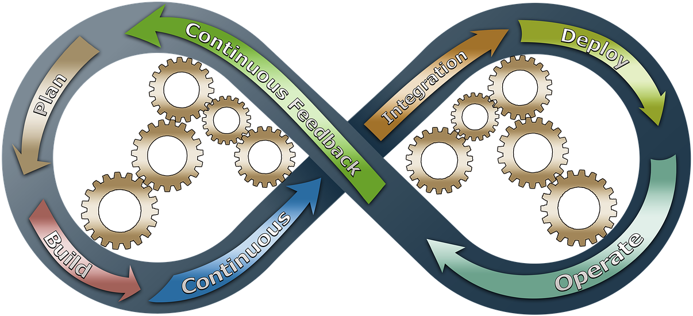

## CI your presentations 

### for fun and profit

 <!-- .element: style="max-width: 50%" -->

Dvir Yitzchaki 

@dvirtzwastaken <!-- .element: style="font-size: 0.4em" -->

Core C++, 2021 <!-- .element: style="font-size: 0.5em" -->

Image Source: [pixabay](https://pixabay.com/illustrations/devops-business-process-improvement-3148393/) 

<!-- .element: class="footnote" -->

---

## Coroutines Hello World

```cpp
///external
///options=/std:c++latest /await
///compiler=vcpp_v19_latest_arm64
#include <experimental/generator>

auto generate() { co_yield 42; }
```

---

## npm packages

- https://github.com/dvirtz/reveal-compiler-explorer
- https://github.com/streetsidesoftware/cspell

<!-- .element: style="font-size: 0.9em" -->


---

Thank You!


@dvirtzwastaken
