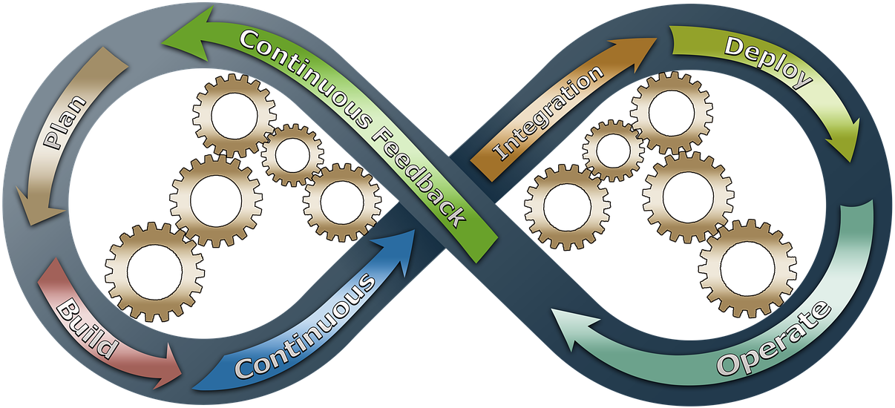

## CI your presentations 

### for fun and profit

 <!-- .element: style="max-width: 50%" -->

Dvir Yitzchaki 

 <!-- .element: style="max-width: 10%; margin: 0" -->

C++ on Sea, 2021 <!-- .element: style="font-size: 0.5em" -->

Image Source: [pixabay](https://pixabay.com/illustrations/devops-business-process-improvement-3148393/) 

<!-- .element: class="footnote" -->

---

<!-- cSpell:disable -->
## Asynchronus Hello World

<!-- cSpell:enable -->

```cpp
///compiler=g102
///options+=-std=c++20 -pthread
///output=World!\nHello
#include <iostream>
#include <thread>

int main() {
  std::jthread{[]{ 
    std::this_thread::sleep_for(std::chrono::seconds{1}); 
    std::cout << "World!\n";
  }};
  std::cout << "Hello ";
}
```

---

## code directives

````md
```cpp
///compiler=g102
///options+=-std=c++20 -pthread
///output=Hello World
#include <iostream>
#include <thread>

int main() {
  std::jthread{[]{ 
    std::this_thread::sleep_for(std::chrono::seconds{1}); 
    std::cout << "World!\n";
  }};
  std::cout << "Hello ";
}
```
````

<!-- .element: style="font-size: 0.5em" -->

---

## reveal-test

https://www.npmjs.com/package/reveal-test

---

## reveal-compiler-explorer

https://www.npmjs.com/package/reveal-compiler-explorer

---

## cspell

https://www.npmjs.com/package/cspell


---

Thank You!


