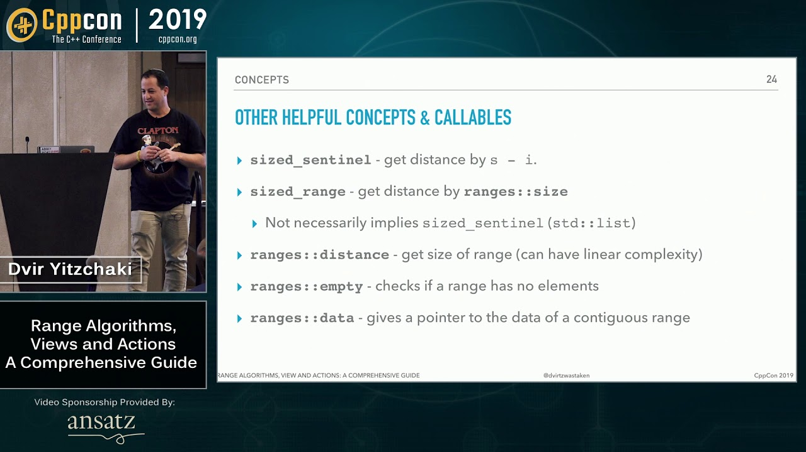

## Ranges status


<!-- .element: class="r-stretch" -->

Dvir Yitzchaki

September 2020

----

## ranges primer


<!-- .element: class="r-stretch" -->

---

## history

|date|event|
|---|---|
| November 2004 | Boost.Range released in Boost 1.32 |
| May 2010 | Boost.Range 2.0 (first range adaptors) |
| November 2013 | First commit to range-v3 |
| October 2014 | Ranges for the Standard Library proposal |
| July 2017 | Ranges TS |
| November 2018 | Merged to C++20 |
| ?? 2020 | Released in C++20 |

<!-- .element: class="no-border no-header" style="font-size: 0.6em" -->

---

## implementations

- [Boost::Range](https://www.boost.org/doc/libs/1_74_0/libs/range/doc/html/index.html) by Thorsten Ottosen, Neil Groves et al.
- [`range-v3`](https://github.com/ericniebler/range-v3) by Eric Niebler
- [`cmcstl2`](https://github.com/CaseyCarter/cmcstl2) by Casey Carter
- [`NanoRange`](https://github.com/tcbrindle/NanoRange) by Tristan Brindle
- [`cjdb-ranges`](https://github.com/cjdb/cjdb-ranges) by Christopher Di Bella
- `stdlibc++` 10.1
- Visual Studio 16.8

---

## What is a range

- A sequence of elements between two locations `i`, `k`.
- Often denoted by `[i, k)`.

---

## What is a range

- <!-- .element: class="fragment" --> A pair of iterators? <br>
  ```cpp
  ///hide
  #include <algorithm>
  #include <vector>

  void foo() {
  std::vector<int> v;
  int buf[2];
  ///unhide
  std::copy(v.begin(), v.end(), buf);
  ///hide
  }
  ```
  <!--.element: style="font-size: 0.45em" -->
- <!-- .element: class="fragment" --> An iterator and a count of elements?
  ```cpp
  ///hide
  #include <algorithm>
  #include <vector>

  void foo() {
  std::vector<int> v;
  int buf[2];
  ///unhide
  std::copy_n(v.begin(), 20, buf);
  ///hide
  }
  ```
  <!--.element: style="font-size: 0.45em" -->
- <!-- .element: class="fragment" --> An iterator and a predicate?
  ```cpp
  ///hide
  #include <algorithm>
  #include <iostream>
  #include <iterator>

  void foo() {
  int buf[2];
  ///unhide
  std::copy(std::istream_iterator<int>{std::cin},
          std::istream_iterator<int>{},
          buf);
  ///hide
  }
  ```
  <!--.element: style="font-size: 0.45em" -->
- <!-- .element: class="fragment" --> Why not all?

---

## `std::for_each`

```cpp [2,4-5]
template<class InputIt, class UnaryFunction>
constexpr UnaryFunction for_each(InputIt first, InputIt last, UnaryFunction f)
{
    for (; first != last; ++first) {
        f(*first);
    }
    return f;
}
```
<!--.element: style="font-size: 0.4em" -->

---

## iterator concepts

|concept|semantics|
|-------|---------|
|`input_or_output_iterator` | can be dereferenced (`*it`) and incremented (`++it`)|
|`input_iterator` | referenced values can be read (`auto v = *it`)|
|`output_iterator` | referenced values can be written to (`*it = v`)|
|`forward_iterator` | input_iterator + comparable and multi-pass|
|`bidirectional_iterator` | forward_iterator + decrementable (`--it`)|
|`random_access_iterator` | bidirectional_iterator + random access (`it += n`)|
|`contiguous_iterator` | random_access_iterator + contiguous in memory|

<!-- .element: class="no-border no-header" style="font-size: 0.6em" -->

---

## Sentinels - the new end iterator

- a semi-regular `S` is a `sentinel_for` an iterator `I` if for a range `[i, s)`
  - `i == s` is well defined.
  - If `i != s` then `i` is dereferenceable and `[++i, s)` denotes a range.

- Such an `s` is called a sentinel

---

## A UNIFING CONSTRUCT

A sentinel can be model

- Pair of iterators
- Iterator and predicate
- Iterator and count

Note: 
- Iterator and predicate: store predicate in the sentinel and let `i == s` return the result of calling `s.predicate(*i)`
- Iterator and count: store distance to end in the iterator and let `i == s` return the result of `i.count_ == 0`

---

## range

a type we can feed to
- `ranges::begin` - to get an iterator
- `ranges::end` - to get a sentinel

A range `[i, s)` refers to the elements

`*i, *(i++), *((i++)++), …, j`

such that j == s.

---

## range concepts

|concept|example|
|-------|---------|
|`input_range` | e.g. a range over a `std::istream_iterator`|
|`output_range` | e.g. a range over a `std::back_insert_iterator`|
|`forward_range` | e.g. `std::forward_list`|
|`bidirectional_range` | e.g. `std::list`|
|`random_access_range` | e.g. `std::deque`|
|`contiguous_range` | e.g. `std::vector`|
|`common_range`|sentinel is same type as iterator|

<!-- .element: class="no-border no-header" style="font-size: 0.6em" -->

---

## other concepts & callables

|a|b|
|-------|---------|
|`sized_sentinel` | get distance by `s - i`|
|`sized_range` | get distance by `ranges::size`|
|`ranges::distance` | get size of range (can have linear complexity) |
|`ranges::empty` | checks if a range has no elements |
|`ranges::data` | gives a pointer to the data of a contiguous range |

<!-- .element: class="no-border no-header" style="font-size: 0.6em" -->

Note: `sized_range` doesn't imply `sized_sentinel` (e.g. `std::list`)

---

## algorithms

now constrained with concepts:

```cpp [|2,6,10,14|4,7,12,15|3,8,11,16|5,13]
///compiler=g102
///options=-std=c++2a
///hide
#include <concepts>
#include <iterator>
#include <ranges>

template<class I, class F>
struct for_each_result;

///unhide
namespace std::ranges {
template<input_iterator I, sentinel_for<I> S, 
         class Proj = identity,
         indirectly_unary_invocable<projected<I, Proj>> Fun>
constexpr for_each_result<I, Fun>
for_each(I first, S last, 
         Fun f, 
         Proj proj = {});

template<input_range R, 
         class Proj = identity,
         indirectly_unary_invocable<projected<iterator_t<R>, Proj>> Fun>
constexpr for_each_result<borrowed_iterator_t<R>, Fun>
for_each(R&& r, 
         Fun f, 
         Proj proj = {});
}
```

<!-- .element: style="font-size: 0.45em" -->

---

## return value

```cpp [4,5]
///compiler=g102
///options=-std=c++2a
///hide
#include <concepts>
#include <utility>

///unhide
namespace std::ranges {
template<class I, class F>
struct for_each_result {
  [[no_unique_address]] I in;
  [[no_unique_address]] F fun;

  template<class I2, class F2>
  requires convertible_to<const I&, I2> && convertible_to<const F&, F2>
  operator for_each_result<I2, F2>() const & {
    return {in, fun};
  }

  template<class I2, class F2>
  requires convertible_to<I, I2> && convertible_to<F, F2>
  operator for_each_result<I2, F2>() && {
    return {std::move(in), std::move(fun)};
  }
};
}
```

<!-- .element: style="font-size: 0.42em" -->

Note: in addition to returning the function, it now returns the end iterator of the input range. This is the iterator that compared equal to the input sentinel.

---

## example

```cpp
///compiler=g102
///options=-std=c++2a
///hide
#include <cassert>
#include <vector>
///unhide
#include <algorithm>

int main() {
  std::vector<int> v1{0, 2, 4, 6};
  int sum  = 0;

  auto &&[i, f] = std::ranges::for_each(v1, [&](int i) { 
    sum += i; 
  });
  assert(sum == 12);
  assert(i == v1.end());
  f(1);
  assert(sum == 13);
}
```

---

<!-- .slide: data-auto-animate -->

## projections motivation

```cpp [1-4|6,8-11|6,13-15]
///hide
#include <string>
#include <algorithm>
#include <vector>

///unhide
struct employee {
  std::string first_name;
  std::string last_name;
};

///hide
void foo() {
///unhide
std::vector<employee> employees;

std::sort(employees.begin(), employees.end(), 
  [](const employee &x, const employee &y) { 
    return x.last_name < y.last_name; 
});

auto p = std::lower_bound(employees.begin(), employees.end(), "Niebler", 
  [](const employee &x, const std::string &y) { 
    return x.last_name < y; 
});
///hide
}
```

<!-- .element: data-id="code" style="font-size: 0.42em" -->

Note: Since the predicates are different, there is a chance they might get out of sync leading to subtle bugs.
surname?

---

<!-- .slide: data-auto-animate -->

## project

```cpp []
///compiler=g102
///options=-std=c++2a
///hide
#include <string>
#include <algorithm>
#include <vector>

///unhide
struct employee {
  std::string first_name;
  std::string last_name;
};

///hide
void foo() {
///unhide
using namespace std::ranges;

std::vector<employee> employees;

auto get_last_name = [](const employee &e) { return e.last_name; };

sort(employees, less{}, get_last_name);
auto p = lower_bound(employees, "Niebler", less{}, get_last_name);
///hide
}
```

<!-- .element: data-id="code" style="font-size: 0.42em" -->

---

<!-- .slide: data-auto-animate -->

## auto member projection

```cpp []
///compiler=g102
///options=-std=c++2a
///hide
#include <string>
#include <algorithm>
#include <vector>

///unhide
struct employee {
  std::string first_name;
  std::string last_name;
};

///hide
void foo() {
///unhide
using namespace std::ranges;

std::vector<employee> employees;

sort(employees, {}, &employee::last_name);
auto p = lower_bound(employees, "Niebler", {}, &employee::last_name);
///hide
}
```

<!-- .element: data-id="code" style="font-size: 0.42em" -->

---

## views

- a range type that has **constant time** copy, move, and assignment operators.
- Examples: 
  - A Range type that wraps a pair of iterators.
  - A Range type that holds its elements by `shared_­ptr` and shares ownership with all its copies.
  - A Range type that generates its elements on demand

Note: most containers are NOT views.

---

## Example

```cpp [|6-7,12-13|10|9|8]
///compiler=g102
///options=-std=c++2a
///hide
#include <type_traits>

template<typename T>
class view_interface;

///unhide
namespace std::ranges {
template<class T>
requires is_object_v<T>
class empty_view : public view_interface<empty_view<T>> {
public:
  static constexpr T* begin() noexcept { return nullptr; }
  static constexpr T* end() noexcept { return nullptr; }
  static constexpr T* data() noexcept { return nullptr; }
  static constexpr size_t size() noexcept { return 0; }
  static constexpr bool empty() noexcept { return true; }

  friend constexpr T* begin(empty_view) noexcept { return nullptr; }
  friend constexpr T* end(empty_view) noexcept { return nullptr; }
};
}
```

<!-- .element: style="font-size: 0.45em" -->

---

## Factories & Adaptors

- Utility objects for creating views
  - adaptors (if transform an existing range) or 
  - factories (otherwise)

```cpp [1-4,7]
///compiler=g102
///options=-std=c++2a
///hide
#include <ranges>

#if 0
///unhide
namespace std::ranges::views {
template<class T>
inline constexpr empty_view<T> empty{};
}
///hide
#endif
///unhide

using namespace std::ranges;
static_assert(empty(views::empty<int>));
```

---

## laziness

- Views are lazily evaluated.
- They generate their elements only on demand, when iterated.
- For this reason, there can be views with infinitely many elements.

---

## more examples

assume the following function

```cpp
///compiler=g102
///options=-std=c++2a
#include <cassert>
#include <algorithm>

namespace ranges = std::ranges;

template<ranges::range V, typename T>
void check_equal(V &&v, std::initializer_list<T> il) {
    assert(ranges::equal(std::forward<V>(v), il));
}
```

---

## more examples

```cpp [3|5-10|12-13]
///compiler=g102
///options=-std=c++2a
///hide
#include <ranges>
#include <algorithm>
#include <cassert>

namespace ranges = std::ranges;

template<ranges::range V, typename T>
void check_equal(V &&v, std::initializer_list<T> il) {
    assert(ranges::equal(std::forward<V>(v), il));
}

int main() {
///unhide
namespace views = std::ranges::views;

check_equal(views::single(42), {42});

const int rng[] = {0, 1, 2, 3, 4, 5, 6, 7, 8, 9, 10};
check_equal(views::filter(rng, 
            [](int i) { return i % 2 == 0; }), 
            {0, 2, 4, 6, 8, 10});
check_equal(views::take(rng, 6), 
            {0, 1, 2, 3, 4, 5});

check_equal(views::iota(42, 45), {42, 43, 44});
check_equal(views::take(views::iota(2), 3), {2, 3, 4});
///hide
}
```

---

## `subrange`

- Combines together an iterator and a sentinel into a single view.
- Returned by many algorithms.

```cpp
///compiler=g102
///options=-std=c++2a
///hide
#include <ranges>
#include <algorithm>
#include <cassert>

namespace ranges = std::ranges;

template<ranges::range V, typename T>
void check_equal(V &&v, std::initializer_list<T> il) {
    assert(ranges::equal(std::forward<V>(v), il));
}

int main() {
///unhide
using namespace ranges;

const int rng[] = {1, 2, 3, 4};
check_equal(subrange{begin(rng) + 1, end(rng)}, 
  {2, 3, 4});
///hide
}
```

---

<!-- .slide: data-auto-animate -->

## classic STL

```cpp []
///hide
#include <vector>
#include <numeric>
#include <algorithm>

///unhide
int sum_of_squares(int count) {
  using namespace std;

  vector<int> numbers(static_cast<size_t>(count));
  iota(numbers.begin(), numbers.end(), 1);
  transform(numbers.begin(), numbers.end(), numbers.begin(), 
                 [](int x) { return x * x; });
  return accumulate(numbers.begin(), numbers.end(), 0);
}
```

<!-- .element: data-id="code" style="font-size: 0.45em" -->

---

<!-- .slide: data-auto-animate -->

## function call syntax

```cpp []
///external
///libs=rangesv3:trunk
///hide
#include <range/v3/all.hpp>

///unhide
int sum_of_squares(int count) {
  using namespace ranges;

  return accumulate(
    views::transform(
      views::iota(1, count), 
      [](int x) { return x * x; }
    ), 0
  );
}
```

<!-- .element: data-id="code" style="font-size: 0.45em" -->

---

<!-- .slide: data-auto-animate -->

## piped syntax

```cpp []
///external
///libs=rangesv3:trunk
///hide
#include <range/v3/all.hpp>

///unhide
int sum_of_squares(int count) {
  using namespace ranges;
  
  auto squares = views::iota(1, count) 
               | views::transform([](int x) { return x * x; });
  return accumulate(squares, 0);
}
```

<!-- .element: data-id="code" style="font-size: 0.45em" -->

---

## actions

- Composable algorithms
- Not standardized

```cpp
///external
///libs=rangesv3:trunk
///options=-std=c++17
///hide
#include <range/v3/action.hpp>
#include <type_traits>

///unhide
namespace actions = ranges::actions;

extern std::vector<int> read_data();

auto vi = read_data()
        | actions::sort
        | actions::unique;

static_assert(std::is_same_v<decltype(vi), 
              std::vector<int>>);
```

Note: all actions in range-v3 are range->range. We might consider range->value e.g. accumulate

---

## `borrowed_iterator_t`

```cpp [13]
///compiler=g102
///options=-std=c++2a
///hide
#include <concepts>
#include <iterator>
#include <ranges>

template<class I, class F>
struct for_each_result;

///unhide
namespace std::ranges {
template<input_iterator I, sentinel_for<I> S, 
         class Proj = identity,
         indirectly_unary_invocable<projected<I, Proj>> Fun>
constexpr for_each_result<I, Fun>
for_each(I first, S last, 
         Fun f, 
         Proj proj = {});

template<input_range R, 
         class Proj = identity,
         indirectly_unary_invocable<projected<iterator_t<R>, Proj>> Fun>
constexpr for_each_result<borrowed_iterator_t<R>, Fun>
for_each(R&& r, 
         Fun f, 
         Proj proj = {});
}
```

<!-- .element: style="font-size: 0.45em" -->

---

## borrowed range

A range is a borrowed_range when you can hold onto its iterators after the range goes out of scope. 

There are two kinds of borrowed ranges:

- lvalue references to ranges. 
- ranges which which opt in, by way of the new enable_borrowed_range variable template, e.g.
  ```cpp
  ///compiler=g102
  ///options=-std=c++2a
  ///hide
  template<class T>
  inline constexpr bool enable_borrowed_range = false;

  template<typename T>
  struct empty_view;
  
  ///unhide
  template<class T>
  inline constexpr bool enable_borrowed_range<empty_view<T>> = true;
  ```

  <!-- .element: style="font-size: 0.45em" -->

Note: It’s not the lvalue reference itself which owns the data, so if the reference dies, we’re fine.

---

## detect dangling iterators

```cpp
///compiler=g102
///options=-std=c++2a
///hide
#include <vector>
#include <algorithm>
#include <ranges>

///unhide
std::vector<int> f();

auto result1 = std::ranges::find(f(), 42);
static_assert(std::same_as<decltype(result1), 
              std::ranges::dangling>);
// *result1 does not compile

auto vec     = f();
auto result2 = std::ranges::find(vec, 42);
static_assert(std::same_as<decltype(result2), 
              std::vector<int>::iterator>);

auto result3 = std::ranges::find(std::views::iota(2), 42);
static_assert(not std::same_as<decltype(result3), 
              std::ranges::dangling>);
```

  <!-- .element: style="font-size: 0.45em" -->

----

## standardization


<!-- .element: class="r-stretch" -->

---

## range algorithms not in C++20

- `<numerics>` ([P1813](https://wg21.link/p1813))
- parallel algorithms ([P0836](https://wg21.link/p0836))
- algorithms added after Ranges TS:
  - ~~`for_each_n`, `clamp`, `sample`~~ ([P1243](https://wg21.link/p1243))
  - `shift_left`, `shift_right` ([issue]("https://drive.google.com/open?id=1mVZNzYruZsDgMsNzEm5Wt1zvK7C5uCVAPvSrianCYDg"))
  - `lexicographical_compare_three_way` ([P2022](https://github.com/wg21il/Papers/tree/P2022/master))
  - `search(range, searcher)`

---

## views

`range-v3` has ~70 views, only a selection of is available in c++20

---

# other open proposals

---

[ranges::to: A function to convert any range to a container](https://wg21.link/p2091), Corentin Jabot, Eric Niebler, Casey Carter

```cpp
///compiler=g102
///options=-std=c++2a
///fails='to' was not declared in this scope
///hide
#include <ranges>
#include <vector>

using namespace std::ranges;
///unhide
auto vec = views::iota(0)
  | views::transform([](int i) {
      return i + 42;
    })
  | views::take(10)
  | to<std::vector>;
```

---

[Conditionally borrowed ranges](https://wg21.link/p2017), Barry Revzin

```cpp []
///compiler=g102
///options=-std=c++2a
///fails='std::ranges::borrowed_iterator_t<std::ranges::reverse_view<std::ranges::ref_view<const std::__cxx11::basic_string<char> > > >' {aka 'struct std::ranges::dangling'} has no member named 'base'
///hide
#include <ranges>
#include <algorithm>

namespace ranges = std::ranges;
namespace views = ranges::views;

///unhide
auto trim(std::string const& s) {
  auto isalpha = [](unsigned char c){ return std::isalpha(c); };
  auto b = ranges::find_if(s, isalpha);
  auto e = ranges::find_if(s | views::reverse, isalpha).base();
  return ranges::subrange(b, e);
}
```

<!-- .element: style="font-size: 0.45em" -->

Several range adapters, e.g. `views::take` and `views::reverse`, semantically behave as if they have a single member of some templated view type. If that underlying view type is a borrowed_range, the range adapter itself can be transitively borrowed.

Note: `ranges::find_if(s | views::reverse, isalpha)` type is `dangling`.

---

[Superior String Splitting](https://wg21.link/p2210), Barry Revzin

```cpp
///compiler=g102
///options=-std=c++2a
///fails=no matching function for call to 'std::ranges::split_view<std::ranges::ref_view<std::__cxx11::basic_string<char> >, std::ranges::single_view<char> >::_OuterIter<true>::value_type::data()'
///hide
#include <ranges>
#include <charconv>

int main() {
namespace views = std::ranges::views;
///unhide
std::string s = "1.2.3.4";

auto ints =
    s | views::split('.')
      | views::transform([](auto v){
            int i = 0;
            std::from_chars(v.data(), v.size(), &i);
            return i;
        });
///hide
}
```

Splitting a range that is forward-or-better should yield subranges that are specializations of `subrange` while dropping `const`-iterability;

Note: `split_view` doesn't preserve the source range category and is always `forward` at most

---

[reconstructible_range - a concept for putting ranges back together](https://wg21.link/p1664), JeanHeyd Meneide, Hannes Hauswedell

```cpp
///compiler=g102
///options=-std=c++2a
///fails=conversion from 'std::ranges::take_view<std::ranges::drop_view<std::span<int, 18446744073709551615> > >' to non-scalar type 'std::span<int, 18446744073709551615>' requested
///hide
#include <ranges>
#include <vector>
#include <span>

int main() {
namespace views = std::ranges::views;
///unhide
std::vector vec{1, 2, 3, 4, 5};
std::span s{vec.data(), 5};
std::span v = s | views::drop(1) | views::take(2);
///unhide
}
```

Adds a `reconstructible_range` concept and a `ranges::reconstruct` CPO for ranges which can be reconstructed from a subrange and/or iterator-sentinel pair.

Note: range algorithms 'lose' the type of the given range and can only return `subrange`.

---

[A pipeline-rewrite operator](https://wg21.link/p2011), Colby Pike, Barry Revzin

```cpp
///compiler=g102
///options=-std=c++2a
///fails=expected primary-expression before '>' token
///hide
#include <ranges>

///unhide
bool dangerous_teams(std::string const& s) {
  return s
    |> views::group_by(std::equal_to{})
    |> views::transform(ranges::distance)
    |> ranges::any_of([](std::size_t s){
          return s >= 7;
      });
}
```

Note:
- The code required to support using `|` functionality adds overhead during compilation, and without the aide of the inliner and basic optimizations it can be expensive at runtime.
- Defining new range algorithms necessitates opting-in to this machinery. Existing code cannot make use of pipeline style.
- Supporting both pipeline style and immediate style requires algorithms to provide both partial and full algorithm implementations, where the partial implementation is mostly boilerplate to generate the partially applied closure object.
- Doesn't work when algorithm / adaptor takes more than one range
- Will make all algorithms pipeable making actions redundant

---

[Saving Private Ranges: Recovering Lost Information from Comparison and Predicate Algorithms](https://wg21.link/p1877), JeanHeyd Meneide

```cpp
///compiler=g102
///options=-std=c++2a
///hide
#include <concepts>
#include <utility>

using std::convertible_to;
///unhide
namespace ranges {
  template<class I1>
  struct predicate_result {
    [[no_unique_address]] I1 in;
    bool value;
    
    template<class II1> requires convertible_to<const I1&, II1>
    operator predicate_result<II1>() const & { return {in, value}; }

    template<class II1> requires convertible_to<const I1&, II1>
    operator predicate_result<II1>() && { return {std::move(in), value}; }

    explicit operator bool () const { return value; }
  };
}
```

<!-- .element: style="font-size: 0.4em" -->

Add end iterator to algorithms returning `bool` such as `copy`.

---

[Throwing Out the Kitchen Sink - Output Ranges](https://thephd.github.io/output-ranges), JeanHeyd Meneide

```cpp
///compiler=g102
///options=-std=c++2a
///hide
#include <span>
#include <algorithm>

int important_access();

void foo() {
///unhide
int destination_data[450];
int very_important_goddamn_integer = important_access();
int source_data[500]{};

std::span<int> source(source_data);
std::span<int> destination(destination_data);
std::ranges::copy(source, destination.begin()); // BOOM!
///hide
}
```

<!-- .element: style="font-size: 0.4em" -->

Instead, we should have

```cpp
///compiler=g102
///options=-std=c++2a
///fails=no match for call to '(const std::ranges::__copy_fn) (std::span<int>&, std::span<int>&)'
///hide
#include <span>
#include <algorithm>

int important_access();

void foo() {
int destination_data[450];
int very_important_goddamn_integer = important_access();
int source_data[500]{};

std::span<int> source(source_data);
std::span<int> destination(destination_data);
///unhide
std::ranges::copy(source, destination);
///hide
}
```

<!-- .element: style="font-size: 0.4em" -->

or

```cpp
///compiler=g102
///options=-std=c++2a
///fails='unbounded_view' is not a member of 'std::ranges'
///hide
#include <span>
#include <algorithm>

int important_access();

void foo() {
int destination_data[450];
int very_important_goddamn_integer = important_access();
int source_data[500]{};

std::span<int> source(source_data);
std::span<int> destination(destination_data);
///unhide
std::ranges::copy(source, std::ranges::unbounded_view(destination.begin()));
///hide
}
```

<!-- .element: style="font-size: 0.4em" -->

Note: Not a proposal yet. passing output iterator is unsafe. one question is what to do when a container is passed, push or fill? ThePHD's answer is to fill by default and pass `std::ranges::unbounded_view{std::back_inserter(destination_data)}` otherwise.

---

[`zip_view`](https://wg21.link/p1035r4), Christopher Di Bella

`zip_view`'s reference type is `tuple<Ts&...>` and its value type is `tuple<Ts...>` but there is no common reference between them.


<!-- .element: class="r-stretch" -->

Note: this was removed from P1035 and should be proposed in another paper.

----

## Thank you



<!-- .element: class="r-stretch" -->